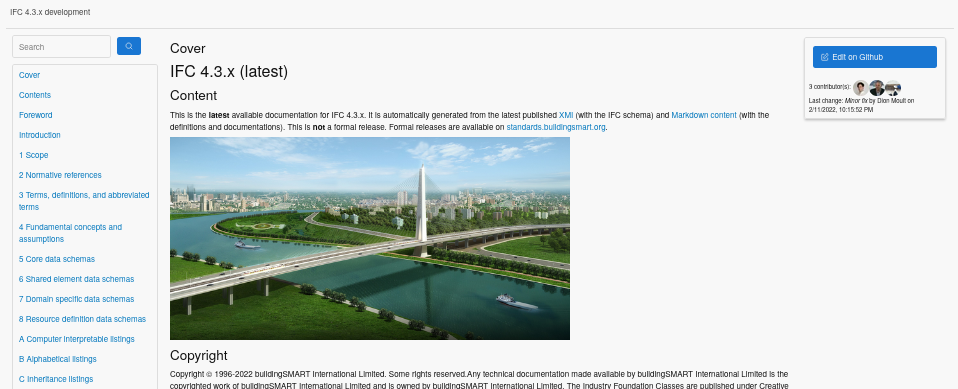

# IFC 4.3 Documentation server

## Introduction

The documentation server is a website for viewing the IFC documentation.
View it live at http://ifc43-docs.standards.buildingsmart.org/



This website has the following features:

 - Allows the IFC documentation to be generated without the need for proprietary
   software, and work cross platform on Windows, Mac, and Linux.
 - The written documentation is now fully captured in plain text using Markdown,
   making it easy for anyone to edit the documentation without special training.
 - All written documentation changes are tracked using Git, allowing anyone to
   edit and see edit histories.
 - Using Github, anybody can make quick online "Wiki" style edits without
   bespoke software installation.
 - Documentation layout is easily customised using HTML templates and CSS styles
 - Schema changelogs are auto generated instead of relying on manual logs
 - Schema diagrams such as entity inheritance trees and concept diagrams are
   automatically generated with automatic layouting, with SVG support and
   clickable links to ensure they are searchable and always current
 - Users can generate their own interactive diagrams that can be maintained and
   checked without the need for image editing software
 - All schema entity references are automatically linked and referenced
 - All figures are automatically captioned and numbered
 - All headers and figures are anchored for sharing portions of the
   specification with anchor links
 - Using markdown and standardised templates helps ensure consistency in layout,
   typography, tables, links, notes, and references.
 - Built-in quality checking procedures during documentation generation.
 - API for quick documentation lookup or previews
 - Mobile friendly (well, we plan on it, I would hope)

## Process

There are three aspects of the IFC documentation server: **Schema**,
**Documentation**, and **Website**.

### Schema

 - **Base schema** - The schema is stored in `schemas/IFC.xml`. This is
   currently a monolithic XMI document which describes all of the IFC schema
   modeled in UML.
 - **Property set definitions** - definitions for property and quantity sets are
   stored in `reference_schemas/psd/`

UML modeling knowledge is a prerequisite for those modifying the **Schema**.
Any changes to the schema must follow the [IFC Change
Process](https://github.com/buildingSMART/IFC4.3.x-development/wiki/IFC-4.3.x-Change-Process)
to ensure that all changes are publicly reviewed, transparent to the community,
and enlist the appropriate domain experts for quality control.

As of writing, this monolithic XMI document is generated using the
proprietary Enterprise Architect tool. However, it is planned to be broken up
into smaller datasets and revised to allow UML modeling without proprietary or
platform requirements.

### Documentation

 - **Static pages** - documentation that does not relate to entities in the
   schema are stored in `content/`.
 - **Schema documentation** - documentation based on entities in the schema are
   stored in `docs/schemas/`. These include data types, property sets, quantity
   sets, functions, and rules.
 - **Concepts** - documentation for IFC concepts are stored in `docs/templates/`
 - **Properties** - documentation for individual properties are stored in
   `docs/properties/`
 - **Images** - images referenced in documentation may be stored in
   `docs/figures/`

No special skills are required to edit the **Documentation**. Just a
simple text editor will do. However, any documentation that is not a minor
formatting change must also follow the [IFC Change
Process](https://github.com/buildingSMART/IFC4.3.x-development/wiki/IFC-4.3.x-Change-Process).

### Website

 - **Preprocessor** - The _Schema_ cannot be immediately accessed by the web
   application due to its complexity. This requires a preprocessing step in
   `code/create_resources.sh`.  This breaks down the complex UML / XMI data into
   simple JSON data that the website can query.
 - **Backend** - The website itself is a Python Flask application which begins
   in `server.py`. This website renders the preprocessed _Schema_ data
   with _Documentation_ using _Frontend_ templates.
 - **Frontend** - The _Documentation_ is turned into a website
   layout using templates. Templates are defined in HTML templates in
   `code/templates/`, as well as CSS, Javascript, and images in `docs/assets/`

To edit the **Website** features, layouting and diagram generation, and other
more complex systems, programming knowledge is required. This is either Python
for the backend code, or HTML, CSS, and Javascript knowledge for frontend
design. Making a change to this application is no different to any other change,
and must also follow the [IFC Change
Process](https://github.com/buildingSMART/IFC4.3.x-development/wiki/IFC-4.3.x-Change-Process).

## Writing markdown

Markdown is easy to get started with. Here's a [Markdown
tutorial](https://www.markdowntutorial.com/) to learn it quickly!

However, there are some conventions established for the purposes of IFC
documentation.

To create a note, you can do:

```
> NOTE This is a note.
```

To create an example:

```
> EXAMPLE This is an example.
```

You may also come across history notes or changes. It is no longer encouraged to
use these, as changes are automatically detected and tracked using version
control.

```
> HISTORY Something happened.
> IFC CHANGE Something changed.
```

To create a captioned figure, you can do this:

```


Figure ABC - Shows something interesting.
```

The image must be immediately succeeded by a paragraph with `Figure 1234` as the
first words. `ABC` can be any unique code that you choose. The new line
separating the image and the figure paragraph is optional, but recommended.

If you want to refer to your figure later on, you can simply mention it in a
paragraph, and the reference will automatically be updated.

```
This is a paragraph that talks about Figure ABC in interesting ways.
```

Although not recommended, you can omit a figure paragraph. In that case it will
be automatically captioned. If an image title is available, the image title will
be used as the image caption.

You can create a table using Markdown like so:

```
Name | Definition
---|---
Foo | Description of foo
Bar | Description of bar

Table XYZ - A table of things.
```

Similar to figures, tables can also be annotated with an arbitrary code of your
choice, which you can refer to later.

Markdown allows HTML, but this is generally unnecessary.

## Diagrams

One novel feature of this documentation system is the ability to directly edit
illustrative  schema diagrams using a text-based notation. For this purpose
Graphviz is used.  The Graphviz DOT definition language is automatically
enriched with colour conventions derived from the IFC schema.

TODO: show code and generated diagrams from it

For example, the IfcWorkPlan instantiation diagram can be included and edited in
the MD files and then be visible in the related HTML page.  Below is the
Graphviz definition of this figure. The user's input overwrites the automatic
settings. This can be verified with the IfcProject node on the HTML diagram,
whose link pointing to Building Smart website replaces the link to the entity's
HTML page.

See an [example
diagram](http://ifc43-docs.standards.buildingsmart.org/IFC/RELEASE/IFC4x3/HTML/lexical/IfcWorkPlan.htm).

## Dependencies

See `Dockerfile` for more detail on how these dependencies are set up.

System dependencies:

 * `docker` - container management (optional)
 * `graphviz` - diagram generator
 * `gunicorn` - http server (optional)
 * `ifcopenshell` - used in a minor capacity which can probably be removed in the future
 * `imagemagick` - automatic image conversion
 * `python` - to run the website
 * `solr` - search database (optional)
 * `supervisord` - process control (optional)

Python modules are all captured in `requirements.txt`

## Development

To run the website on your local machine for development, you can do:

```bash
$ cd code/
$ pip install -r requirements.txt
$ ./create_resources.sh
$ FLASK_APP=server.py FLASK_ENV=development flask run
 * Serving Flask app "server.py" (lazy loading)
 * Environment: development
 * Debug mode: on
 * Running on http://127.0.0.1:5000/ (Press CTRL+C to quit)
 * Restarting with stat
 * Debugger is active!
 * Debugger PIN: 155-459-101
```

You can now visit `http://127.0.0.1:5000/` to see the running website.

## Deployment

Typically for hosting a production version of this website, you can choose to
deploy a container running the website using Docker.

```bash
$ cd code/

# Build a new system image called "ifcdoc"
$ docker build -t "ifcdoc" .

# Let's see the image we just created
$ docker images
REPOSITORY   TAG           IMAGE ID       CREATED          SIZE
ifcdoc       latest        df699a56028f   12 seconds ago   3GB

# Run the image we created in a new container called "ifcdoc-container", with our local port 8080 mapped to the container's port 80
$ docker run -p 8080:80 --name "ifcdoc-container" -d "ifcdoc"

# Check running Docker processes to confirm that the container is running
$ docker ps
CONTAINER ID   IMAGE    COMMAND                  CREATED          STATUS          PORTS                                   NAMES
0d4b0775cf29   ifcdoc   "/bin/sh -c 'supervi…"   12 seconds ago   Up 11 seconds   0.0.0.0:8080->80/tcp, :::8080->80/tcp   ifcdoc-container
```

Now you can visit the containerized deployment in your browser by visiting
`http://localhost:8080`.

You can stop the Docker container as follows:

```bash
$ docker stop ifcdoc-container

# Check running processes (-a flag shows all processes) to ensure it has exited
$ docker ps -a
CONTAINER ID   IMAGE    COMMAND                  CREATED         STATUS                        PORTS   NAMES
0d4b0775cf29   ifcdoc   "/bin/sh -c 'supervi…"   3 minutes ago   Exited (137) 32 seconds ago           ifcdoc-container
```

Then you can start it again:

```bash
$ docker start ifcdoc-container

# Check running Docker processes to confirm that the container is running
$ docker ps
CONTAINER ID   IMAGE    COMMAND                  CREATED         STATUS         PORTS                                   NAMES
0d4b0775cf29   ifcdoc   "/bin/sh -c 'supervi…"   5 minutes ago   Up 3 seconds   0.0.0.0:8080->80/tcp, :::8080->80/tcp   ifcdoc-container
```
