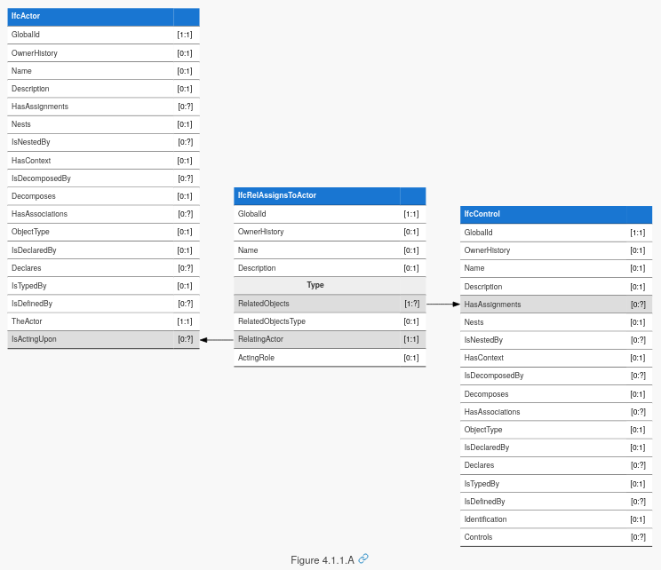
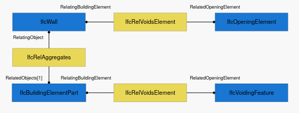
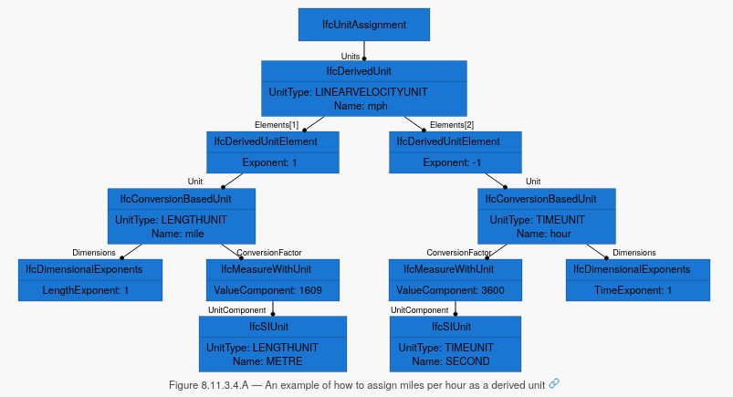

# IFC 4.3 Documentation server

## Introduction

The documentation server is a website for viewing the IFC documentation.
View it live at http://ifc43-docs.standards.buildingsmart.org/


This website has the following features:

 - Allows the IFC documentation to be generated without the need for proprietary
   software, and work cross platform on Windows, Mac, and Linux.
 - The written documentation is now fully captured in plain text using Markdown,
   making it easy for anyone to edit the documentation without special training.
 - A built-in search feature. How did we live without it :)
 - All written documentation changes are tracked using Git, allowing anyone to
   edit and see edit histories.
 - Using Github, anybody can make quick online "Wiki" style edits without
   bespoke software installation.
 - Documentation layout is easily customised using HTML templates and CSS styles
 - Schema changelogs are auto generated instead of relying on manual logs
 - Schema diagrams such as entity inheritance trees and concept diagrams are
   automatically generated with automatic layouting, with SVG support and
   clickable links to ensure they are searchable and always current
 - Users can generate their own interactive diagrams that can be maintained and
   checked without the need for image editing software
 - Beautifully rendered math equations
 - All schema entity references are automatically linked and referenced
 - All figures are automatically captioned and numbered
 - All headers and figures are anchored for sharing portions of the
   specification with anchor links
 - Using markdown and standardised templates helps ensure consistency in layout,
   typography, tables, links, notes, and references.
 - Built-in quality checking procedures during documentation generation.
 - Hovering over entities shows a quick popup preview of common attributes and
   data types for convenience
 - Shows inherited concept usages on all entities
 - Quick section jumping to browse long or complex pages
 - Navigation breadcrumb easily communicates the domain scope of the current
   entity you are browsing
 - Automatic syntax highlighting and line numbering for EXPRESS, STEP, XML, and
   JSON code snippets and examples
 - Examples are shown with thumbnails and automatically referenced by entities
 - API for quick documentation lookup
 - Mobile friendly (well, we plan on it, I would hope)

## Process

There are three aspects of the IFC documentation server: **Schema**,
**Documentation**, and **Website**.

### Schema

 - **Base schema** - The schema is stored in `schemas/IFC.xml`. This is
   currently a monolithic XMI document which describes all of the IFC schema
   modeled in UML.
 - **Property set definitions** - definitions for property and quantity sets are
   stored in `reference_schemas/psd/`

UML modeling knowledge is a prerequisite for those modifying the **Schema**.
Any changes to the schema must follow the [IFC Change
Process](https://github.com/buildingSMART/IFC4.3.x-development/wiki/IFC-4.3.x-Change-Process)
to ensure that all changes are publicly reviewed, transparent to the community,
and enlist the appropriate domain experts for quality control.

As of writing, this monolithic XMI document is generated using the
proprietary Enterprise Architect tool. However, it is planned to be broken up
into smaller datasets and revised to allow UML modeling without proprietary or
platform requirements.

### Documentation

 - **Static pages** - documentation that does not relate to entities in the
   schema are stored in `content/`.
 - **Schema documentation** - documentation based on entities in the schema are
   stored in `docs/schemas/`. These include data types, property sets, quantity
   sets, functions, and rules.
 - **Concepts** - documentation for IFC concepts are stored in `docs/templates/`
 - **Properties** - documentation for individual properties are stored in
   `docs/properties/`
 - **Images** - images referenced in documentation may be stored in
   `docs/figures/`

No special skills are required to edit the **Documentation**. Just a
simple text editor will do. However, any documentation that is not a minor
formatting change must also follow the [IFC Change
Process](https://github.com/buildingSMART/IFC4.3.x-development/wiki/IFC-4.3.x-Change-Process).

### Website

 - **Preprocessor** - The _Schema_ cannot be immediately accessed by the web
   application due to its complexity. This requires a preprocessing step in
   `code/create_resources.sh`.  This breaks down the complex UML / XMI data into
   simple JSON data that the website can query.
 - **Backend** - The website itself is a Python Flask application which begins
   in `server.py`. This website renders the preprocessed _Schema_ data
   with _Documentation_ using _Frontend_ templates.
 - **Frontend** - The _Documentation_ is turned into a website
   layout using templates. Templates are defined in HTML templates in
   `code/templates/`, as well as CSS, Javascript, and images in `docs/assets/`

To edit the **Website** features, layouting and diagram generation, and other
more complex systems, programming knowledge is required. This is either Python
for the backend code, or HTML, CSS, and Javascript knowledge for frontend
design. Making a change to this application is no different to any other change,
and must also follow the [IFC Change
Process](https://github.com/buildingSMART/IFC4.3.x-development/wiki/IFC-4.3.x-Change-Process).

## Writing markdown

Markdown is easy to get started with. Here's a [Markdown
tutorial](https://www.markdowntutorial.com/) to learn it quickly!

However, there are some conventions established for the purposes of IFC
documentation.

### Style guide

Markdown allows a few different syntaxes to achieve the same thing. However, as
the markdown may be parsed, the following conventions should apply.

```markdown
# Use this style of header

Do not use this
===============

 * Use asterisks
 * For unordered lists

 - Do not use dashses
 - For unordered lists

 1. Use numbers for numbered lists
 2. And always increment the number
```

### Inline references to resources

If you want to reference an IFC entity, attribute, type, property or quantity
set, property, function, or rule, you should follow the capitalisation
convention of CapsCase and distinguish it with italics. This allows the keyword
to stand out regardless of viewing medium.

Also note that references will be automatically linked by the web application
when possible so you should not manually add links.

When referring to entities or types in the plural, do not use an "s". Instead,
simply use the name and say "entities" or "types" afterwards.

```
I can reference an _IfcWall_ or multiple _IfcWall_ entities and _IfcLabel_
types. I can also refer to the _Pset_WallCommon_ property set, attributes like
_Name_ or properties like _NetHeight_.
```

### External references

References shall be used when it is possible for a reader to get a deeper
understanding of the topic by reading another ISO standard or specification that
IFC is built upon.

The reference should unambiguously denote both the standard or specification,
provide an official link to that specification, as well as an appropriate
section title, number, or keyword within the referenced document.

References should not be used to copy verbatim key paragraphs and content from a
referenced specification. Those key paragraphs should be part of the main
documentation, but then be accompanied by a short "Reference" afterwards.

```
> REFERENCE Symbol `c` according to [ISO 2553:2019](https://www.iso.org/standard/72740.html).
```

### Notes

Notes shall be used to highlight edge cases that implementers need to be aware
of, or to warn against an assumption (like a "gotcha") that an implementer or
user may make. Notes shall be used sparingly. Good technical writing shall be
clear and minimise the need for these caution notes.

```
> NOTE _IfcBeam_ shall not be used for the representation of a load-bearing beam
> in a structural analysis model. This is done using a _IfcStructuralMember_
> instead.
```

### Examples

It is necessary for the specification to use generic, abstract jargon when
describing concepts, but this may be difficult to understand for users. It is
always encouraged to accompany all abstract scenarios with a concrete example.
Examples should be short, use simple language, and use scenarios which may apply
on real life projects that users can easily relate to.

```
> EXAMPLE A spatial zone may be given a _Name_ of "1-003", typically a running
> number provided by default by the application. Then _LongName_ may then be
> "Office", with a _Description_ of "Corner office with habour view".
```

Examples which are longer should not use an example block. They should use a
dedicated example page, which includes attached files, screenshots, and
descriptions.

### Changes

Sometimes, descriptions are made about the changes in the schema. In the future,
a better system will be made to unify this into the dedicated and automated
changelog system. However, for the time being, you may describe changes inline
in the documentation. You should describe exactly what changed, the version
where it changed, and point people to alternatives or describe why it changed.

Where changes are automatically detected in the changelog system, you should not
include this change note.

```
> HISTORY Something happened.
> IFC{M.m.A.C} CHANGE Something changed.
> IFC{M.m.A.C} DEPRECATION Something disappeared.
```

The format `{M.m.A.C}` follows the version numbering scheme found on the [IFC specifications
database](https://github.com/buildingSMART/IFC4.3.x-development/issues/280).

Different messages may be used to indicate deprecations. For example:

```
> IFC4.3.0.0 DEPRECATION This attribute shall not be used, use property _Bar_ at _Pset_Foo_ instead.
> IFC4.3.0.0 DEPRECATION This attribute is deprecated and shall no longer be used.
> IFC4.3.0.0 DEPRECATION This property shall not be used, use property _Bar_ at _Pset_Foo_ instead.
> IFC4.3.0.0 DEPRECATION This property is deprecated and shall no longer be used.
```

### Figures

To create a captioned figure, you can do this:

```


Figure ABC - Shows something interesting.
```

The image must be immediately succeeded by a paragraph with `Figure ABC` as the
first words. `ABC` can be any unique code that you choose. The new line
separating the image and the figure paragraph is optional, but recommended.

If you want to refer to your figure later on, you can simply mention it in a
paragraph, and the reference will automatically be updated.

```
This is a paragraph that talks about Figure ABC in interesting ways.
```

Although not recommended, you can omit a figure paragraph. In that case it will
be automatically captioned. If an image title is available, the image title will
be used as the image caption.

### Tables

You can create a table using Markdown like so:

```
Name | Definition
---|---
Foo | Description of foo
Bar | Description of bar

Table XYZ - A table of things.
```

Similar to figures, tables can also be annotated with an arbitrary code of your
choice, which you can refer to later.

### Equations

If you need to render an equation, simply include it using LaTeX:

```
$$V_{sphere} = \frac{4}{3}\pi r^3$$
```

There may be some [quirks with LaTeX rendering](https://math.codidact.com/posts/278763) to be aware of.

Markdown allows HTML, but this is generally unnecessary.

### Diagrams

One novel feature of this documentation system is the ability to directly edit
illustrative  schema diagrams using a text-based notation. For this purpose
Graphviz is used.  The Graphviz DOT definition language is automatically
enriched with colour conventions derived from the IFC schema.

There are two types of diagrams: concept diagrams and entity diagrams.

Concept diagrams are found in chapter 4. A concept diagram shows entities with
all their direct and indirect attributes being referencing other entities. Here
is an example:

```
concept {
    IfcActor:IsActingUpon -> IfcRelAssignsToActor:RelatingActor
    IfcRelAssignsToActor:RelatedObjects -> IfcControl:HasAssignments
    IfcRelAssignsToActor:RelatedObjects[binding="Type"]
}
```

This example produces the following diagram. Notice that the arrow direction is
automatically determined for you. You create entities in order you prefer. If
the concept is parameterised, you can create a "binding" annotation to highlight
an attribute with a particular name that correlates to the concept usage table.



An entity diagram shows entities referencing other entities.

```
digraph dot_neato {
    IfcWall [pos="0,0!"];
    IfcRelVoidsElement [pos="200,0!"];
    IfcOpeningElement [pos="400,0!"];

    IfcRelAggregates [pos="0,-70!"];

    IfcBuildingElementPart [pos="0,-140!"];
    IfcRelVoidsElement2 [label="IfcRelVoidsElement", pos="200,-140!"];
    IfcVoidingFeature [pos="400,-140!"];

    IfcRelVoidsElement -> IfcWall [headlabel="RelatingBuildingElement", labelangle=90, labeldistance=3];
    IfcRelVoidsElement -> IfcOpeningElement [headlabel="RelatedOpeningElement", labelangle=-90, labeldistance=3];
    IfcRelAggregates -> IfcWall [label="RelatingObject"];
    IfcRelAggregates -> IfcBuildingElementPart [label="RelatedObjects[1]"];
    IfcRelVoidsElement2 -> IfcBuildingElementPart [headlabel="RelatingBuildingElement", labelangle=90, labeldistance=3];
    IfcRelVoidsElement2 -> IfcVoidingFeature [headlabel="RelatedOpeningElement", labelangle=-90, labeldistance=3];
}
```

This is the resulting diagram.



For entity diagrams, they tend to be complex. As a result, it is preferred for
manual coordinates to be specified for the nodes locations. Positions are
specified using `pos="x,y!"` attributes. Nodes should be spaced in a grid-like
manner to aid readability. Nodes should be spaced 200 units in the X direction
apart from one another, and 70 units in the Y direction.

Below is a more complex example showing nodes splitting in a tree-like manner.
In this case, one child node can be offset 100 units in the X direction, and the
other child node offset -100 units in the X direction.

```
digraph dot_neato {
    IfcUnitAssignment [pos="0,0!"];
    IfcDerivedUnit [label=<{IfcDerivedUnit | UnitType: LINEARVELOCITYUNIT<br />Name: mph}>, pos="0,-70!"];
    IfcDerivedUnitElement_0 [label=<{IfcDerivedUnitElement | Exponent: 1}>, pos="-100,-140!"];
    IfcDerivedUnitElement_1 [label=<{IfcDerivedUnitElement | Exponent: -1}>, pos="100,-140!"];

    IfcConversionBasedUnit_0 [label=<{IfcConversionBasedUnit | UnitType: LENGTHUNIT<br />Name: mile}>, pos="-200,-210!"];
    IfcDimensionalExponents_0 [label=<{IfcDimensionalExponents | LengthExponent: 1}>, pos="-300,-280!"];
    IfcMeasureWithUnit_0 [label=<{IfcMeasureWithUnit | ValueComponent: 1609}>, pos="-100,-280!"];
    IfcSIUnit_0 [label=<{IfcSIUnit | UnitType: LENGTHUNIT<br />Name: METRE}>, pos="-100,-350!"];

    IfcConversionBasedUnit_1 [label=<{IfcConversionBasedUnit | UnitType: TIMEUNIT<br />Name: hour}>, pos="200,-210!"];
    IfcDimensionalExponents_1 [label=<{IfcDimensionalExponents | TimeExponent: 1}>, pos="300,-280!"];
    IfcMeasureWithUnit_1 [label=<{IfcMeasureWithUnit | ValueComponent: 3600}>, pos="100,-280!"];
    IfcSIUnit_1 [label=<{IfcSIUnit | UnitType: TIMEUNIT<br />Name: SECOND}>, pos="100,-350!"];

    IfcUnitAssignment -> IfcDerivedUnit [label="Units"];
    IfcDerivedUnit -> IfcDerivedUnitElement_0 [headlabel="Elements[1]", labelangle=130, labeldistance=3];
    IfcDerivedUnit -> IfcDerivedUnitElement_1 [headlabel="Elements[2]", labelangle=-130, labeldistance=3];

    IfcDerivedUnitElement_0 -> IfcConversionBasedUnit_0 [headlabel="Unit", labelangle=130, labeldistance=3];
    IfcConversionBasedUnit_0 -> IfcDimensionalExponents_0 [headlabel="Dimensions", labelangle=130, labeldistance=3];
    IfcConversionBasedUnit_0 -> IfcMeasureWithUnit_0 [headlabel="ConversionFactor", labelangle=-130, labeldistance=3];
    IfcMeasureWithUnit_0 -> IfcSIUnit_0 [headlabel="UnitComponent", labelangle=80, labeldistance=4];

    IfcDerivedUnitElement_1 -> IfcConversionBasedUnit_1 [headlabel="Unit", labelangle=-130, labeldistance=3];
    IfcConversionBasedUnit_1 -> IfcDimensionalExponents_1 [headlabel="Dimensions", labelangle=-130, labeldistance=3];
    IfcConversionBasedUnit_1 -> IfcMeasureWithUnit_1 [headlabel="ConversionFactor", labelangle=130, labeldistance=3];
    IfcMeasureWithUnit_1 -> IfcSIUnit_1 [headlabel="UnitComponent", labelangle=80, labeldistance=4];
}
```

This is the resulting diagram.



See an [example diagram on a live page](http://ifc43-docs.standards.buildingsmart.org/IFC/RELEASE/IFC4x3/HTML/lexical/IfcWorkPlan.htm).

## Dependencies

See `Dockerfile` for more detail on how these dependencies are set up.

System dependencies:

 * `docker` - container management (optional)
 * `graphviz` - diagram generator
 * `gunicorn` - http server (optional)
 * `ifcopenshell` - used in a minor capacity which can probably be removed in the future
 * `imagemagick` - automatic image conversion
 * `python` - to run the website
 * `redis` - database for building indexes (optional)
 * `solr` - search database (optional)
 * `supervisord` - process control (optional)

Python modules are all captured in `requirements.txt`

## Development

To run the website on your local machine for development, you can do:

```bash
$ cd code/
$ pip install -r requirements.txt
$ ./create_resources.sh
$ FLASK_APP=server.py FLASK_ENV=development flask run
 * Serving Flask app "server.py" (lazy loading)
 * Environment: development
 * Debug mode: on
 * Running on http://127.0.0.1:5000/ (Press CTRL+C to quit)
 * Restarting with stat
 * Debugger is active!
 * Debugger PIN: 155-459-101
```

To load example files, you can clone the sample files into a directory called
`examples` one level up from this repository:

```bash
$ cd /path/to/IFC4.3.x-development
$ cd ..
$ git clone https://github.com/buildingSMART/Sample-Test-Files.git examples
```

You can now visit `http://127.0.0.1:5000/` to see the running website.

## Publishing

For publishing a static HTML snapshot of the documentation, you may enable ISO
mode. This disables dynamic features such as the Git edit history and search.
You can preview what ISO mode looks like by adding `?iso=1` to any page.

Prior to publishing, enable ISO mode by setting `is_iso = True` in `server.py`.
One option of publishing is by using `wget`:

```
$ wget -r -l inf -E -k -p -H -Draw.githubusercontent.com,unpkg.com,polyfill.io,cdn.jsdelivr.net,cdnjs.cloudflare.com,i.creativecommons.org,localhost http://localhost:5000
```

The options used are:

 * -r recursive
 * -l infinite recursion depth
 * -E adjust extension, to enforce ".html" extension
 * -k convert links, to ensure links are relative and work offline
 * -p page requisites, downloads assets such as inline images and stylesheets
 * -H span hosts, to allow downloading assets outside localhost
 * -D comma separated lists of hosts where content may exist

It takes a while to run, so for testing you may limit the recursion depth by
setting `-l 2` or another low number.

Afterwards, run the following procedures to change the directory structure and add the necessary mathjax plugins.

~~~
mkdir -p localhost/lib
mv cdn.jsdelivr.net cdnjs.cloudflare.com i.creativecommons.org polyfill.io raw.githubusercontent.com unpkg.com localhost/lib
find . -type f \( -name '*.html' -o -name '*.htm' \) \
    -exec sed s,../cdn.jsdelivr.net,lib/cdn.jsdelivr.net,g -i {} \; \
    -exec sed s,../cdnjs.cloudflare.com,lib/cdnjs.cloudflare.com,g -i  {} \; \
    -exec sed s,../i.creativecommons.org,lib/i.creativecommons.org,g -i  {} \; \
    -exec sed s,../polyfill.io,lib/polyfill.io,g -i  {} \; \
    -exec sed s,../raw.githubusercontent.com,lib/raw.githubusercontent.com,g -i  {} \; \
    -exec sed s,../unpkg.com,lib/unpkg.com,g -i  {} \;
mkdir -p localhost/lib/cdn.jsdelivr.net/npm/mathjax\@3/es5/output/svg/fonts
cd localhost/lib/cdn.jsdelivr.net/npm/mathjax\@3/es5/output/
wget https://cdn.jsdelivr.net/npm/mathjax\@3.2.0/es5/output/svg.js
cd svg/fonts
wget https://cdn.jsdelivr.net/npm/mathjax\@3.2.0/es5/output/svg/fonts/tex.js
~~~

## Deployment

Typically for hosting a production version of this website, you can choose to
deploy a container running the website using Docker.

The system uses docker-compose with nginx for serving HTTPS and HTTP
basic auth. It requires running the following steps:

```
# in case of ISO mode
htpasswd -b proxy/auth/.htpasswd $USERNAME $PASSWORD

docker run -it -v $PWD/proxy/cert:/etc/letsencrypt \
  -p 80:80 \
  certbot/certbot certonly --standalone --register-unsafely-without-email --agree-tos --cert-name host \
  -d $DOMAIN_NAME

docker compose up -d --build
```
