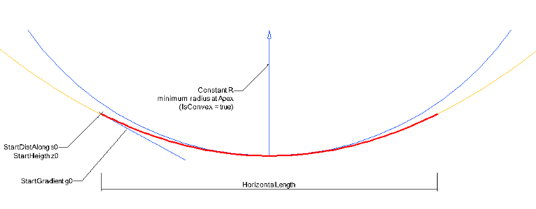

IfcAlignment2DVerSegParabolicArc
================================
The vertical parabolic segment is defined as a parabola using the inherited
attributes from _IfcAlignment2DVerticalSegment_ and the following additional
curve parameters _ParabolaConstant_ as the minimum radius of the parabolic arc
at its apex, and _IsConvex_ to indicate the whether the parabolic arc defined
a sag or a crest.  
  
The parabolic arc is described by (see figure 1):  
  
* R = signed _ParabolaConstant_, if _IsConvex_ = true, then -R, if _IsConvex_ = false, then +R as length measure  
* s\X\7E0\X\7E = _StartDistAlong_ as length measure  
* z\X\7E0\X\7E = _StartHeight_ as length measure  
* g\X\7E0\X\7E = _StartGradient_ as ratio measure  
*   
  
The following equations are used for any point along the parabola:  
  
* at any point s\X\7E1\X\7E along the _HorizontalLength_   
* the gradient g\X\7E1\X\7E = (s\X\7E1\X\7E-s\X\7E0\X\7E) / R + g\X\7E0\X\7E   
* the height z\X\7E1\X\7E = (s\X\7E1\X\7E-s\X\7E0\X\7E) \\\\* (g\X\7E1\X\7E+g\X\7E0\X\7E)/2 + z\X\7E0\X\7E   
  
  
  
---  
  
  
Legend:  
  
red: the parabolic curve with start point and calculated end point used as an
vertical alignment  
yellow: the underlying unbounded parabola definition  
  
blue: the minimum circle defined by the parabola constant agreeing to the "is
convex" fag, the constant, and the start gradient  
  
  

Figure 1 -- Alignment vertical segment parabola convex  
  
  
  
  
  
  
  
| start point
provided by _StartDistAlong_ and _StartHeight_  
instanteneous gradient provided by _StartGradient_ ,  
and length provided by _HorizontalLength_  
---|---  
  

Figure 3 -- Alignment vertical parabolic arc segment convex

|  
  
  
  
  
  
  
| start point
provided by _StartDistAlong_ and _StartHeight_  
instanteneous gradient provided by _StartGradient_ ,  
and length provided by _HorizontalLength_  
---|---  
  

Figure 3 -- Alignment vertical parabolic arc segment concave

|  
  
  
[ _bSI
Documentation_](https://standards.buildingsmart.org/IFC/DEV/IFC4_2/FINAL/HTML/schema/ifcgeometricconstraintresource/lexical/ifcalignment2dversegparabolicarc.htm)

