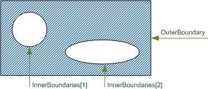

IfcAnnotationFillArea
=====================
The _IfcAnnotationFillArea_ defines an area by a definite _OuterBoundary_,
that might include _InnerBoundaries_. The areas defined by the
_InnerBoundaries_ are excluded from applying the fill area style. The
_InnerBoundaries_ shall not intersect with the _OuterBoundary_ nor being
outside of the _OuterBoundary_.  
  
The fill area style that is applied to the _IfcAnnotationFillArea_ is declared
using the _IfcFillAreaStyle_, associated to the area by an _IfcStyledItem_.
Applicable fill area styles are a solid color, a hatching, tiles, or a
combination of those styles.  
  
{ .extDef}  
> NOTE  Definition according to ISO 10303-46:  
> An annotation fill area is a set of curves that may be filled with hatching,
> colour or tiling. The annotation fill are is described by boundaries which
> consist of non-intersecting, non-self-intersecting closed curves. These
> curves form the boundary of planar areas to be filled according to the style
> for the annotation fill area.  
  
Figure 1 illustrates annotation fill area.  
  
  
  
      
  
---  
  
  
  

Figure 1 -- Annotation fill area

  
  
  
  
  
  
> NOTE  Entity adapted from **annotation_fill_area** defined in ISO10303-46  
  
> HISTORY  New entity in IFC2x2.  
  
{ .change-ifc2x3}  
> IFC2x3 CHANGE  The two attributes _OuterBoundary_ and _InnerBoundaries_ are
> added and replace the previous single boundary.  
  
{ .spec-head}  
Informal Propositions:  
  
1\. Any curve that describes an inner boundary shall not intersect with, nor
include, another curve defining an inner boundary.  
2\. The curve defining the outer boundary shall not intersect with any curve
defining an inner boundary, nor shall it be surrounded by a curve defining an
inner boundary.  
[ _bSI
Documentation_](https://standards.buildingsmart.org/IFC/DEV/IFC4_2/FINAL/HTML/schema/ifcpresentationdefinitionresource/lexical/ifcannotationfillarea.htm)

