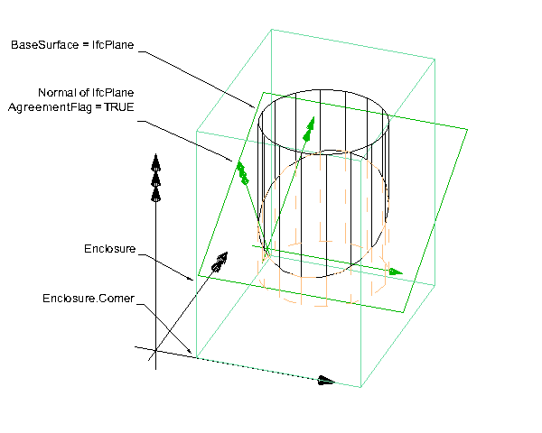

IfcBoxedHalfSpace
=================
The _IfcBoxedHalfSpace_ is used (as its supertype _IfcHalfSpaceSolid_) only
within Boolean operations. It divides the domain into exactly two subsets,
where the domain in question is that of the attribute _Enclosure_.  
  
The purpose of the attribute _Enclosure_ is to provide a search box for the
other operand in the Boolean operation. It shall be sufficiently large to
fully enclose the resulting solid after the Boolean operation with the half
space. It however does not alter the final result. The result of the Boolean
operation would be the same, as if executed by the supertype
_IfcHalfSpaceSolid_. See Figure 1 below.  
  
  
  
The _IfcBoundingBox_ that provides the enclosure is given for the convenience
of the receiving application to enable the use of size box comparison for
efficiency (for example, to check first whether size boxes intersect, if not
no calculations has to be done to check whether the solids of the entities
intersect).  
  
  
  
  
| The _Enclosure_ therefore helps to prevent dealing with infinite-size
related issues. The enclosure box is  
positioned within the object coordinate system, established by the
_ObjectPlacement_ of the element represented  
(for example, by _IfcLocalPlacement_ ). Figure 2 shows the _Enclosure_ box
being sufficiently large to  
fully enclose the Boolean result.  
  
---|---  
  
  
  

Figure 2 -- Boxed half space geometry

  
  
|  
  
  
  
  
  
  
{ .extDef}  
> NOTE  Definition according to ISO/CD 10303-42:1992  
> This entity is a subtype of the half space solid which is trimmed by a
> surrounding rectangular box. The box has its edges parallel to the
> coordinate axes of the geometric coordinate system.  
> The purpose of the box is to facilitate CSG computations by producing a
> solid of finite size.  
  
> NOTE  Entity adapted from **boxed_half_space** defined in ISO 10303-42.  
  
> HISTORY  New entity in IFC1.5.1  
  
{ .change-ifc2x4}  
> IFC4 CHANGE  Usage correct, position coordinate system for _Enclosure_ is
> the object coordinate system.  
[ _bSI
Documentation_](https://standards.buildingsmart.org/IFC/DEV/IFC4_2/FINAL/HTML/schema/ifcgeometricmodelresource/lexical/ifcboxedhalfspace.htm)

