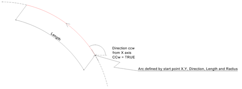

IfcCircularArcSegment2D
=======================
The circular arc segment uses the inherited attributes _StartPoint_ as the
start of the circular arc, _StartDirection_ as the tangent at the start point
and _SegmentLength_ as the arc length.  
  
  
  
  
|
  
---|---  
  

Figure 1 -- Circular arc segment 2D

|

Figure 2 -- Circular arc segment 2D CCW  
  
  
  
[ _bSI
Documentation_](https://standards.buildingsmart.org/IFC/DEV/IFC4_2/FINAL/HTML/schema/ifcgeometryresource/lexical/ifccirculararcsegment2d.htm)

Attribute definitions
---------------------
| Attribute   | Description                                                                                                                                                                                                                                                                  |
|-------------|------------------------------------------------------------------------------------------------------------------------------------------------------------------------------------------------------------------------------------------------------------------------------|
| Radius      | The radius of the circular arc                                                                                                                                                                                                                                               |
| IsCCW       | (counter-clockwise or clockwise) as the orientation of the circular arc with Boolean=\X2\201D\X0\true\X2\201D\X0\ being counter-clockwise, or \X2\201C\X0\to the left", and Boolean=\X2\201D\X0\false\X2\201D\X0\ being clockwise, or \X2\201C\X0\to the right\X2\201D\X0\\. |

