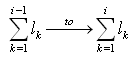
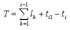
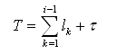

IfcCompositeCurve
=================
An _IfcCompositeCurve_ is a continuous curve composed of curve segments.  
  
Figure 1 illustrates an example of a composite curve.  
  
  
  
Consider an _IfcCompositeCurve_ having line segment and an arc segment. The
line should be parameterized:  
  
* _IfcPolyline_ with start= 0.,0. end= 0.,1., _SameSense_= TRUE, parametric length = 1.  
  
The arch should be parameterized:  
  
* _IfcTrimmedCurve_ with start= 180'', end= 90'', _SameSense_= FALSE, parametric length = 90.  
  
Then the parameterization of the composite curve is:  
  
* _IfcCompositeCurve_ with 0. ≤ T ≤ 1\. (line segment) and 1. ≤ T ≤ 91\. (arc segment), parametric length = 91.  
  
  
  
{ .extDef}  
> NOTE Definition according to ISO 10303-42:  
> A composite curve is a collection of curves joined end-to-end. The
> individual segments of the curve are themselves defined as composite curve
> segments. The parameterization of the composite curve is an accumulation of
> the parametric ranges of the referenced bounded curves. The first segment is
> parameterized from _0_ to _l\X\7E1\X\7E_ and for _i__≤__2_, the _i^th^_
> segment is parameterized from:  
>  
>>   
> where _l\X\7Ek\X\7E_ is the parametric length (i.e., difference between
> maximum and minimum parameter values) of the curve underlying the _k^th^_
> segment. Let _T_ denote the parameter for the composite curve. Then, if the
> _i_th segment is not a reparameterised composite curve segment, _T_ is
> related to the parameter _t\X\7Ei\X\7E_;
> _t\X\7Ei0\X\7E__≤__t\X\7Ei\X\7E__≤__t\X\7Ei1\X\7E_; for the _i_th segment by
> the equation:  
>  
>>  if
_Segments[i].SameSense_ = TRUE;  
> or by the equation:  
>  
>>  if
_Segments[i].SameSense_ = FALSE;  
> If the segments[i] is of type reparameterised composite curve segment,  
>  
>>  where _τ_ is defined at
reparameterized composite curve segment (see
_IfcReparameterizedCompositeCurveSegment_).  
  
  
>  
> NOTE  Entity adapted from **composite_curve** defined in ISO 10303-42.  
  
> HISTORY  New entity in IFC1.0  
  
{ .spec-head}  
Informal Propositions:  
  
1\. The _SameSense_ attribute of each segment correctly specifies the senses
of the component curves. When traversed in the direction indicated by
_SameSense_, the segments shall join end-to-end.  
[ _bSI
Documentation_](https://standards.buildingsmart.org/IFC/DEV/IFC4_2/FINAL/HTML/schema/ifcgeometryresource/lexical/ifccompositecurve.htm)

Attribute definitions
---------------------
| Attribute     | Description                                                                                                  |
|---------------|--------------------------------------------------------------------------------------------------------------|
| Segments      |                                                                                                              |
| SelfIntersect | Indication of whether the curve intersects itself or not; this is for information only.                      |
| NSegments     | The number of component curves.                                                                              |
| ClosedCurve   | Indication whether the curve is closed or not; this is derived from the transition code of the last segment. |

