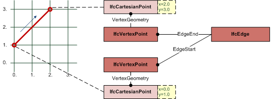

IfcEdge
=======
An _IfcEdge_ defines two vertices being connected topologically. The geometric
representation of the connection between the two vertices defaults to a
straight line if no curve geometry is assigned using the subtype
_IfcEdgeCurve_. The _IfcEdge_ can therefore be used to exchange straight edges
without an associated geometry provided by _IfcLine_ or _IfcPolyline_ thought
_IfcEdgeCurve.EdgeGeometry_.  
  
  
  
  
  
  
|

> EXAMPLE  Figure 1 illustrates an example where the bounds of the _IfcEdge_
> are given by the _EdgeStart_ and _EdgeEnd_ ; this also determines the
> direction of the edge. The location within a coordinate space is determined
> by the _IfcVertexPoint_ type for _EdgeStart_ and _EdgeEnd_. Since no edge
> geometry is assigned, it defaults to a straight line agreeing to the
> direction sense.

  
  
---|---  
  

Figure 1 -- Edge representation

|  
  
  
  
  
  
{ .extDef}  
> NOTE  Definition according to ISO/CD 10303-42:1992  
> An edge is the topological construct corresponding to the connection of two
> vertices. More abstractly, it may stand for a logical relationship between
> two vertices. The domain of an edge, if present, is a finite, non-self-
> intersecting open curve in _R^M^_, that is, a connected 1-dimensional
> manifold. The bounds of an edge are two vertices, which need not be
> distinct. The edge is oriented by choosing its traversal direction to run
> from the first to the second vertex. If the two vertices are the same, the
> edge is a self loop. The domain of the edge does not include its bounds, and
> 0 ≤ Ξ ≤ ∞. Associated with an edge may be a geometric curve to locate the
> edge in a coordinate space; this is represented by the edge curve subtype.
> The curve shall be finite and non-self-intersecting within the domain of the
> edge. An edge is a graph, so its multiplicity M and graph genus _G^e^_ may
> be determined by the graph traversal algorithm. Since _M_ = _E_ = 1, the
> Euler equation (1) reduces in the case to:  
>>   
> where _V_ = 1 or 2, and _G^e^_ = 1 or 0. Specifically, the topological edge
> defining data shall satisfy: > * an edge has two vertices
>   
> * the vertices need not be distinct   
> * Equation shall hold   
  
> NOTE  Entity adapted from **edge** defined in ISO 10303-42.  
  
> HISTORY  New entity in IFC2.0  
  
{ .spec-head}  
Informal Propositions:  
  
1\. The edge has dimensionality 1.  
2\. The extent of an edge shall be finite and nonzero.  
[ _bSI
Documentation_](https://standards.buildingsmart.org/IFC/DEV/IFC4_2/FINAL/HTML/schema/ifctopologyresource/lexical/ifcedge.htm)

Attribute definitions
---------------------
| Attribute   | Description   |
|-------------|---------------|
| EdgeEnd     |               |
| EdgeStart   |               |

