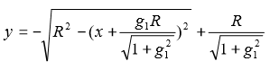
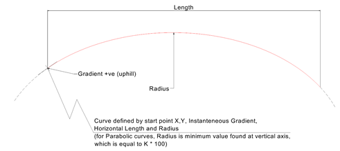
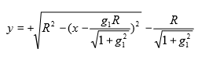
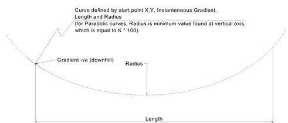

IfcAlignment2DVerSegCircularArc
===============================
The vertical circular arc segment is defined as an arc using the inherited
attributes from _IfcAlignment2DVerticalSegment_ and the following additional
curve parameters _Radius_ as the radius of the circular arc, and _IsConvex_ to
indicate the whether the circular arc defines a sag (i.e. concave, increasing
gradiant) or a crest (i.e. convex, decreasing gradiant).  
  
The circular arc is described by:  
  
* x = offset as length measure relative to start of curve segment (i.e. 0 is at head).  
* g\X\7E1\X\7E = _StartGradient_ as ratio measure  
*   
* R = _Radius_ as length measure  
  
For crest curves (where _IsConvex_ is True), the elevation of a point along
the curve (relative to _StartHeight_) is defined as:  
  
  
| start point provided
by _StartDistAlong_ and _StartHeight_  
instanteneous gradient provided by _StartGradient_ ,  
and length provided by _HorizontalLength_  
---|---  
  

Figure 1 -- Alignment vertical arc segment convex

|  
  
  
  
  
  
For sag curves (where _IsConvex_ is False), the elevation of a point along the
curve (relative to _StartHeight_) is defined as:  
  
  
| start point provided
by _StartDistAlong_ and _StartHeight_  
instanteneous gradient provided by _StartGradient_ ,  
and length provided by _HorizontalLength_  
---|---  
  

Figure 2 -- Alignment vertical arc segment concave

|  
  
  
[ _bSI
Documentation_](https://standards.buildingsmart.org/IFC/DEV/IFC4_2/FINAL/HTML/schema/ifcgeometricconstraintresource/lexical/ifcalignment2dversegcirculararc.htm)

