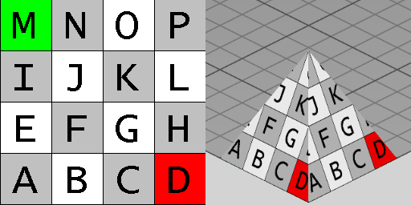

IfcRectangularPyramid
=====================
The _IfcRectangularPyramid_ is a Construction Solid Geometry (CSG) 3D
primitive. It is a solid with a rectangular base and a point called apex as
the top. The tapers from the base to the top. The axis from the center of the
base to the apex is perpendicular to the base. The inherited _Position_
attribute defines the _IfcAxisPlacement3D_ and provides the location and
orientation of the pyramid:  
  
* _SELF\\\IfcCsgPrimitive3D.Position_: The location and orientation of the axis system for the primitive.   
* _SELF\\\IfcCsgPrimitive3D.Position.Location_: The center of the circular area being the bottom face of the cone.  
* _SELF\\\IfcCsgPrimitive3D.Position.Position[3]:_ The z-axis of the inherited placement coordinate system provides the center axis of the _IfcRightCircularCone_, and the apex is at the _Height_ value applied to the positive direction of the z-axis. The _BottomRadius_ defines the circular base at the xy-plane of the placement coordinate system.  
  
As shown in Figure 1, the pyramid is positioned within its own placement
coordinate system. The origin is the center of the bottom rectangle, that lies
in the XY plane. The apex lies on the positive z axis at [0, 0, _Height_].  
  
  
  
> HISTORY  New entity in IFC2x3  
  
{ .use-head}  
Texture use definition  
  
On each triangular side face, textures are aligned facing upright. Textures
are stretched or repeated to the extent of the base of each face according to
RepeatS. Textures are stretched or repeated towards the top point according to
Repeat T, where the top point has coordinates of (0.5,1.0) if RepeatT is
False.  
  
On the bottom face, textures are aligned facing front-to-back.  
  
Figure 2 illustrates default texture mapping with a clamped texture
(RepeatS=False and RepeatT=False). The image on the left shows the texture
where the S axis points to the right and the T axis points up. The image on
the right shows the texture applied to the geometry where the X axis points
back to the right, the Y axis points back to the left, and the Z axis points
up.  
  
  
  
{ .gridtable}  
  
  
  
  
---  
  
  
  
  
  
| Side  
| Normal  
| Origin X  
| Origin Y  
| Origin Z  
| S Axis  
| T Axis  
  
---|---|---|---|---|---|---  
  
  
Left  
| -X  
| 0  
| +YLength  
| 0  
| -Y  
| (towards top point)  
  
  
  
Right  
| +X  
| +Xlength  
| 0  
| 0  
| +Y  
| (towards top point)  
  
  
  
Front  
| -Y  
| 0  
| 0  
| 0  
| +X  
| (towards top point)  
  
  
  
Back  
| +Y  
| +XLength  
| +YLength  
| 0  
| -X  
| (towards top point)  
  
  
  
Bottom  
| -Z  
| +XLength  
| 0  
| 0  
| -X  
| +Y  
  
  
  
  
  
  
  
  

Figure 2 -- Rectangular pyramid textures

  
  
  
  
  
[ _bSI
Documentation_](https://standards.buildingsmart.org/IFC/DEV/IFC4_2/FINAL/HTML/schema/ifcgeometricmodelresource/lexical/ifcrectangularpyramid.htm)

