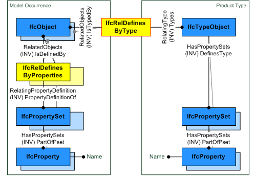

IfcRelDefinesByType
===================
The objectified relationship _IfcRelDefinesByType_ defines the relationship
between an object type and object occurrences. The _IfcRelDefinesByType_ is a
1-to-N relationship, as it allows for the assignment of one type information
to a single or to many objects. Those objects then share the same object type,
and the property sets and properties assigned to the object type.  
  
The _IfcRelDefinesByType_ links the object type definition with the object
occurrence. Both may define properties by assigning an _IfcPropertySet_,
including one or many subtypes of _IfcProperty_ to either the object type or
object occurrence, as shown in Figure 1.  
  
There are several scenarios to define the same property set on the object type
definition and object occurrence side:  
  
1\. All properties for all object occurrences of a common object type have the
same value - then only the object type definition has a property set assigned.  
2\. All properties for all object occurrences are different, that is there are
no common property values for the object type definition - then each of the
object occurrence has a property set assigned.  
3\. Some properties within the same property set have common values and are
assigned to the object type definition and some are occurrence specific and
assigned (with potentially different values) to the object occurrences - then:  
* The sum of all properties within a given property set applicable to an object occurrence is the union of properties assigned to the object type definition plus the properties assigned to the object occurrence.  
* If the object occurrence has a property with the same _IfcProperty.Name_ in an _IfcPropertySet_, as the corresponding object type definition, then the occurrence property value overrides the type property value.   
  
  
  
---  
  

Figure 1 -- Type definition relationships

  
  
  
The following table provides an example of assigning  
  
  
  
|  **properties assigned to _IfcWall_**  
|  **properties assigned to _IfcWallType_**  
|  **resulting property value for individual wall**  
  
---|---|---  
  
  
 _Pset_WallCommon_  
|  _Pset_WallCommon_  
|  \S\  
  
  
  
_\S\ -\S\ ExtendToStructure = TRUE_  
| \S\  
| TRUE  
  
  
  
\S\  
| _\S\ -\S\ ThermalTransmittance_ = 0.375  
| 0.375  
  
  
  
 _\S\ -\S\ ExtendToStructure_ = FALSE  
|  _\S\ -\S\ ExtendToStructure_ = TRUE  
| FALSE  
  
  
  
  
> HISTORY  New entity in IFC2x.  
  
{ .change-ifc2x4}  
> IFC4 CHANGE  The attribute _RelatedObjects_ had been demoted from the
> supertype _IfcRelDefines_ to _IfcRelDefinesByType_.  
[ _bSI
Documentation_](https://standards.buildingsmart.org/IFC/DEV/IFC4_2/FINAL/HTML/schema/ifckernel/lexical/ifcreldefinesbytype.htm)

