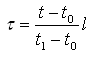

IfcReparametrisedCompositeCurveSegment
======================================
The _IfcReparametrisedCompositeCurveSegment_ is geometrically identical to a
_IfcCompositeCurveSegment_ but with the additional capability of
reparametrization.  
  
{ .extDef}  
> NOTE  Definition according to ISO/CD 10303-42:1992  
> The reparametrised composite curve segment is a special type of composite
> curve segment which provides the capability to re-define its parametric
> length without changing its geometry.  
>  
> If t\X\7E0\X\7E ≤ t ≤ t\X\7E1\X\7E is the parameter range of _ParentCurve_,
> the new parameter . for the reparametrised composite curve segment is given
> by the equation:  
{ .extDef}  
>>  if
_SameSense_ = TRUE;  
> or by the equation:  
{ .extDef}  
>>  if
_SameSense_ = FALSE;  
  
  
>  
> NOTE  Entity adapted from **reparametrised_composite_curve_segment** in ISO
> 10303-42.  
  
> HISTORY  New entity in IFC4  
[ _bSI
Documentation_](https://standards.buildingsmart.org/IFC/DEV/IFC4_2/FINAL/HTML/schema/ifcgeometryresource/lexical/ifcreparametrisedcompositecurvesegment.htm)

Attribute definitions
---------------------
| Attribute   | Description   |
|-------------|---------------|
| ParamLength | $             |

