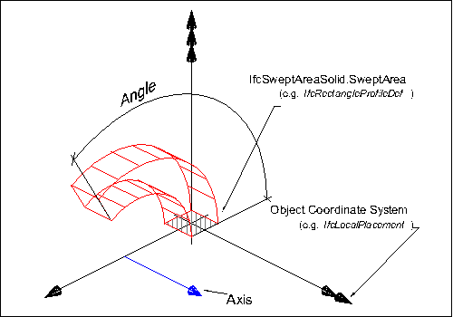
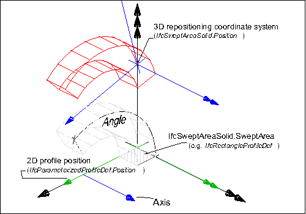
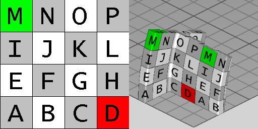

IfcRevolvedAreaSolid
====================
An _IfcRevolvedAreaSolid_ is a solid created by revolving a cross section
provided by a profile definition about an axis.  
  
The resulting solid is positioned by the _IfcSweptAreaSolid_._Position_
relative to the object coordinate system. If provided, it allows to reposition
the revolved solid. If not provided, it defaults to the current object
coordinate system. The axis and the cross section shall be in the same plane,
prior to any repositioning.  
  
> NOTE  Both the axis and the cross section are required to lie in the xy
> plane of the object position coordinate system.  
  
  
  
  
|

> EXAMPLE  Figure 1 illustrates geometric parameters of the revolved solid.
> The revolved area solid defines the revolution of a 2D area (given by a
> profile definition) by an axis and angle. The result is a solid. The swept
> area is given by a  
> profile definition.

  

>  
>
>
>  
>
>   * The profile is defined:  
>
>     * as a 2D primitive, here _IfcRectangleProfileDef_ , that is placed
> relative to the xy plane of object coordinate system
>  
>
>     * since no 2D profile position coordinate system is provided, here
> _IfcParameterizedProfileDef_. _Position_ = NIL, the profile is positioned
> without transformation into the xy plane of the object coordinate system (by
> default, centric at 0.,0. with no rotation)
>  
>  
>
>   * The resulting swept solid is not repositioned, as no position coordinate
> system is provided, here IfcSweptAreaSolid. _Position_ = NIL.
>  
>
  
>

  

> The _AxisLine_ can have any orientation within the XY plane, it does not
> have to be parallel to the y-axis as  
> shown in the illustration.

  
  
  
---|---  
  
  
  

Figure 1 -- Revolved area solid geometry

  
  
  
  
  
  
  
  
  
|

> EXAMPLE  Figure 1 illustrates geometric parameters and additional
> positioning parameters of the revolved area solid. The revolved area solid
> defines the rotation of a 2D area by an axis and angle. The 2D area,
> provided by a parameterized profile definition, can be positioned relative
> to the object coordinate system (other then by default at 0.,0. with no
> rotation). The result is a solid that can be repositioned within the object
> coordinate system.

  

>  
>
>   * The profile to be swept is defined:  
>  
>
>     * as a 2D primitive, here _IfcRectangleProfileDef_ , that is placed
> relative to the xy plane of object coordinate system
>  
>
>     * a 2D profile position coordinate system is provided that positions the
> profile relative to the xy plane (here at a corner of the rectangle)
>  
>
>  
>
>   * The resulting swept solid is repositioned, here it is moved into local z
> and rotated by 15'' along the x axis.
>  
>

  
  
  
---|---  
  
  
  

Figure 2 -- Repositioned revolved area solid geometry

  
  
  
  
  
  
{ .extDef}  
> NOTE  Definition according to ISO/CD 10303-42:1992  
> A revolved area solid is a solid formed by revolving a planar bounded
> surface about an axis. The axis shall be in the plane of the surface and the
> axis shall not intersect the interior of the bounded surface. The bounded
> surface may have holes which will sweep into holes in the solid. The
> direction of revolution is clockwise when viewed along the axis in the
> positive direction. More precisely if **A** is the axis location and **d**
> is the axis direction and **C** is an arc on the surface of revolution
> generated by an arbitrary point **p** on the boundary of the swept area,
> then **C** leaves **p** in direction **d** x (**p** - **A**) as the area is
> revolved.  
  
> NOTE  Entity adapted from **revolved_area_solid** defined in ISO 10303-42.  
  
> HISTORY  New entity in IFC1.5  
  
{ .spec-head}  
Informal Propositions:  
  
1\. The _AxisLine_ shall lie in the plane of the _SweptArea_ (as defined at
supertype _IfcSweptAreaSolid_).  
2\. The _AxisLine_ shall not intersect the interior of the _SweptArea_ (as
defined at supertype _IfcSweptAreaSolid_).  
3\. The _Angle_ shall be between 0° and 360°, or 0 and 2π (depending on the
unit type for _IfcPlaneAngleMeasure_).  
  
{ .use-head}  
Texture Use Definition  
  
For side faces, textures are aligned facing upright along the sides with
origin at the first point of an arbitrary profile, and following the outer
bound of the profile counter-clockwise (as seen from above). For parameterized
profiles, the origin is defined at the +Y extent for rounded profiles (having
no sharp edge) and the first sharp edge counter-clockwise from the +Y extent
for all other profiles. Textures are stretched or repeated on each side along
the outer boundary of the profile according to _RepeatS_. Textures are
stretched or repeated on each side along the outermost (longest) revolution
path according to _RepeatT_, where coordinates are compressed towards the axis
of revolution.  
  
For top and bottom caps, textures are aligned facing front-to-back, with the
origin at the minimum X and Y extent. Textures are stretched or repeated on
the top and bottom to the extent of each face according to _RepeatS_ and
_RepeatT_.  
  
For profiles with voids, textures are aligned facing upright along the inner
side with origin at the first point of an arbitrary profile, and following the
inner bound of the profile clockwise (as seen from above). For parameterized
profiles, the origin of inner sides is defined at the +Y extent for rounded
profiles (having no sharp edge such as hollow ellipses or rounded rectangles)
and the first sharp edge clockwise from the +Y extent for all other profiles.  
  
  
  
  
|  

> Figure 3 illustrates default texture mapping with a repeated texture
> (RepeatS=True and RepeatT=True). The image on  
> the left shows the texture where the S axis points to the right and the T
> axis points up. The image on the right shows  
> the texture applied to the geometry where the X axis points back to the
> right, the Y axis points back to the left, and  
> the Z axis points up. For an _IfcRevolvedAreaSolid_ having a profile of
> _IfcTShapeProfileDef_ and  
> revolved at 22.5 degrees, the side texture coordinate origin is the first
> corner counter-clockwise from the +Y axis,  
> which equals  
>  
> (-0.5*IfcTShapeProfileDef.OverallWidth,
> +0.5*IfcTShapeProfileDef.OverallDepth),  
>  
>  while the top (end cap)  
> texture coordinates start at  
>  
> (-0.5*IfcTShapeProfileDef.OverallWidth,
> -0.5*IfcTShapeProfileDef.OverallDepth).

  
  
  
---|---  
  
  
  

Figure 3 -- Revolved area solid textures

  
  
  
  
  
[ _bSI
Documentation_](https://standards.buildingsmart.org/IFC/DEV/IFC4_2/FINAL/HTML/schema/ifcgeometricmodelresource/lexical/ifcrevolvedareasolid.htm)

Attribute definitions
---------------------
| Attribute   | Description                                                                                                                                                         |
|-------------|---------------------------------------------------------------------------------------------------------------------------------------------------------------------|
| Angle       | The angle through which the sweep will be made. This angle is measured from the plane of the swept area provided by the XY plane of the position coordinate system. |
| AxisLine    | The line of the axis of revolution.                                                                                                                                 |

Formal Propositions
-------------------
| Rule              | Description   |
|-------------------|---------------|
| AxisStartInXY     |               |
| AxisDirectionInXY |               |

Associations
------------
| Attribute   | Description   |
|-------------|---------------|
| Axis        |               |

