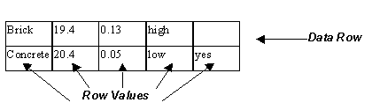

IfcTableRow
===========
_IfcTableRow_ contains data for a single row within an _IfcTable_.  
  
Limitation: For backward compatibility, all _IfcTableRow_ objects referenced
by an _IfcTable_ shall have the same number of Row Cells. The actual number of
Cells shall be taken from the number of cells of the first _IfcTableRow_ for
that table. The number of Cells is calculated by the derived attribute
_NumberOfCellsInRow_ in the associated _IfcTable_.  
  
> NOTE  The attribute _IsHeading_ exists for backward compatibility.
> _IfcTableColumn_ should be used instead beginning with IFC4.  
  
  
  
  
  
  
|  
Figure 337 illustrates table row use.  
  
  
---|---  
  
  
  

  
Figure 337 -- Table row use  

  
  
|  

  
  

  
  
  
  
  
  
  
  
|  
Figure 338 depicts how table rows were structured prior  
to IFC4 with the use of the _IsHeading_ flag. Note  
that the use of the _IfcTableColumn_ constructs  
should be used instead of the _IsHeading_ flag  
(which remains for backward compatibility only).  
  
  
  
  
  

  
Figure 338 -- Table row use alternative  

  
  
|  

  
  

  
  
  
  
  
  
> HISTORY  New entity in IFC1.5.  
[ _bSI
Documentation_](https://standards.buildingsmart.org/IFC/DEV/IFC4_2/FINAL/HTML/schema/ifcutilityresource/lexical/ifctablerow.htm)

Attribute definitions
---------------------
| Attribute   | Description                                                                                                                                                   |
|-------------|---------------------------------------------------------------------------------------------------------------------------------------------------------------|
| RowCells    | The data value of the table cell..                                                                                                                            |
| IsHeading   | Flag which identifies if the row is a heading row or a row which contains row values. \X\0D> NOTE - If the row is a heading, the flag takes the value = TRUE. |

