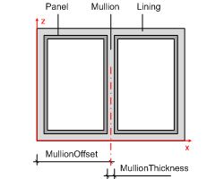
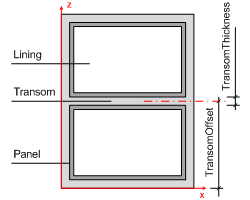
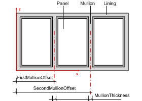
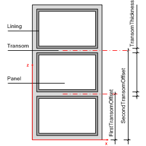

IfcWindowLiningProperties
=========================
The window lining is the outer frame which enables the window to be fixed in
position. The window lining is used to hold the window panels or other
casements. The parameter of the _IfcWindowLiningProperties_ define the
geometrically relevant parameter of the lining.  
  
> NOTE  The _IfcWindowLiningProperties_ shall only be applied to construct the
> 3D shape of a window, if the attribute
> _IfcWindowType_.ParameterTakesPrecedence is set TRUE.  
  
The _IfcWindowLiningProperties_ are included in the set of properties of
_IfcWindowStyle.HasPropertySets_. More information about the window lining can
be included in the same set of the _IfcWindowType_ using another
_IfcPropertySet_ for dynamic extensions.  
  
The _IfcWindowLiningProperties_ does not hold a geometric representation.
However it defines parameters which can be used to create the shape of the
window type(which is inserted by the _IfcWindow_ into the spatial context of
the project) as shown in Figure 1. The parameters at the
_IfcWindowLiningProperties_ define a standard window lining, including (if
given) a mullion and a transom (for horizontal and vertical splits). The outer
boundary of the lining is determined by the ''Profile'' shape representation
assigned to the _IfcWindow_, which inserts the _IfcWindowType_.  
  
  
  
  
  
  
  
  
|   
| The lining is applied to all faces of the opening reveal. The parameter are:  

  

  * _LiningDepth_
  

  * _LiningThickness_
  

  * _LiningOffset_
  

  * _LiningToPanelOffsetX_
  

  * _LiningToPanelOffsetY_
  

  
The inner side is defined as the direction of the window panel opening
operation.  
  
  
---|---  
  
  
  
|  
If the _OperationType_ of the window style is  

  

  * DoublePanelVertical (shown)
  

  * TriplePanelBottom
  

  * TriplePanelTop
  

  * TriplePanelLeft
  

  * TriplePanelRight
  

  
the following additional parameter apply:  

  

  * _MullionThickness_
  

  * _FirstMullionOffset_ measured as offset to the Z axis (in XZ plane) as a normalized ratio measure
  

  
  
  
  
  
  
|  
If the _OperationType_ of the window type is:  

  

  * DoublePanelHorizontal
  

  * TriplePanelBottom
  

  * TriplePanelTop
  

  * TriplePanelLeft
  

  * TriplePanelRight
  

  
the following additional parameter apply  

  

  * _TransomThickness_
  

  * _FirstTransomOffset_ measured as offset to the X axis (in XZ plane) as a normalized ratio measure
  

  
  
  
  
  
  
|  
If the _OperationType_ of the window type is:  

  

  * TriplePanelVertical
  

  
the following additional parameter apply:  

  

  * _SecondMullionOffset_ measured as offset to the Z axis (in XZ plane) as a normalized ratio measure
  

  
  
  
  
  
  
|  
If the _OperationType_ of the window type is:  

  

  * TriplePanelHorizontal
  

  
the following additional parameter apply:  

  

  * _SecondTransomOffset_ measured as offset to the X axis (in XZ plane) as a normalized ratio measure
  

  
  
  
  
  
  
  
  
  

Figure 1 -- Window lining properties

  
  
  
  
  
> HISTORY  New entity in IFC2.0. Has been renamed from _IfcWindowLining_ in
> IFC2x.  
  
{ .change-ifc2x4}  
> IFC4 CHANGE  The following attributes have been added _LiningOffset_,
> _LiningToPanelOffsetX_, _LiningToPanelOffsetY_. The attribute
> _ShapeAspectStyle_ is deprecated and shall no longer be used. Supertype
> changed to new _IfcPreDefinedPropertySet_.  
[ _bSI
Documentation_](https://standards.buildingsmart.org/IFC/DEV/IFC4_2/FINAL/HTML/schema/ifcarchitecturedomain/lexical/ifcwindowliningproperties.htm)

