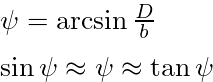

IfcAlignmentCantSegmentTypeEnum
===============================

The IfcAlignmentCantSegmentTypeEnum indicates the type of a segment of a cant alignment segment (IfcAlignmentCantSegment). 

Cant is defined as the amount by which one running rail is raised above the other running rail, in a track cross section.
&gt;NOTE Definition according to EN 13803/2017

For 3D modeling both the cant value and the cant angle (bank angle, lateral angle, cross slope angle) are relevant.

The relation between cant value **D**, Railhead distance **b** and cant angle **&psi;** is shown below.

&gt;NOTE in contempory track engineering &psi; is approximated by sinus of &psi; or tangens of &psi; very often.

| Variation of Cant | Segmenttype        | Enumeration Values |
|:----|:------------------|:----------|
| 0 |  both rails without relative elevation        | CONSTANTCANT  |
| constant in the complete segment, <> 0 | elevated rail  | CONSTANTCANT |
| variation along the segment | Transition with linear cant variation | LINEARTRANSITION   |
| variation along the segment | Transition with non-linear cant variation | HELMERTCURVE, BLOSSCURVE, COSINECURVE, SINECURVE, VIENNESEBEND |

**Cant variation in high performance transition bends**

While for combinations of horizontal clothoids and linear cant transitions the extension along the base line differs in some cases, curvature transition and cant transition for high performance horizontal transition bends are expected to have the same start position and end position. In some regulations the same linear extension requirement is mandatory for high performance transition bends.

Whether the cant variation is defined by the same base formula as the curvature of the corresponding horizontal high performance transition bend or by a linear ramp also might differ between regulations.

**Used Symbols and their meaning**

| Symbol | meaning  | Unit, value range |
|:----|:------------------|:----------|
| L | full length of segment        | positive length  L > 0 |
| s | current position on segment        | 0 < s < L |
| &xi;  |  = s / L  (Greek "xi") standardised, dimensionless path length along the alignment / track centre line        | 0 < &xi; < 1 |
|  D |  cant .... amount by which one running rail is raised above the other running rail, in a track cross section         | length  |
| D1 | cant at beginning of the alignment segment        | length  |
| D(s) | variable cant at station "s" along the alignment cant segment.  | length |
|  b |  Railhead distance;  distance between the nominal centre points of the two contact patches of a wheelset (e.g. about 1500 mm for nominal track gauge 1435 mm)        | length  |
| &psi; | (Greek "psi") Angle of cant (cross slope angle, bank angle)        | rad |
| &phi; | (Greek "phi") Directional angle (azimuth, bearing)  | rad |

&gt;NOTE Symbols according to EN 13803/2017
