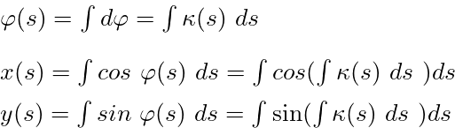

IfcAlignmentHorizontalSegmentTypeEnum
=====================================

The IfcAlignmentHorizontalSegmentTypeEnum indicates the type of a segment of a horizontal alignment segment (IfcAlignmentHorizontalSegment). Horizontal segments can be viewed from a geometric perspective and from a kinematic perspective. In recent times the kinematic perspective gained importance. The enumerations are detailed according to this development especially in modern track design.

**Kinematic perspective on horizontal alignment segments**

The central parameter of the kinematic perspective is lateral acceleration of the vehicle induced by change of direction while driving. In the horizontal layout this is the represented by the curvature of the segment. According to the curvature value the following categorization can be made:

| Curvature | Segmenttype        | Enumeration Values |
|:----|:------------------|:----------|
| 0 | straight line        | LINE |
| constant in the complete segment, <> 0 | Circular arc  | CIRCULARARC |
| variation along the segment | Transition with linear curvature variation | CLOTHOID, CUBIC  |
| variation along the segment | Transition with non-linear curvature variation | HELMERTCURVE, BLOSSCURVE, COSINECURVE, SINECURVE, VIENNESEBEND |

**Geometric perspective on horizontal alignment segments**

The traditional view is denoted by the geometric perspective in the context of the business terminology related IfcAlignment documentation. Before the availability of modern computers alignment design was performed using "traditional" drawing techniques. In the first phase of computerization this origin led to a representation in the x,y space first and a check of safety related properties in a second step. This can still be seen in regulations which have been put into effect 1980 or earlier. Of course designs which have been produced on basis of these regulations reflect the "good enough" attitude in the precision of the documentation. 

In a later phase an increasing importance of the kinematic perspective can be observed. Here precise control of the lateral acceleration (horizontal and cant layout) and vertical acceleration (vertical layout) became prevalent. Designers started to use high performance transition bends especially in high speed scenarios. In the kinematic perspective precise curvature fitting between consecutive segments needs to be better than in the "good enough" approach of traditional geometric perspective. Central terms are e.g. "jerks", "theoretical cant" or "cant deficiency".

**Generic calculation of intrinsic x, y-coordinates for a given curvature**

For each horizontal alignment segment with a known curvature formula a generic method to calculate segment intrinsic coordinates exists.

>NOTE:&nbsp;While it is possible to apply the generic calculation also for trivial cases like LINE or CIRCULARARC it is much more efficient to use available formulas.

**Word of warning**

"Good enough" traditional designs have to be carefully checked before being included into a high precision 3D model. Intermediate corrections might be necessary. Fortunately the clothoid works very well with comparable documentation quality both in the classic geometric perspective and in the more recent kinematic perspective. Fortunately the vast majority of horizontal transition bends are designed and implemented as clothoids.

**Recommendation**

Check the relevant regulations for the network in question. Alignment designs as such are very stable over the lifetime of the road or track. Especially for old designs quality and precision of available documentation has to be checked very carefully. A clear understanding of limitations should be established before implementing automated data flows between high precision BIM environments and legacy documentation systems. This applies both to legacy, central databases and to legacy, individual documents. 

**Used Symbols and their meaning**

| Symbol | meaning  | Unit, value range |
|:----|:------------------|:----------|
| L | full length of segment        | positive length  L > 0 |
| s | current position on segment        | 0 < s < L |
| &xi;  |  = s / L  (Greek "xi") standardised, dimensionless path length along the alignment / track centre line        | 0 < &xi; < 1 |
|  &kappa; | (Greek "kappa") Curvature (inverse radius) of the alignment / track centre line in plan view (horizontal layout).        | 1/radius  |
| &kappa;1 | Curvature (inverse radius) at beginning of the alignment / track centre line in plan view (horizontal layout).        | 1/radius  |
| h | height of the gravity center line used for calculation above the track centreline in the ground plan.  | length |
| &psi; | (Greek "psi") Angle of cant (cross slope angle, bank angle)        | rad |
| &phi; | (Greek "phi") Directional angle (azimuth, bearing)  | rad |
| x(s) | variable longitudinal coordinate of the projection of the alignment / track centreline into the ground plan.  | length |
| y(s) | variable transverse coordinate of the projection of the alignment / track centreline into the ground plan.  | length |

**Terminology**

**Intrinsic coordinate, intrinisc coordinate system of an alignment segment:**

The origin of an intrinsic coordinate system is the start of the segment. The direction of the positive x-axis is the start direction of the segments.
