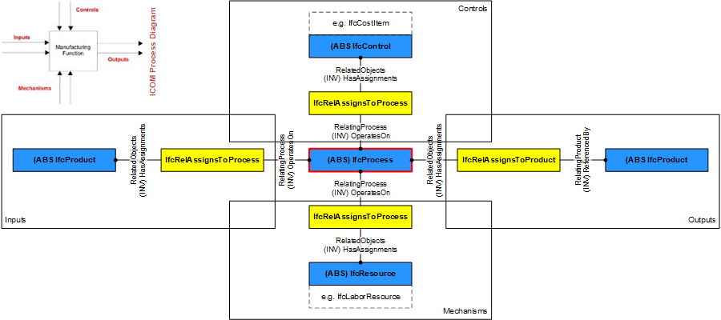

# IfcProcess

_IfcProcess_ is defined as one individual activity or event, that is ordered in time, that has sequence relationships with other processes, which transforms input in output, and may connect to other processes through input output relationships. An _IfcProcess_ can be an activity (or task), or an event. It takes usually place in building construction with the intent of designing, costing, acquiring, constructing, or maintaining products or other and similar tasks or procedures. Figure 1 illustrates process relationships.
<!-- end of short definition -->

{ .extDef}
> NOTE Definition according to ISO9000:
> A process is a set of activities that are interrelated or that interact with one another. Processes use resources to transform inputs into outputs. Processes are interconnected because the output from one process becomes the input for another process. In effect, processes are "glued" together by means of such input output relationships.

Process information relates to other objects by establishing the following relationships:

* **Nesting of processes** : _IfcRelNests_ - A process can contain sub processes and thereby be nested.
* **Sequencing of processes** : _IfcRelSequence_ - Processes can be placed in sequence (including overlapping for parallel tasks), and have predecessors and successors.
* **Assigning process to schedules** : _IfcRelAssignsToControl_ - Activities such as tasks, and predominately summary tasks, are assigned to a work schedule.
* **Having a product assigned to the process as input** : _IfcRelAssignsToProcess_ - Products can be assigned as input to a process, such as for construction process planning.
* **Having a product assigned to the process as output** : _IfcRelAssignsToProduct_ - Products can be assigned as output to a process, such as for construction process planning.
* **Having a control assigned to the process as process control** : _IfcRelAssignsToProcess_ - Items that act as a control onto the process can be assigned to a process, such as for cost management (a cost item assigned to a work task).
* **Having a resource assigned to the process as consumed by the process** : _IfcRelAssignsToProcess_ - Items that act as a mechanism to a process, such as labor, material and equipment in cost calculations.

> HISTORY New entity in IFC1.0.

{ .change-ifc2x}
> IFC2x CHANGE The attribute _Productivity_ has been removed.

{ .change-ifc2x4}
> IFC4 CHANGE The attribute _Identification_ has been promoted from subtypes _IfcTask_ and others.

## Attributes

### Identification
An identifying designation given to a process or activity.
  It is the identifier at the occurrence level.

{ .change-ifc2x4}
> IFC4 CHANGE Attribute promoted from subtypes.

### LongDescription
An extended description or narrative that may be provided.
{ .change-ifc2x4}
> IFC4 CHANGE New attribute.

### IsPredecessorTo
Dependency between two activities, it refers to the subsequent activity for which this activity is the predecessor. The link between two activities can include a link type and a lag time.

### IsSuccessorFrom
Dependency between two activities, it refers to the previous activity for which this activity is the successor. The link between two activities can include a link type and a lag time.

### OperatesOn
Set of relationships to other objects, e.g. products, processes, controls, resources or actors, that are operated on by the process.

## Concepts

### Property Sets for Objects

