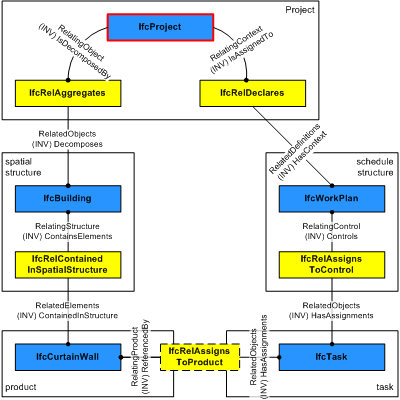
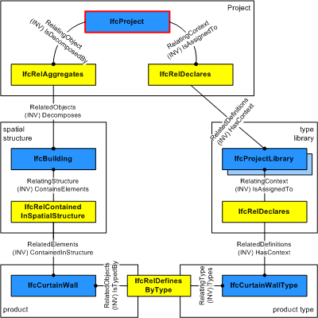

# IfcProject

_IfcProject_ indicates the undertaking of some design, engineering, construction, or maintenance activities leading towards a product. The project establishes the context for information to be exchanged or shared, and it may represent a construction project but does not have to. The _IfcProject_'s main purpose in an exchange structure is to provide the root instance and the context for all other information items included.

The context provided by the _IfcProject_ includes:

* the default units
* the geometric representation context for exchange structures including shape representations
    * the project coordinate system
    * the coordinate space dimension
    * the precision used within the geometric representations
    * optionally the indication of the true north
    * optionally the map conversion between the project coordinate system and the geospatial coordinate reference system.

> HISTORY  New entity in IFC1.0

{ .change-ifc2x4}
> IFC4 CHANGE  The attributes _RepresentationContexts_ and _UnitsInContext_ are made optional and are promoted to supertype _IfcContext_.

{ .spec-head}
## Informal Propositions:

1. There shall only be one project within the exchange context. This is enforced by the global rule _IfcSingleProjectInstance_.

## Formal Propositions

### HasName
The _Name_ attribute has to be provided for _IfcProject_. It is the short name for the project.

### CorrectContext
If a _RepresentationContexts_ relation is provided then there shall be no instance of _IfcGeometricRepresentationSubContext_ directly included in the set of _RepresentationContexts_.

### NoDecomposition
The _IfcProject_ represents the root of the any decomposition tree. It shall therefore not be used to decompose any other object definition.

## Concepts

### Project Classification Information

### Project Declaration

The _IfcProject_ is also the context for other information about the construction project such as a work plan. Non-product structures are assigned by their first level object to _IfcProject_ using the IfcRelDeclares relationship. The _IfcProject_ provides the context for work plans (or other non-product based) descriptions of the construction project. It is handled by the objectified relationship _IfcRelDeclares_.

> NOTE  The spatial structure and the schedule structure can be decomposed. For example the _IfcBuilding_ can be decomposed into _IfcBuildingStorey_ entities, and the _IfcWorkPlan_ can be decomposed into _IfcWorkSchedule_ entities.

> NOTE  The products and tasks can be decomposed further. For example the _IfcCurtainWall_ can be decomposed into _IfcMember_ and _IfcPlate_, the _IfcTask_ can be decomposed into other _IfcTask_ entities.

> NOTE  The products and tasks can have direct linking relationships. For example the _IfcCurtainWall_ can be assigned to an _IfcTask_ as an input or output for a construction schedule.

Figure 1 illustrates the use of _IfcProject_ as context for work plans or work schedules.

#### IfcProjectLibrary

Referenced projects incorporated into this project.

#### IfcPropertySetTemplate

Property set templates defined by this project.

#### IfcTypeObject

Type definition defined by this project.

#### IfcActor

Actors participating in this project.

#### IfcControl

Controls issued within this project.

#### IfcGroup

Groups defined by this project.

#### IfcProcess

Processes defined by this project.

#### IfcResource

Resources defined by this project.

### Project Document Information

### Project Global Positioning

The representation context of the project refers to a global positioning, i.e. the local engineering coordinate system of the project has a mapping to a defined projected coordinate system (a rectangular map coordinate system, as used in GIS systems)

### Project Library Information

### Project Representation Context

#### Model_3D

Context for all 3D geometry.

#### Plan_2D

Context for all 2D annotations.

### Project Representation Context 2D

### Project Representation Context 3D

### Project Template Definitions

If a project includes custom properties for which end users should be able to view and/or edit, then backing property templates must be defined. Such templates define applicable data types and values. Applications should not allow modification of any custom properties (other than those defined within this specification) for which no template is available.

### Project Type Definitions

### Project Units

#### LENGTHUNIT

Length unit as meters, millimeters, or inches.

#### PLANEANGLEUNIT

Angle unit as degrees or radians.

### Spatial Decomposition

The _IfcProject_ is used to reference the root of the spatial structure of a building or other construction project (that serves as the primary project breakdown and is required to be hierarchical). The spatial structure elements are linked together, and to the _IfcProject_, by using the objectified relationship _IfcRelAggregates_.

The following constraints are applied to using the relationshio _IfcRelAggregates_ in context of _IfcProject_

> NOTE  The anomaly to use the composition structure through _IfcRelAggregates_ for assigning the uppermost spatial container to _IfcProject_ is due to upward compatibility reasons with earlier releases of this standard.

* _IfcProject.Decomposes_ -- it shall be NIL, i.e. the _IfcProject_ shall be on top of the root of the spatial structure tree.
* _IfcProject.IsDecomposedBy_ -- referencing (_IfcSite_ || _IfcBuilding_ || _IfcSpatialZone_) by using _IfcRelAggregates.RelatedObjects_. The _IfcSite_, _IfcBuilding_, or _IfcSpatialZone_ being referenced shall be the root of the spatial structure.

Figure 1 illustrates project relationships with spatial structures, elements, and element type libraries.

#### IfcSite

If referenced, the site is the root of the spatial structure.

#### IfcBuilding

If referenced, the building is the root of the spatial structure (no explicit site information included).

#### IfcSpatialZone

If referenced, the spatial zone is the root of the spatial structure (to be used as a stub for non-building related projects).

