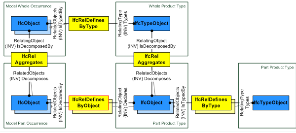
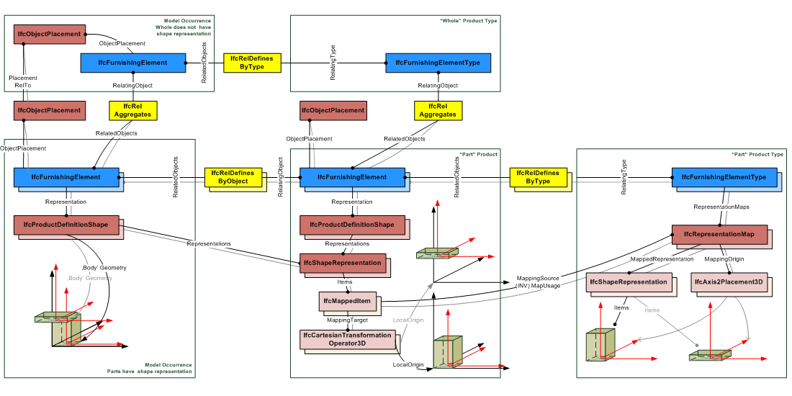

# IfcRelDefinesByObject

The objectified relationship _IfcRelDefinesByObject_ defines the relationship between an object that is part in an object type decomposition and an object occurrence that is part in an occurrence decomposition of that type.
<!-- end of short definition -->

The _IfcRelDefinesByObject_ is a 1-to-N relationship, as it allows for the assignment of one declaring object information to one or many reflected objects. Those objects then share the same object property sets and, for subtypes of _IfcProduct_, the eventually assigned representation maps.

The relationship _IfcRelDefinesByObject_ may only connect objects that take part in both a type decomposition and an occurrence decomposition of the same type. The _IfcRelDefinesByObject_ links the decomposed object type part, also called the "declaring part" with the occurrence of that part inside the occurrence of the decomposed type, also called the "reflected part", as shown in Figure 1.

The _IfcRelDefinesByObject_ can be used together with the shape representations of the product type as shown in Figure 2. The _IfcShapeRepresentation_ of the "declaring part" is referenced by the "reflected part". The _IfcObjectPlacement_ of the model occurrence (the whole) determines the position within the project context.

> HISTORY New entity in IFC4.

## Attributes

### RelatedObjects
Objects being part of an object occurrence decomposition, acting as the "reflecting parts" in the relationship.

### RelatingObject
Object being part of an object type decomposition, acting as the "declaring part" in the relationship.
