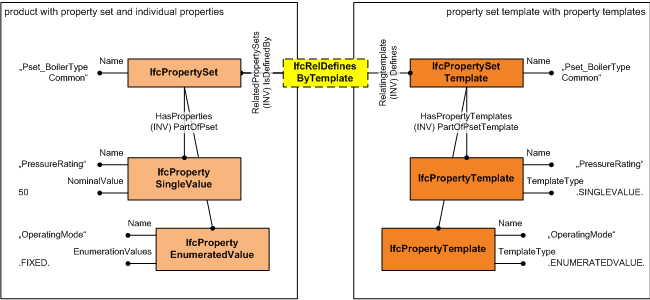

# IfcSimplePropertyTemplate

The _IfcSimplePropertyTemplate_ defines the template for all dynamically extensible properties, either the subtypes of _IfcSimpleProperty_, or the subtypes of _IfcPhysicalSimpleQuantity_. The individual property templates are interpreted according to their _Name_ attribute and may have a predefined template type, property units, and property measure types. The correct interpretation of the attributes:

* _PrimaryUnit_
* _SecondaryUnit_
* _PrimaryMeasureType_
* _SecondaryMeasureType_
<!-- end of definition -->
is determined by the _TemplateType_. The attributes Enumerators and Expression only apply to instances of _IfcSimplePropertyTemplate_ having a particular _TemplateType_. The _TemplateType_ also controls which subtype of either _IfcSimpleProperty_ or _IfcPhysicalSimpleQuantity_ shall be used for property occurrences corresponding to this template.

The _IfcSimplePropertyTemplate_ is part of the set of templates included in the _IfcPropertySetTemplate_. The template can be accessed through the inverse attribute _PartOfPsetTemplate_ The _IfcPropertySetTemplate_ may define one or several instances of _IfcPropertySet_ (or _IfcElementQuantity_). The definition assignment is established by the objectified relationship _IfcRelDefinesByTemplate_ as shown in Figure 1. There is no direct link between an _IfcSimplePropertyTemplate_ and a subtype of either _IfcSimpleProperty_ or _IfcPhysicalSimpleQuantity_. The definition relationship between the template and the individual properties (or quantities) is established by the _Name_ attributes.

> NOTE  Constraints at _IfcPropertySetTemplate_ and _IfcPropertySet_ (and _IfcElementQuantity_) guarantee that the _Name_ attributes of included property templates and individual properties are unique.

> HISTORY  New entity in IFC4.

## Attributes

### TemplateType
Property type defining whether the property template defines a property with a single value, a bounded value, a list value, a table value, an enumerated value, or a reference value. Or the quantity type defining whether the template defines a quantity with a length, area, volume, weight or time value.
> NOTE  the value of this property determines the correct use of the _PrimaryUnit_, _SecondaryUnit_, _PrimaryDataType_, _SecondaryDataType_, and _Expression_ attributes.

### PrimaryMeasureType
Primary measure type assigned to the definition of the property. It should be provided, if the _TemplateType_ is set to:

* <small>P_SINGLEVALUE</small>: determining the measure type of _IfcPropertySingleValue.NominalValue_
* <small>P_ENUMERATEDVALUE</small>: determining the measure type of _IfcPropertyEnumeratedValue.EnumerationValues_
* <small>P_BOUNDEDVALUE</small>: determining the measure type of _IfcPropertyBoundedValue.LowerBoundValue_
* <small>P_LISTVALUE</small>: determining the measure type of _IfcPropertyListValue.ListValues_
* <small>P_TABLEVALUE</small>: determining the measure type of _IfcPropertyTableValue.DefiningValues_
* <small>P_REFERENCEVALUE</small>: determining the measure type of _IfcPropertyTableValue.PropertyReference_

> NOTE  The value range of the measure type is within the select type _IfcValue_ for all _TemplateType_'s with the exception of <small>P_REFERENCEVALUE</small>. Here it is within the select type _IfcObjectReferenceSelect_.

### SecondaryMeasureType
Secondary measure type assigned to the definition of the property. It should be provided, if the _TemplateType_ is set to:

* <small>P_BOUNDEDVALUE</small>: determining the measure type of _IfcPropertyBoundedValue.UpperBoundValue_
* <small>P_TABLEVALUE</small>: determining the measure type of _IfcPropertyTableValue.DefinedValues_

The value range of the measure type is within the select type _IfcValue_  for all _TemplateType_'s with the exception of <small>P_ENUMERATEDVALUE</small>. Here it is the comma delimited list of enumerators.
> NOTE  The measure type of _IfcPropertyEnumeration.EnumerationValues_ is provided as _PrimaryDataType_.

### Enumerators
Name of the property enumeration, and list of all valid enumerators being selectable values, assigned to the definition of the property.
This attribute shall only be provided, if the _TemplateType_ is set to:

* <small>P_ENUMERATEDVALUE</small>

### PrimaryUnit
Primary unit assigned to the definition of the property. It should be provided, if the _TemplateType_ is set to:

* <small>P_SINGLEVALUE</small>: determining the _IfcPropertySingleValue.Unit_
* <small>P_ENUMERATEDVALUE</small>: determining the _IfcPropertyEnumeration.Unit_
* <small>P_BOUNDEDVALUE</small>: determining the _IfcPropertyBoundedValue.Unit_
* <small>P_LISTVALUE</small>: determining the _IfcPropertyListValue.Unit_
* <small>P_TABLEVALUE</small>: determining the _IfcPropertyTableValue.DefiningUnit_

### SecondaryUnit
Secondary unit assigned to the definition of the property. It should be provided, if the _TemplateType_ is set to:

* <small>P_TABLEVALUE</small>: determining the _IfcPropertyTableValue.DefinedUnit_

### Expression
The expression used to store additional information for the property template depending on the _TemplateType_. It should provide the following definitions, if the _TemplateType_ is set to:

* <small>P_TABLEVALUE</small>: the expression that could be evaluated to define the correlation between the defining values and the defined values.
* <small>Q_LENGTH, Q_AREA, Q_VOLUME, Q_COUNT, Q_WEIGTH, Q_TIME</small>: the formula to be used to calculate the quantity

> NOTE  No value shall be asserted if the _TemplateType_ is not listed above.

### AccessState
Information about the access state of the property. It determines whether a property can be viewed and/or modified by any receiving application without specific knowledge of it.

**Attribute use definition for _IfcStateEnum_**

* READWRITE: Properties of this template are readable and writable. They may be viewed and modified by users of any application. These are typical informational properties set by a user.
* READONLY: Properties of this template are read-only. They may be viewed but not modified by users of any application. (Applications may generate such values). These are typical automatically generated properties that should be displayed only, but not written back.
* LOCKED: Properties of this template are locked. They may only be accessed by the owning application (the publisher of the property set template). These are typically application dependent, internal properties that should not be published.
* READWRITELOCKED: Properties of this template are locked, readable, and writable. They may only be accessed by the owning application.
* READONLYLOCKED: Properties of this template are locked and read-only. They may only be accessed by the owning application.
