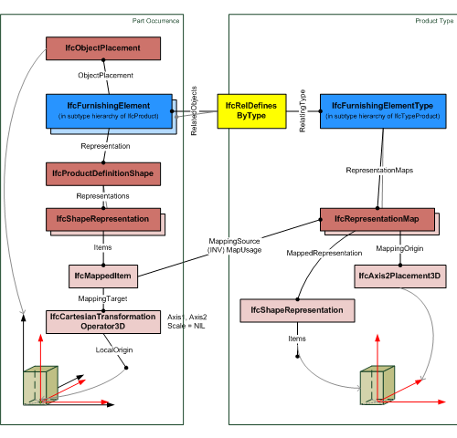
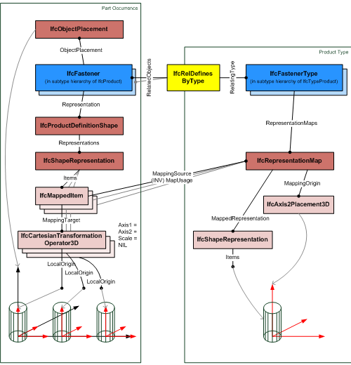

# IfcTypeProduct

_IfcTypeProduct_ defines a type definition of a product without being already inserted into a project structure (without having a placement), and not being included in the geometric representation context of the project. It is used to define a product specification, that is, the specific product information that is common to all occurrences of that product type.

An _IfcTypeProduct_ may have a list of property set attached and an optional set of product representations. Values of these properties and the representation maps are common to all occurrences of that product type. The type-occurrence relationship is realized using the objectified relationship _IfcRelDefinesByType_.

> NOTE  The product representations are defined as representation maps, which may be assigned by a product instance through the representation item(s) being an _IfcShapeRepresentation_ and having _Items_ of type _IfcMappedItem_.

The representations at the occurrence level (represented by subtypes of _IfcProduct_) can override the specific representations at the type level:

* for geometric representations, a Cartesian transformation operator can be applied at the occurrence level.
* for property sets, a property within an occurrence property set, assigned at the product occurrence, overrides the same property assigned to the product type.

An _IfcTypeProduct_ may be exchanged without being already assigned to subtypes of _IfcProduct_.

> HISTORY  New entity in IFC2x.

{ .change-ifc2x4}
> IFC4 CHANGE  The entity _IfcTypeProduct_ shall not be instantiated from IFC4 onwards. It will be changed into an ABSTRACT supertype in future releases of IFC.

## Attributes

### RepresentationMaps
List of unique representation maps. Each representation map describes a block definition of the shape of the product style. By providing more than one representation map, a multi-view block definition can be given.

### Tag
The tag (or label) identifier at the particular type of a product, e.g. the article number (like the EAN). It is the identifier at the specific level.

### ReferencedBy
Reference to the _IfcRelAssignsToProduct_ relationship, by which other products, processes, controls, resources or actors (as subtypes of _IfcObjectDefinition_) can be related to this product type.
{ .change-ifc2x4}
> IFC4 CHANGE  New inverse relationship.

## Formal Propositions

### ApplicableOccurrence
The product type (or style), if assigned to an object, shall only be assigned to object being a sub type of _IfcProduct_.

## Concepts

### Library Association

### Product Type Shape

The RepresentationMaps define the type product shape and multiple geometric representations can be assigned. If a product occurrence is assigned to the type by using the IfcRelDefinesByType relationship, then these occurrences have to reference the representation maps. The reference is created by one or multiple IfcShapeRepresentation's having an IfcMappedItem as Items, that places the IfcRepresentationMap of the type product into the spatial contexts, i.e. by using an Cartesian transformation operator to transform the IfcRepresentationMap into the object coordinate system of the product occurrence.

Figure 1 illustrates an example of referencing a representation map by the shape representation of a product occurrence. Here the Cartesian transformation operator only uses translation, but no rotation, mirroring, or scaling.

Figure 2 illustrates an example of referencing a representation multiple times map by the shape representation of a product occurrence. Here the Cartesian transformation operator only uses translation, but no rotation, mirroring, or scaling. The different translation values determine the pattern of the multiple placement.

