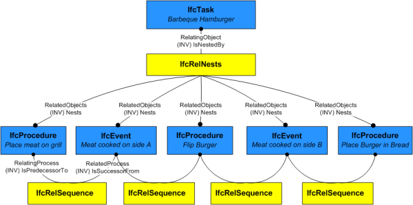

# IfcProcedure

An _IfcProcedure_ is a logical set of actions to be taken in response to an event or to cause an event to occur.

> HISTORY  New entity in IFC2x2

{ .change-ifc2x4}
> IFC4 CHANGE  _ProcedureType_ renamed to _PredefinedType_ and made optional (upward compatible). Where rules WR1 and WR2 have been removed.

{ .use-head}
Use definitions

_IfcProcedure_ is used to capture information about stepped processes such as calibration, start/stop procedures for equipment items, designated actions to take in the event of an emergency etc. A procedure is not a task, but may describe a set of tasks and their order of occurrence in response to or to cause an event.

As shown in Figure 11, _IfcProcedure_ does not restrict anything but describes specific steps of how something should happen. While a procedure does control/restrict in the sense of indicating "this is how the task should be performed" by nature of describing inner detail, this is not different than parts of a product indicating "this is how the parts should be assembled". Consequently, it doesn't restrict the outer item as a whole but provides inner detail of the item.

## Attributes

### PredefinedType
Identifies the predefined types of a procedure from which
    the type required may be set.

## Formal Propositions

### HasName
The Name attribute should be inserted to describe the task name.

### CorrectPredefinedType
Either the _PredefinedType_ attribute is unset, or the inherited attribute _ObjectType_ must be asserted when the value of _PredefinedType_ is set to _USERDEFINED_.

## Concepts

### Control Assignment

An IfcProcedure may be assigned to an
 IfcWorkCalendar to indicate times when such
 procedure may be performed using
 IfcRelAssignsToControl; otherwise the effective
 calendar is determined by the nearest IfcProcess
 ancestor with a calendar assigned. Advisory notes should be
 assigned to the specific IfcProcess for which it
 gives advice using IfcRelAssignsToProcess.

### Nesting

The IfcProcedure may be contained within an
 IfcTask or IfcProcedure using the
 IfcRelNests relationship. An IfcProcedure may
 in turn nest other IfcProcedure or IfcEvent
 entities. Such nesting indicates decomposed level of
 detail.

### Object Typing

IfcProcedure defines the anticipated or actual
 occurrence of any procedure; common information about
 procedure types is handled by IfcProcedureType.

### Process Assignment

> NOTE  A particular type of IfcProcedure is a
>  caution, warning or other form of advisory note. Typically,
>  it is anticipated that such a procedure would be assigned
>  to the specific IfcProcess for which it gives advice
>  using IfcRelAssignsToProcess.
>

### Product Assignment

For building operation scenarios, IfcProcedure may
 be assigned to a product (IfcElement subtype) using
 IfcRelAssignsToProduct to indicate a specific
 product occurrence that performs the procedure.

> EXAMPLE  An IfcActuator may have a "Close"
>  procedure. If the IfcProcedure is defined by an
>  IfcProcedureType and the IfcProcedureType is
>  assigned to a product type (using
>  IfcRelAssignsToProduct), then the
>  IfcProcedure must be assigned to one or more
>  occurrences of the specified product type using
>  IfcRelAssignsToProduct.

### Property Sets

### Sequential Connectivity

The relationship IfcRelSequence is used to indicate
 control flow. An IfcProcedure as a successor to an
 IfcEvent indicates that the procedure should be
 performed in response to the event. An IfcProcedure
 as a predecessor to an IfcEvent indicates that the
 event should be triggered following the procedure. As
 procedures have arbitrary duration, the
 IfcRelSequence.SequenceType attribute has no effect
 on an IfcProcedure but still applies to the opposite
 end of the relationship if IfcTask is used.

