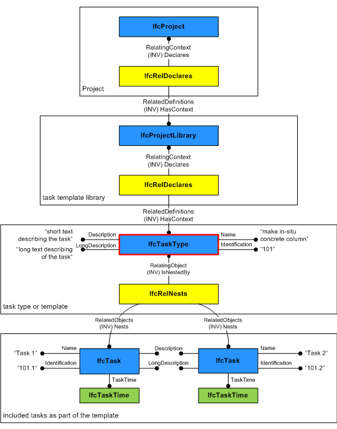

# IfcTaskType

An _IfcTaskType_ defines a particular type of task that may be specified for use within a work control.
<!-- end of short definition -->

> HISTORY New entity in IFC4

An _IfcTaskType_ provides for all forms of types of task that may be specified. It is a reference definition for a unit of work that may be broken down into (a sequence of) subtasks. Please note that a reference definition can not be part of a workflow definition, i.e. _IfcTaskType_ instances define the most abstract level of a reference process without dependencies to other reference processes.

Usage of _IfcTaskType_ defines the parameters for one or more occurrences of _IfcTask_. Parameters may be specified through property sets that may be enumerated in the _IfcTaskTypeEnum_ data type or through explicit attributes of _IfcTaskType_. Task occurrences (_IfcTask_ entities) are linked to the task type through the _IfcRelDefinesByType_ relationship.

Figure 1 shows the definition of a task type that is part of a task template library. Please note that in this example the task type is further subdivided into tasks that define task times (for example, duration) and/or a task sequence.

Figure 1 — Task type relationships

## Attributes

### PredefinedType
Identifies the predefined types of a task type from which the type required may be set.

### WorkMethod
The method of work used in carrying out a task.

## Formal Propositions

### CorrectPredefinedType
The attribute _ProcessType_ must be asserted when the value of _PredefinedType_ is set to _USERDEFINED_.

## Concepts

### Object Nesting

_IfcTaskType_ may nest other _IfcTaskType_ or _IfcTask_ entities using the _IfcRelNests_ relationship. Such nesting indicates decomposed level of detail. Nesting of _IfcTask_ entities is used if a task type shall be detailed by a sequence of tasks or if there is a need to include additional time information such as the duration of subtasks. Please note that _IfcTask_ entities being contained within an _IfcTaskType_ are linked with their task occurrences via _IfcRelDefinesByObject_ relationships. It is also possible to define a task type for these _IfcTask_ entities via _IfcRelDefinesByType_ relationships. For further information please see the documentation of _IfcRelDefinesByObject_.

