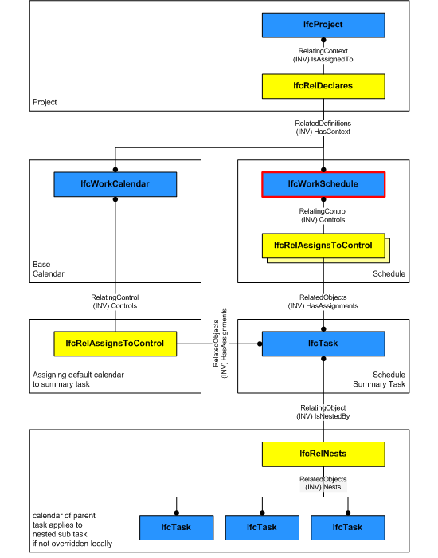

# IfcWorkSchedule

An _IfcWorkSchedule_ represents a task schedule of a work plan, which in turn can contain a set of schedules for different purposes.

> HISTORY&nbsp; New entity in IFC2.0.

{ .use-head}
Declaration Use Definition

_IfcWorkSchedule_ can reference a project (the single _IfcProject_ instance) via _IfcRelDeclares_.

Figure 1 shows the backbone structure of a work schedule that defines (1) a context through _IfcRelDeclares_ (not necessarily the project) and (2) controls tasks (typically the schedule summary task) and resources. Please note that a work calendar shall be assigned to the summary task and not the work schedule.

If an assigned _IfcTask_ is a root-level task, such task must be declared on the _IfcProject_ using the _IfcRelDeclares_ relationship.

## Attributes

### PredefinedType
Identifies the predefined types of a work schedule from which 
    the type required may be set.

## Formal Propositions

### CorrectPredefinedType
The attribute ObjectType must be asserted when the value of the IfcWorkScheduleTypeEnum is set to USERDEFINED.

## Concepts

### Aggregation

A work schedule can include other work schedules as sub-items. 
 If not included in another work schedule it might be a part of a work plan
 (IfcWorkPlan) defined through IfcRelAggregates relationship.
 

### Control Assignment

 An IfcWorkSchedule controls a set of tasks and
 resources defined through IfcRelAssignsToControl.
 Additionally, through the IfcWorkControl abstract
 supertype, the actors creating the schedule can be
 specified and schedule time information such as start time,
 finish time, and total float of the schedule can also be
 specified.
 

### Document

 The documents of the
 IfcWorkSchedule can be referenced by the
 IfcRelAssociatesDocuments relationship. 

### Nesting

A work schedule can include other work schedules as sub-items
 through IfcRelNests relationship. 
 

### Property Sets

