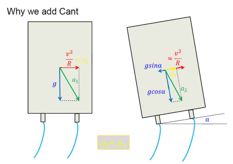
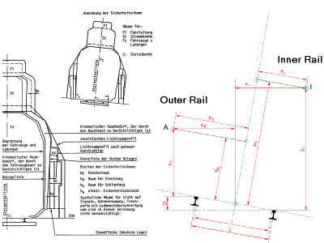

# IfcAlignmentCant

An _IfcAlignmentCant_ is a lateral inclination profile defined along the horizontal alignment. All points defined in this profile have two coordinate values. The first value is the distance along the horizontal alignment, and the second value is the height relative to the projection of the point along vertical alignment.

**Cant as a railway specificity**

> NOTE Figure 1 was first published in _(Basics of) Railway Curve Kinematics Presentation_, (Wojtczak 2018)

The diagram in the figure above shows the principle of compensating part of the lateral acceleration by elevating the outer rail relative to the inner rail of a track.

Almost always the following principles for the placement of horizontal segments and cant segments are implemented:

* Straight horizontal line: no applied cant
* Horizontal circular arc: constant applied cant
* Horizontal transition bend: variation of applied cant according to a defined formula

In specific difficult topographic environments like mountain lines the extension of a cant transition may differ from the horizontal transition. So far this has only been found for clothoids and is either a so called shortened ramp (cant transition is shorter than the corresponding horizontal curvature transition) or a so called “scissor” ramp (overlapping variations of cant on both rails with opposite direction).

Application of high-performance horizontal transition bends is always combined with a cant transition with identical start and end location.

In real world designs, such as slow speed sections in railway stations, exceptions to the above principles can be found. It might even happen that the inner rail is elevated relative to the outer rail.

Detailed geometric modelling of the superelevation has a low priority in the existing processes in most rail companies. This will very probably change with the introduction of 3D modelling in rail design. The following list shows some use cases:

* Correct 3D placement of certain assets (e.g. sleepers)
* Relevant input for calculation of structural gauge space
* Correct calculation of horizontal coordinate values for the Viennese Bend® (high performance transition bend)

## Attributes

### RailHeadDistance
Length measured as distance between the nominal centre points of the two contact patches of a wheelset and rails.

## Concepts

### Alignment Cant Attributes

