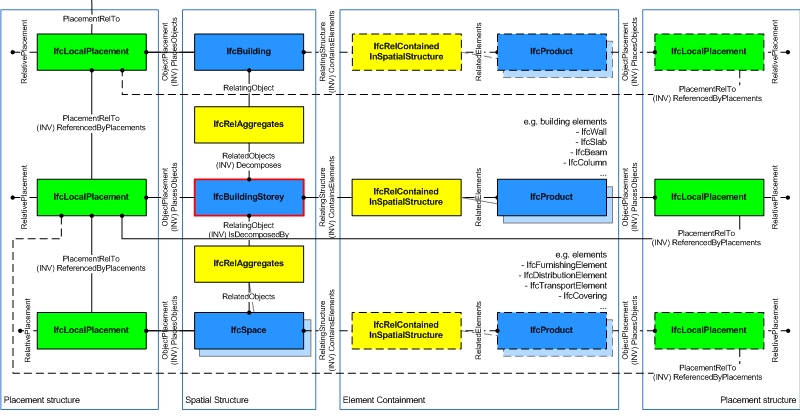
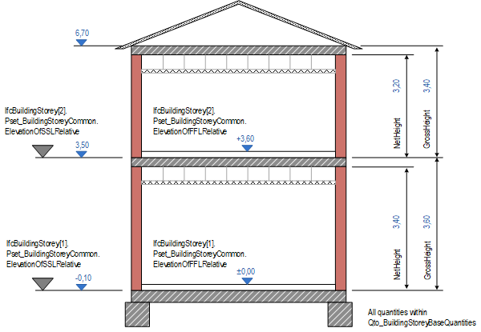

# IfcBuildingStorey

The building storey has an elevation and typically represents a (nearly) horizontal aggregation of spaces that are vertically bound.  
  
A storey is (if specified) associated to a building. A storey may span over several connected storeys. Therefore storey complex provides for a collection of storeys included in a building. A storey can also be decomposed in (horizontical) parts, where each part defines a partial storey. This is defined by the composition type attribute of the supertype _IfcSpatialStructureElements_ which is interpreted as follow:  
  
\* \*\*COMPLEX\*\*: building storey complex  
\* \*\*ELEMENT\*\*: building storey  
\* \*\*PARTIAL\*\*: partial building storey  
  
> EXAMPLE&nbsp; In split level houses, a storey is split into two or more partial storeys, each with a different elevation. It can be handled by defining a storey, which includes two or more partial storeys with the individual elevations.  
  
The _IfcBuildingStorey_ is used to build the spatial structure of a building (that serves as the primary project breakdown and is required to be hierarchical). The spatial structure elements are linked together by using the objectified relationship _IfcRelAggregates_.  
  
Figure 1 shows the _IfcBuildingStorey_ as part of the s patial structure. It also serves as the spatial container for building and other elements.  
  
> NOTE&nbsp; Detailed requirements on mandatory element containment and placement structure relationships are given in view definitions and implementer agreements.  
  
  
  
Figure 2 describes the heights and elevations of the _IfcBuildingStorey_.  
  
\* elevation of storey provided by: _IfcBuildingStorey.Elevation_ as a local height value relative to _IfcBuilding.ElevationOfRefHeight_, it is usually the top of construction slab  
\* net height of storey, also referred to as total height or system height (top of construction slab to top of construction slab above): provided by BaseQuantity with Name="GrossHeight"  
\* net height of storey (top of construction slab to bottom of construction slab above): provided by BaseQuantity with Name="NetHeight"  
  
  
  
> HISTORY&nbsp; New entity in IFC1.0

## Attributes

### Elevation
Elevation of the base of this storey, relative to the 0,00 internal reference height of the building. The 0.00 level is given by the absolute above sea level height by the _ElevationOfRefHeight_ attribute given at _IfcBuilding_.\X\0D
\X\0D
> NOTE&nbsp; If the geometric data is provided (_ObjectPlacement_ is specified), the _Elevation_ value shall either not be included, or be equal to the local placement Z value.
