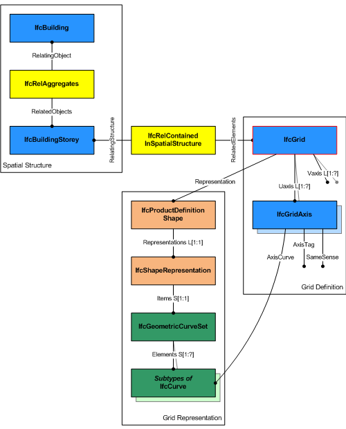

# IfcGrid

_IfcGrid_ ia a planar design grid defined in 3D space used as an aid in locating structural and design elements. The position of the grid (_ObjectPlacement_) is defined by a 3D coordinate system (and thereby the design grid can be used in plan, section or in any position relative to the world coordinate system). The position can be relative to the object placement of other products or grids. The XY plane of the 3D coordinate system is used to place the grid axes, which are 2D curves (for example, line, circle, arc, polyline).
<!-- end of short definition -->

The inherited attributes _Name_ and _Description_ can be used to define a descriptive name of the grid and to indicate the grid's purpose. A grid is defined by (normally) two, or (in case of a triangular grid) three lists of grid axes. The following figures show some examples.

A grid may support a rectangular layout as shown in Figure 1, a radial layout as shown in Figure 2, or a triangular layout as shown in Figure 3.

> NOTE The _PredefinedType_ denotes the type of grid that is represented by _IfcGrid_. The instantiation of _IfcGridAxis_ entities has to agree to the _PredefinedType_, if provided.

> NOTE The grid axes, defined within the design grid, are those elements to which project objects will be placed relatively using the _IfcGridPlacement_.

Figure 1 — Grid rectangular layout

Figure 2 — Grid radial layout

Figure 3 — Grid triangular layout

> HISTORY New entity in IFC1.0.

{ .change-ifc2x4}
> IFC4 CHANGE The attribute _PredefinedType_ has been added at the end of the attribute list.

**Informal Propositions**

 1. Grid axes, which are referenced in different lists of axes (UAxes, VAxes, WAxes) shall not be parallel.
 2. Grid axes should be defined such that there are no two grid axes which intersect twice (see Figure 4).

> NOTE Left side: ambiguous intersections A1 and A2, a grid containing such grid axes is not a valid design grid; Right side: the conflict can be resolved by splitting one grid axis in a way such that no ambiguous intersections exist.

Figure 4 — Grid intersections

## Attributes

### UAxes
List of grid axes defining the first row of grid lines.

### VAxes
List of grid axes defining the second row of grid lines.

### WAxes
List of grid axes defining the third row of grid lines. It may be given in the case of a triangular grid.

### PredefinedType
Predefined types to define the particular type of the grid.
{ .change-ifc4}
> IFC4 Change New attribute.

## Concepts

### Grid Attributes

### Footprint Geometry

 The 2D geometric representation of _IfcGrid_ is defined using the 'GeometricCurveSet' geometry. The following attribute values should be inserted

* _IfcShapeRepresentation.RepresentationIdentifier_ = 'FootPrint'.
* _IfcShapeRepresentation.RepresentationType_ = 'GeometricCurveSet' .

The following constraints apply to the 2D representation:

* The _IfcGeometricCurveSet_ shall be an (and the only) _Item_ of the _IfcShapeRepresentation_. It should contain an _IfcGeometricCurveSet_ containing subtypes of _IfcCurve_, each representing a grid axis. Applicable subtypes of _IfcCurve_ are:
 _IfcPolyline_, _IfcCircle_, _IfcTrimmedCurve_ (based on _BaseCurve_ referencing _IfcLine_ or _IfcCircle_), and _IfcOffsetCurve2D_.
* Each subtype of _IfcCurve_ may have a curve style assigned, using _IfcStyledItem_ referencing _IfcCurveStyle_.
* Optionally the grid axis labels may be added as _IfcTextLiteral_, and they may have text styles assigned, using _IfcStyledItem_ referencing _IfcTextStyle_.

Figure 31 — Grid Layout

> As shown in Figure 31, the _IfcGrid_ defines a placement coordinate system using the _ObjectPlacement_. The XY plane of the coordinate system is used to place the 2D grid axes. The _Representation_ of _IfcGrid_ is defined using _IfcProductRepresentation_, referencing an _IfcShapeRepresentation_, that _includes IfcGeometricCurveSet_ as _Items_. All grid axes are added as _IfcPolyline_ to the _IfcGeometricCurveSet_.

Figure 32 — Grid representation
>
> As shown in Figure 32, the attributes _UAxes_ and _VAxes_ define lists of _IfcGridAxis_ within the context of the grid. Each instance of _IfcGridAxis_ refers to the same instance of _IfcCurve_ (here the subtype _IfcPolyline_) that is contained within the _IfcGeometricCurveSet_ that represents the _IfcGrid_.

### Placement

The local placement for _IfcGrid_ is defined in its supertype _IfcProduct_. It is defined by the _IfcLocalPlacement_, which defines the local coordinate system that is referenced by all geometric representations.

* The _PlacementRelTo_ relationship of _IfcLocalPlacement_ shall point (if given) to the local placement of the same _IfcSpatialStructureElement_, which is used in the _ContainedInStructure_ inverse attribute, or to a spatial structure element at a higher level, referenced by that.
* If the relative placement is not used, the absolute placement is defined within the world coordinate system.
