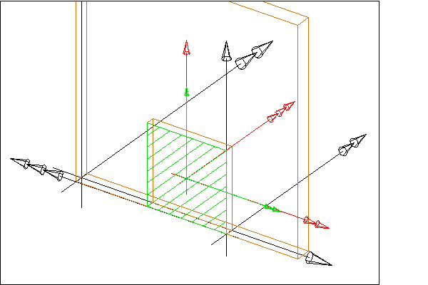
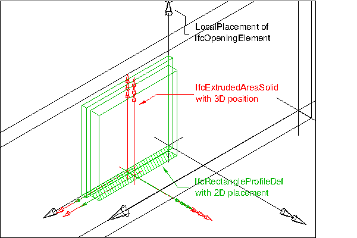

# IfcOpeningElement

The opening element stands for opening, recess or chase, all reflecting voids. It represents a void within any element that has physical manifestation. Openings can be inserted into walls, slabs, beams, columns, or other elements.

The IFC specification provides two entities for opening elements:

* _IfcOpeningStandardCase_ is used for all openings that have a constant profile along a linear extrusion. They are placed relative to the voided elements and the extrusion direction is perpendicular to the plane of the element (horizontally for walls, vertically for slabs). Only a single extrusion body is allowed. It cuts through the whole thickness of the voided element, i.e. it reflects a true opening.
* _IfcOpeningElement_ is used for all other occurrences of openings and in particular also for niches or recesses.

> NOTE&nbsp; View definitions or implementer agreements may restrict the types of elements which can be voided by an _IfcOpeningElement_ or _IfcOpeningStandardCase_

There are two different types of opening elements:

* an opening, where the thickness of the opening is greater or equal to the thickness of the element;
* a recess or niche, where the thickness of the recess is smaller than the thickness of the element.

The attribute _PredefinedType_ should be used to capture the differences,

* the attribute is set to OPENING for an opening or
* the attribute is set to RECESS for a recess or niche.
* If the value for _PredefinedType_ is omitted, or the value is set to NOTDEFINED, no specific information of whether it is an opening or recess shall be assumed.

An _IfcOpeningElement_ has to be inserted into an _IfcElement_ by using the _IfcRelVoidsElement_ relationship. It may be filled by an _IfcDoor_, _IfcWindow_, or another filling element by using the relationship _IfcRelFillsElements_. Depending on the type of the _IfcShapeRepresentation_ of the _IfcOpeningElement_ the voiding relationship implies:

*  if the _IfcShapeRepresentation_.<emRepresentationIdentifier = 'Body', then the Body shape represntation of the opening has to be subtracted from the body shape representation of the voided element - implicit Boolean difference operation.
*  if the _IfcShapeRepresentation_.<emRepresentationIdentifier = 'Reference', then the Reference shape representation of the opening is not subtracted, it is provided in addition to the hole in the Body shape representation of the voided element.

The _IfcOpeningElement_ shall not participate in the containment relationship, i.e. it is not linked directly to the spatial structure of the project. It has a mandatory _VoidsElements_ inverse relationship pointing to the _IfcElement_ that is contained in the spatial structure.

* The inverse relationship _ContainedInStructure_ shall be NIL.

> NOTE&nbsp; See _IfcRelVoidsElement_ for a diagram on how to apply spatial containment and the voiding relationship.

> HISTORY&nbsp; New entity in IFC1.0

{ .change-ifc2x}
> IFC2x CHANGE&nbsp; The intermediate ABSTRACT supertypes _IfcFeatureElement_ and _IfcFeatureSubtraction_ have been added.

{ .change-ifc2x4}
> IFC4 CHANGE&nbsp; The attribute _PredefinedType_ has been added at the end of attribute list. It should be used instead of the inherited attribute _ObjectType_ from now on.

## Attributes

### PredefinedType
Predefined generic type for an opening that is specified in an enumeration. There may be a property set given specifically for the predefined types.
{ .change-ifc2x4}
> IFC4 CHANGE The attribute has been added at the end of the entity definition.

### HasFillings
Reference to the Filling Relationship that is used to assign Elements as Fillings for this Opening Element. The Opening Element can be filled with zero-to-many Elements.

## Formal Propositions

### CorrectPredefinedType
Either _PredefinedType_ is unset or the inherited attribute _ObjectType_ shall be provided, if the _PredefinedType_ is set to USERDEFINED or _PredefinedType_.

## Concepts

### Body Geometry

The 'Body' representation of IfcOpeningElement can be 
represented using the representation types 'SweptSolid', and
'Brep'. The representation type 'Brep' is explained at
IfcFeatureElement

Swept Solid Representation Type with Horizontal
Extrusion

The 'SweptSolid' geometric representation of
IfcOpeningElement, using horizontal extrusion direction
(for walls), is defined using the swept area solid geometry. The
following attribute values for the IfcShapeRepresentation
holding this geometric representation shall be used:

* RepresentationIdentifier : 'Body'
* RepresentationType : 'SweptSolid'

The following additional constraints apply to the swept solid
representation:

* Solid: IfcExtrudedAreaSolid is required, the
set of IfcShapeRepresentation.Items may include a single,
or multiple, instances of IfcExtrudedAreaSolid.
* Profile: IfcRectangleProfileDef,
IfcCircleProfileDef and
IfcArbitraryClosedProfileDef shall be supported.
* Extrusion: The profile shall be extruded horizontally
(perpendicular to the extrusion direction of the voided
element such as for wall openings), or vertically (in the
extrusion direction of the voided element such as for for floor
openings). If multiple instances of IfcExtrudedAreaSolid
are used, the extrusion direction of each extrusion should be
equal.

> 
> NOTE  In case of non-parallel jambs, the shape
> representation shall be a 'SweptSolid' representation with
> vertical extrusion.
> 

Figure 160 illustrates an opening with horizontal extrusion.

> NOTE  The local placement directions for the IfcOpeningElement are only given as an example, other directions are valid as well.

Figure 160 — Opening with full extrusion

Figure 161 illustrates an opening for a recess.

> NOTE  The local placement directions for the IfcOpeningElement are only given as an example, other directions are valid as well.

> NOTE  Rectangles are now defined centric, the placement 
> location has to be set:

* IfcCartesianPoint(XDim/2,YDim/2)

Figure 161 — Opening with recess extrusion

Swept Solid Representation with Vertical Extrusion

The 'SweptSolid' geometric representation of
IfcOpeningElement, using vertical extrusion direction (for
walls), is defined using the swept area solid geometry, however
the extrusion direction may be vertical, i.e. in case of a wall
opening, the extrusion would be in the direction of the wall
height. The following attribute values for the
IfcShapeRepresentation holding this geometric
representation shall be used:

* RepresentationIdentifier : 'Body'
* RepresentationType : 'SweptSolid'

The following additional constraints apply to the swept solid
 representation:

* Solid: IfcExtrudedAreaSolid is required, the
set of IfcShapeRepresentation.Items may include a single,
or multiple, instances of IfcExtrudedAreaSolid.
* Profile: IfcRectangleProfileDef,
IfcCircleProfileDef and
IfcArbitraryClosedProfileDef shall be supported.
* Extrusion: The profile shall be extruded vertically,
i.e. for wall openings along the extrusion direction of the
voided element.  If multiple instances of
IfcExtrudedAreaSolid are used, the extrusion direction 
should be equal.

Vertical extrusions shall be used when an opening or recess
has a non rectangular foot print geometry that does not change
along the height of the opening or recess.

Figure 162 shows a vertical extrusion with multiple extrusion bodies for the opening. Each extrusion body has a different extrusion length.

> NOTE  The local placement directions for the IfcOpeningElement are only given as an example, other directions are valid as well.

Figure 162 — Opening with multiple extrusions

### Product Local Placement

The local placement for IfcOpeningElement is defined in
its supertype IfcProduct. It is defined by the
IfcLocalPlacement, which defines the local coordinate
system that is referenced by all geometric representations.

* The PlacementRelTo relationship of
IfcLocalPlacement should point to the local placement of 
the same element, which is voided by the opening, i.e. referred 
to by VoidsElement.RelatingBuildingElement.

### Property Sets for Objects

### Quantity Sets

### Reference Geometry

Since there are no Boolean operations, either as IfcBooleanResult or implicitly by IfcRelVoidsElement the geometry of the IfcOpeningElement shall not be used to subtract the opening from the 'Body' shape representation of the voided element.

