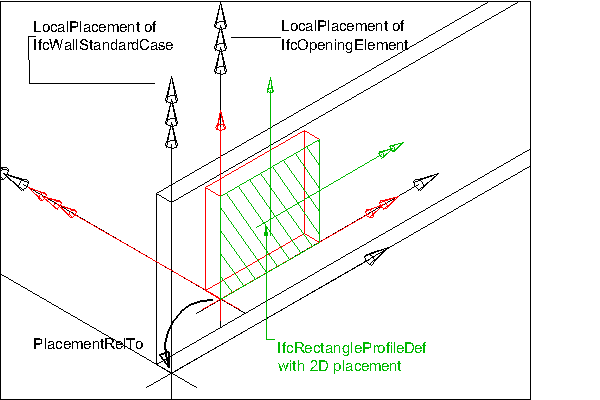

# IfcOpeningStandardCase

The standard opening, _IfcOpeningStandardCase_, defines an opening with certain constraints for the dimension parameters, position within the voided element, and with certain constraints for the geometric representation. The _IfcOpeningStandardCase_ handles all cases of openings, that:

* are true openings where the opening depth is greater than or equal to the thickness of the element, and the _Predefinedtype_ is set correctly to .OPENING.
* are true recesses where the opening depth is lower than the thickness of the element, and the _Predefinedtype_ is set correctly to .RECESS.
* are extruded perpendicular to the wall plane in case of openings in a wall
* are extruded perpendicular to the slab plane in case of openings in a slab
* have a local placement relative to the local placement of the voided element
* have a 'Body' shape representation with 'SweptSolid' representation type
* have only a single extrusion body within the 'Body' shape representation

> HISTORY  New entity in IFC4

## Concepts

### Body Geometry

The geometric representation of IfcOpeningStandardCase is defined using the following multiple shape representations for its definition:

* Body: A SweptSolid representation defining the 3D subtraction shape of the standard opening

**Body Representation**

The body representation of IfcOpeningStandardCase is represented using the representation type 'SweptSolid'.

_Swept Solid Representation Type with Horizontal
Extrusion_

The standard geometric representation of IfcOpeningStandardCase is defined using the 'SweptSolid' representation. The following attribute values for the IfcShapeRepresentation holding this geometric representation shall be used::

* RepresentationIdentifier : 'Body'
* RepresentationType : 'SweptSolid'

The following additional constraints apply to the swept solid representation:

* **Solid**: a single IfcExtrudedAreaSolid is required
* **Profile**: IfcRectangleProfileDef, IfcCircleProfileDef and IfcArbitraryClosedProfileDef shall be supported.
* **Extrusion**: The profile shall be extruded horizontally (i.e. perpendicular to the extrusion direction of the voided element) for wall openings, or vertically (i.e. in the extrusion direction of the voided element), for slab openings.

As shown in Figure 36, the orientation of the opening profile that is extruded for the opening body shall guarantee the following interpretation of dimension parameter for rectangular openings:

* _IfcRectangleProfileDef.YDim_ interpreted as opening width
* _IfcRectangleProfileDef.XDim_ interpreted as opening height

### Product Local Placement

The following constraint is mandatory for IfcOpeningStandardCase

* The PlacementRelTo relationship of IfcLocalPlacement should point to the local placement of the same element, which is voided by the opening, i.e. referred to by _VoidsElement.RelatingBuildingElement_.

