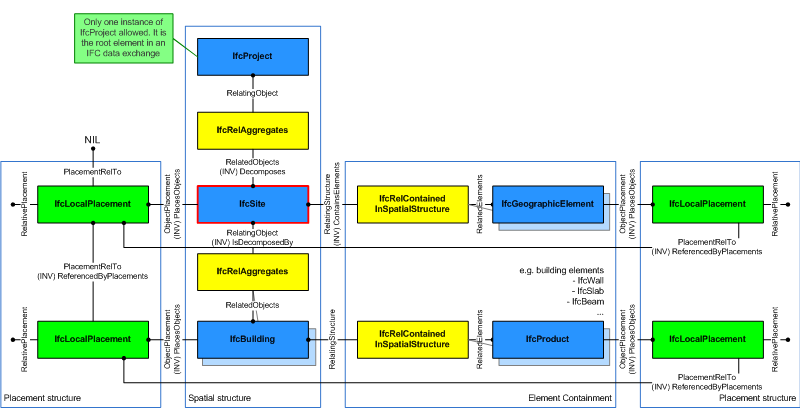
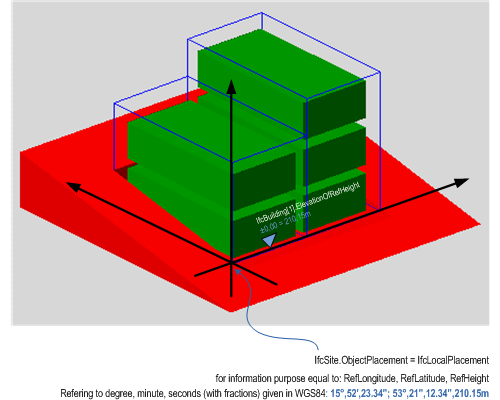

# IfcSite

A site is a defined area of land, possibly covered with water, on which the project construction is to be completed. A site may be used to erect, retrofit or turn down building(s), or for other construction related developments.

> NOTE  Definition according to ISO 6707-1: area of land or water where construction work or other development is undertaken.

Precise geospatial information of a site shall be derived from the georeferencing entities that relate the _IfcProject_ to the real world, using sets of datum (see _IfcCoordinateOperation_ and _IfcCoordinateReferenceSystem_).

In small-scale projects (e.g., building), when georeferencing is not provided as recommended above, the  _Longitude_, _Latitude_ and _Elevation_ attributes of _IfcSite_ can be used for approximate indication of the site location. This methodology is not meant to replace precise georeferencing, but can still be useful for those use cases that do not require accurate geospatial information (e.g., sun shading simulations). If asserted, the _Longitude_, _Latitude_ and _Elevation_ establish the point in WGS84 where the point 0.,0.,0. of the _LocalPlacement_ of _IfcSite_ is situated.

The geometrical placement of the site, defined by the _IfcLocalPlacement_, shall be always relative to the spatial structure element, in which this site is included, or absolute, i.e. to the world coordinate system, as established by the geometric representation context of the project. The world coordinate system, established at the _IfcProject.RepresentationContexts_, may include a definition of the true north within the XY plane of the world coordinate system, if provided, it can be obtained at _IfcGeometricRepresentationContext.TrueNorth_.

A project may span over several connected or disconnected sites. Therefore site complex provides for a collection of sites included in a project. A site can also be decomposed in parts, where each part defines a site section. This is defined by the composition type attribute of the supertype _IfcSpatialStructureElements_ which is interpreted as follow:

* COMPLEX = site complex
* ELEMENT = site
* PARTIAL = site section

Figure 1 shows the _IfcSite_ as part of the spatial structure. In addition to the logical spatial structure, also the placement hierarchy is shown. In this example the spatial structure hierarchy and the placement hierarchy are identical.

> NOTE  Detailed requirements on mandatory element containment and placement structure relationships are given in view definitions and implementer agreements.

Figure 2 describes the heights and elevations of the _IfcSite_. It is used to provide the geographic longitude, latitude, and height above sea level for the origin of the site. The origin of the site is the local placement.

The provision of longitude, latitude, height at the _IfcSite_ for georeferencing is provided for upward compatibility reasons. It requires a single instance of _IfcSite_ and WGS84 as coordinate reference system.

For exact georeferencing (or referencing to any other geographic coordinate system other than WSG84) the entities _IfcCoordinateReferenceSystem_ and _IfcMapConversion_ have to be used to define an exact mapping of the project engineering coordinate system to the geographic (or map) coordinate system.

* <small>reference height of site is provided by: <em>IfcSite.RefElevation</em>, it is given according to the height datum used at this location.</small>
* <small>the reference height of each building situated at the site is given against the same height datum used at this location.</small>
* <small>the elevations of each storey belonging to each building are given as local height relative to the reference height of the building.</small>

> HISTORY  New entity in IFC1.0.

## Attributes

### RefLatitude
World Latitude at reference point (most likely defined in legal description). Defined as integer values for degrees, minutes, seconds, and, optionally, millionths of seconds with respect to the world geodetic system WGS84.
> NOTE  Latitudes are measured relative to the geodetic equator, north of the equator by positive values - from 0 till +90, south of the equator by negative values - from 0 till -90.

### RefLongitude
World Longitude at reference point (most likely defined in legal description). Defined as integer values for degrees, minutes, seconds, and, optionally, millionths of seconds with respect to the world geodetic system WGS84.
> NOTE  Longitudes are measured relative to the geodetic zero meridian, nominally the same as the Greenwich prime meridian: longitudes west of the zero meridian have negative values - from 0 till -180, longitudes east of the zero meridian have positive values - from 0 till -180.

> EXAMPLE  Chicago Harbor Light has according to WGS84 a longitude -87.35.40 (or 87.35.40W) and a latitude 41.53.30 (or 41.53.30N).

### RefElevation
Datum elevation relative to sea level.

### LandTitleNumber
The land title number (designation of the site within a regional system).

> IFC4.3.0.0 DEPRECATION  This attribute shall not be used for export, use property _LandTitleID_ at _Pset_LandRegistration_ instead.

### SiteAddress

Address given to the site for postal purposes.

> IFC4.3.0.0 DEPRECATION This attribute is deprecated and shall no longer be used. Use Pset_Address instead.

## Concepts

### Body Geometry

The body representation of IfcSite may be typically defined using a solid or surface model. Applicable solids are Breps and Tesselations. Applicable surface models are the IfcFaceBasedSurfaceModel and the IfcShellBasedSurfaceModel.

The representation identifier and type of this representation of IfcSite is:

* _IfcShapeRepresentation.RepresentationIdentifier_ = 'Body'
* _IfcShapeRepresentation.RepresentationType_ = 'Brep', or 'SurfaceModel'

### FootPrint GeomSet Geometry

The foot print representation of IfcSite is given by either a single 2D curve (such as IfcPolyline or IfcCompositeCurve), or by a list of 2D curves (in case of inner boundaries).

### Product Local Placement

The local placement for IfcSite is defined in its supertype IfcProduct. It is defined by the IfcLocalPlacement, which defines the local coordinate system that is referenced by all geometric representations.

* The PlacementRelTo relationship of IfcLocalPlacement shall point to the IfcSpatialStructureElement of type "IfcSite", if relative placement is used (e.g. to position a site relative a a site complex, or a site section to a site).
* If the relative placement is not used, the absolute placement is defined within the world coordinate system. If there is only one site object, then this is the default situation.

### Property Sets for Objects

### Quantity Sets

### Site Attributes

### Spatial Composition

By using the inverse relationship _IfcSite.Decomposes_ it references IfcProject || IfcSite through _IfcRelAggregates.RelatingObject_, If it refers to another instance of IfcSite, the referenced IfcSite needs to have a different and higher CompositionType, i.e. COMPLEX (if the other IfcSite has ELEMENT), or ELEMENT (if the other IfcSite has PARTIAL).

### Spatial Container

If there are building elements and/or other elements directly related to the IfcSite (like a fence, or a shear wall), they are associated with the IfcSite by using the objectified relationship IfcRelContainedInSpatialStructure. The IfcIfcSite references them by its inverse relationship:

* _IfcSite.ContainsElements_ -- referencing any subtype of IfcProduct (with the exception of other spatial structure element) by _IfcRelContainedInSpatialStructure.RelatedElements_

### Spatial Decomposition

By using the inverse relationship _IfcSite.IsDecomposedBy_ it references (IfcSite || IfcBuilding || IfcSpace by _IfcRelAggregates.RelatedObjects_. If it refers to another instance of IfcSite, the referenced IfcSite needs to have a different and lower CompositionType, i.e. ELEMENT (if the other IfcSite has COMPLEX), or PARTIAL (if the other IfcSite has ELEMENT).

### Survey Points Geometry

The survey point representation of IfcSite is defined
using a set of survey points and optionally breaklines. The
breaklines are restricted to only connect points given in the set
of survey points. Breaklines, if given, are used to constrain the
triangulation.

The representation identifier and type of this geometric
representation of IfcSite is:

* IfcShapeRepresentation.RepresentationIdentifier =
'SurveyPoints'
* IfcShapeRepresentation.RepresentationType =
'GeometricCurveSet'

Figure 180 shows a set of survey points, given as 3D Cartesian points within the object coordinate system of the site. Figure 181 shows the result after facetation.

The set of IfcCartesianPoint is included in the set of IfcGeometricCurveSet.Elements.

Figure 180 — Site survey points

Figure 181 — Site survey points facetation

Figure 182 shows A set of survey points, given as 3D Cartesian points, and a set of break points, given as a set of lines, connecting some survey points, within the object coordinate system of the site. Figure 183 shows the result after facetation.

The set of IfcCartesianPoint and the set of IfcPolyline are included in the set of IfcGeometricCurveSet.Elements.

Figure 182 — Site breaklines

Figure 183 — Site breaklines facetation

> NOTE  The geometric representation of the site has been based on the ARM level description of the site\_shape\_representation given within the ISO 10303-225 "Building Elements using explicit shape representation".

