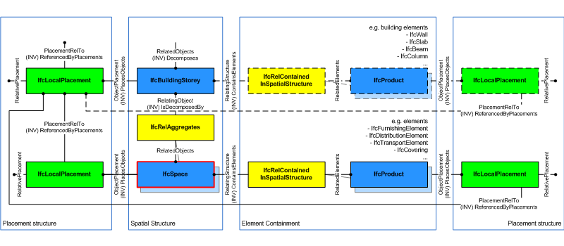
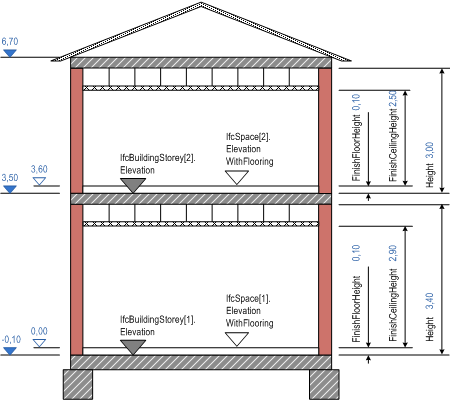

# IfcSpace

A space represents an area or volume bounded actually or theoretically. Spaces are areas or volumes that provide for certain functions within a building.

A space is associated to a building storey (or in case of exterior spaces to a site). A space may span over several connected spaces. Therefore a space group provides for a collection of spaces included in a storey. A space can also be decomposed in parts, where each part defines a partial space. This is defined by the _CompositionType_ attribute of the supertype _IfcSpatialStructureElement_ which is interpreted as follow:

* COMPLEX = space group
* ELEMENT = space
* PARTIAL = partial space

> NOTE&nbsp; View definitions and implementation agreements may restrict spaces with _CompositionType_=ELEMENT to be non-overlapping.

The _IfcSpace_ is used to build the spatial structure of a building (that serves as the primary project breakdown and is required to be hierarchical). The spatial structure elements are linked together by using the objectified relationship _IfcRelAggregates_.

Figure 1 shows the _IfcSpace_ as part of the spatial structure. It also serves as the spatial container for space related elements.

> NOTE&nbsp; Detailed requirements on mandatory element containment and placement structure relationships are given in view definitions and implementer agreements.

The following guidelines should apply for using the _Name_, _Description_, _LongName_ and _ObjectType_ attributes.

* _Name_ holds the unique name (or space number) from the plan.
* _Description_ holds any additional information field the user may have specified, there are no further recommendations.
* _LongName_ holds the full name of the space, it is often used in addition to the _Name_, if a number is assigned to the room, then the descriptive name is exchanged as _LongName_.
* _ObjectType_ holds the space type, i.e. usually the functional category of the space .

> NOTE&nbsp; In cases of inconsistency between the geometric representation of the _IfcSpace_ and the combined geometric representations of the surrounding _IfcRelSpaceBoundary_, the geometric representation of the space should take priority over the geometric representation of the surrounding space boundaries.

Figure 2 describes the heights and elevations of the _IfcSpace_.

* elevation of the space (top of construction slab) equals elevation of storey: provided by _IfcBuildingStorey.Elevation_ relative to em>IfcBuilding.ElevationOfRefHeight
* elevation of the space flooring (top of flooring on top of slab): provided by _IfcSpace.ElevationWithFlooring_ relative to _IfcBuilding.ElevationOfRefHeight_
* height of space (top of slab below to bottom of slab above): provided by BaseQuantity with Name="Height"
* floor height of space (top of slab below to top of flooring): provided by BaseQuantity with Name="FinishFloorHeight"
* net height of space (top of flooring to bottom of suspended ceiling): provided by BaseQuantity with Name="FinishCeilingHeight"

> HISTORY&nbsp; New entity in IFC1.0

## Attributes

### PredefinedType
Predefined generic types for a space that are specified in an enumeration. There might be property sets defined specifically for each predefined type.

> NOTE&nbsp; Previous use had been to indicates whether the _IfcSpace_ is an interior space by value INTERNAL, or an exterior space by value EXTERNAL. This use is now deprecated, the property 'IsExternal' at 'Pset_SpaceCommon' should be used instead.

{ .change-ifc2x4}
> IFC4 CHANGE&nbsp; The attribute has been renamed from _ExteriorOrInteriorSpace_ with upward compatibility for file based exchange.

### ElevationWithFlooring
Level of flooring of this space; the average shall be taken, if the space ground surface is sloping or if there are level differences within this space.

### HasCoverings
Reference to _IfcCovering_ by virtue of the objectified relationship _IfcRelCoversSpaces_. It defines the concept of a space having coverings assigned. Those coverings may represent different flooring, or tiling areas.

> NOTE&nbsp; Coverings are often managed by the space, and not by the building element, which they cover.

{ .change-ifc2x3}
> IFC2x Edition3 CHANGE&nbsp; New inverse relationship. Upward compatibility for file based exchange is guaranteed.

### BoundedBy
Reference to a set of _IfcRelSpaceBoundary_'s that defines the physical or virtual delimitation of that space against physical or virtual boundaries.

## Formal Propositions

### CorrectPredefinedType
Either the _PredefinedType_ attribute is unset (e.g. because an _IfcSpaceType_ is associated), or the inherited attribute _ObjectType_ shall be provided, if the _PredefinedType_ is set to USERDEFINED.

### CorrectTypeAssigned
Either there is no space type object associated, i.e. the _IsTypedBy_ inverse relationship is not provided, or the associated type object has to be of type _IfcSpaceType_.

## Concepts

### Body Brep Geometry

The space can be represented by a brep geometry representation

### Body Clipping Geometry

The following additional constraints apply to the advanced
representation:

* Solid: IfcExtrudedAreaSolid is required,
* Profile: IfcArbitraryClosedProfileDef is
required, IfcArbitraryProfileDefWithVoids shall be
supported.
* Extrusion: The extrusion direction shall be vertically,
i.e., along the positive Z Axis of the co-ordinate system of the
containing spatial structure element.
* Boolean result: The difference operation with the second
operand being of type IfcHalfSpaceSolid (or one of its 
subtypes) shall be supported.

Figure 185 shows an extrusion of an arbitrary profile definition into the swept area solid. The solid and an half space solid are operands of the Boolean result of IfcSpace.

Figure 185 — Space body clipping

### Body SweptSolid Geometry

The following constraints apply to the standard
representation:

* Solid: IfcExtrudedAreaSolid is required,
* Profile: IfcArbitraryClosedProfileDef is
required, IfcArbitraryProfileDefWithVoids shall be
supported.
* Extrusion: The extrusion direction shall be vertically,
i.e., along the positive Z Axis of the co-ordinate system of the
containing spatial structure element.

Figure 184 shows an extrusion of an arbitrary profile definition with voids into the swept area solid of IfcSpace.

Figure 184 — Space body swept solid

### FootPrint GeomSet Geometry

The following constraints apply to the 2D representation:

* An IfcBoundedCurve is required, using
IfcPolyline for faceted space contours or
 IfcCompositeCurve for space contours with arc segments. For
 spaces with inner boundaries, a set of IfcBoundedCurve's is
 used, that should be grouped into an
 IfcGeometricCurveSet.

 

> EXAMPLE  Figure 183 shows a two-dimensional bounded curve representing the
> foot print of IfcSpace.

Figure 183 — Space footprint

 

### Product Local Placement

The local placement for IfcSpace is defined at its 
supertype IfcProduct. It is defined by the 
IfcLocalPlacement, which defines the local coordinate system 
that is referenced by all geometric representations.

* The PlacementRelTo relationship of 
IfcLocalPlacement shall point to the local placement of the
 IfcSpatialStructureElement of type IfcBuildingStorey or IfcSite if
 relative placement is used.
* If the relative placement is not used, the absolute placement
 is defined within the world coordinate system.

### Property Sets for Objects

### Quantity Sets

### Space Boundaries 1st Level

### Space Boundaries 2nd Level

### Spatial Composition

By using the inverse relationship IfcSpace.IsDecomposedBy it references IfcSpace by IfcRelAggregates.RelatedObjects. If it refers to another
 instance of IfcSpace, the referenced IfcSpace needs 
to have a different and lower CompositionType, i.e. ELEMENT 
(if the other IfcSpace has COMPLEX), or PARTIAL (if the
 other IfcSpace has ELEMENT).

### Spatial Container

If there are building elements and/or other elements directly 
related to the IfcSpace (like most furniture and
distribution elements), they are associated with the 
IfcSpace by using the objectified relationship
IfcRelContainedInSpatialStructure. The IfcSpace 
references them by its inverse relationship:

* IfcSpace.ContainsElements -- referencing any subtype of 
IfcProduct (with the exception of other spatial structure
element) by
 IfcRelContainedInSpatialStructure.RelatedElements.

### Spatial Decomposition

By using the inverse relationship IfcSpace.Decomposes it references IfcSite ||
IfcBuildingStorey || IfcSpace by 
IfcRelAggregates.RelatingObject. If it refers to another 
instance of IfcSpace, the referenced IfcSpace 
needs to have a different and higher CompositionType, i.e.
COMPLEX (if the other IfcSpace has ELEMENT), or ELEMENT (if 
the other IfcSpace has PARTIAL).

