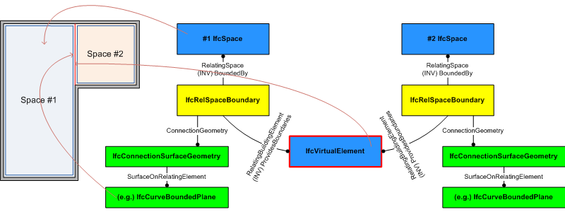

# IfcVirtualElement

A virtual element is a special element used to provide imaginary, placeholder, or provisional areas, volumes, and boundaries. Virtual elements are usually not displayed and do not have quantities, associated materials, and other measures.

Uses of _IfcVirtualElement_ include:

 * An imaginary boundary such as between two adjacent, but not separated, spaces. The _IfcVirtualElement_ may provide the 2D curve or 3D surface representation of the virtual space connection and is referenced by two instances of _IfcRelSpaceBoundary_, each pointing to one of the two adjacent _IfcSpaces_. The boundary is exchanged using _PredefinedType_ = BOUNDARY.
 * A provision for voids. Such as where a particular volume of space is requested by an engineering function that might later be accepted or rejected. If accepted it is transformed into a void within a building element, like a wall opening, or a slab opening. The provision for voids is exchanged using the _PredefinedType_ = PROVISIONFORVOID. Typically this shall use a swept solid geometry, where the profile of the swept solid lies on/near the surface of the referred building element and the extrusion depths is equal to or bigger then (in case of round or otherwise irregular element shape) the thickness of the building element. The appropriate property set _Pset_ProvisionForVoid_ should be attached.
 * A clearance space. Typically a placeholder for the necessary space allocation for future designed elements, such as mechanical equipment that will be determined in a later design phase. It is also used for structure gauge. The clearance is exchanged using the _PredefinedType_ = CLEARANCE.

Figure 1 describes how to use _IfcRelSpaceBoundary_ in conjunction with _IfcVirtualElement_ to define space boundaries.

Figure 1 &mdash; Virtual element used as space boundaries

> IFC4.3.0.0 CHANGE Virtual elements can now be used for void provisions and clearance to replace existing functionality on _IfcBuildingElementProxy_.

> IFC2x2 CHANGE  The entity _IfcVirtualElement_ has been added. Upward compatibility for file based exchange is guaranteed.

> HISTORY  New entity in IFC2x2 Addendum.

## Formal Propositions

### CorrectPredefinedType
Either the _PredefinedType_ attribute is unset, or the inherited attribute _ObjectType_ must be asserted when the value of _PredefinedType_ is set to _USERDEFINED_.

## Concepts

### Material Single

It is illegal to assign an _IfcMaterial_ to an _IfcVirtualElement_ with the _PredefinedType_ = PROVISIONFORVOID.

### FootPrint Geometry

### Surface Geometry

The 3D geometric representation of IfcVirtualElement is defined using a surface geometry. The following constraints apply to the 3D surface representation:

 * 'Surface3D': _IfcSurfaceOfLinearExtrusion_, _IfcCurveBoundedPlane_, _IfcCurveBoundedSurface_, _IfcRectangularTrimmedSurface_
 * 'GeometricSet': a list of 3D surfaces within the constraints shown above.

In case of an _IfcSurfaceOfLinearExtrusion_:

 * Profile: _IfcArbitraryOpenProfileDef_
 * Extrusion: The extrusion direction shall be vertically, i.e., along the positive Z Axis of the coordinate system of the containing spatial structure element.

In case of an _IfcCurveBoundedPlane_, _IfcCurveBoundedSurface_, _IfcRectangularTrimmedSurface_:

 * Extrusion: The _BasisSurface_ shall be a surface that is upright, i.e. standing perpendicular to the xy place of the coordinate system of the containing spatial structure element.
