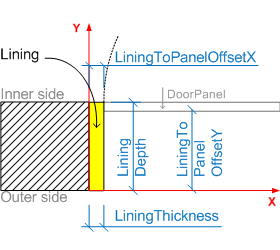
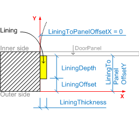
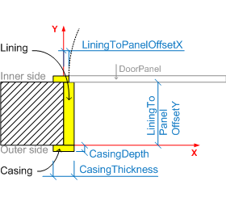
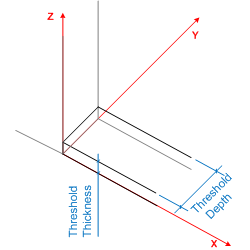
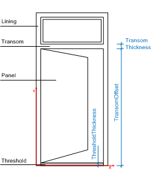

# IfcDoorLiningProperties

The door lining is the frame which enables the door leaf to be fixed in position. The door lining is used to hang the door leaf. The parameters of the door lining define the geometrically relevant parameter of the lining.<!-- end of definition -->

> NOTE The _IfcDoorLiningProperties_ shall only be applied by the receiving application to parametrically define the 3D shape of a door, if the attribute _IfcDoorType_.ParameterTakesPrecedence is set TRUE.

The _IfcDoorLiningProperties_ are included in the list of properties of _IfcDoorType_.HasPropertySets. More information about the door lining can be included in the same list of the _IfcDoorType_ using another _IfcPropertySet_ for dynamic extensions.

The _IfcDoorLiningProperties_ does not hold its own geometric representation. However it defines parameters which can be used to create the shape of the door type (which is inserted by the _IfcDoor_ into the spatial context of the project) as described below. The parameters of the _IfcDoorLiningProperties_ define a standard door lining, including (if given) a threshold and a transom. The outer boundary of the lining is determined by the 'Profile' shape representation assigned to the _IfcDoor_, which inserts the _IfcDoorType_.

The lining is applied to the left, right and upper side of the opening reveal. The parameters are:

 * LiningDepth, if omitted, equal to wall thickness - this only takes effect if a value for <em>LiningThickness</em> is given. If both parameters are not given, then there is no lining.</li>
 * LiningThickness
 * LiningToPanelOffsetX
 * LiningToPanelOffsetY

> NOTE The parameters <em>LiningToPanelOffsetX</em> and <em>LiningToPanelOffsetY</em> are added in IFC4.

The lining can only cover part of the opening reveal.

 * LiningOffset, given if lining edge has an offset to the x axis of the local placement.

> NOTE In addition to the <em>LiningOffset</em>, the local placement of the <em>IfcDoor</em> can already have an offset to the wall edge and thereby shift the lining along the y axis. The actual position of the lining is calculated from the origin of the local placement along the positive y axis with the distance given by <em>LiningOffset</em>.

The lining may include a casing, which covers part of the wall faces around the opening. The casing covers the left, right and upper side of the lining on both sides of the wall. The parameters are:

 * CasingDepth
 * CasingThickness

The lining may include a threshold, which covers the bottom side of the opening. The parameters are:

 * ThresholdDepth, if omitted, equal to wall thickness - this only takes effect if a value for <em>ThresholdThickness</em> is given. If both parameters are not given, then there is no threshold.
 * ThresholdThickness
 * ThresholdOffset (not shown in figure), given, if the threshold edge has an offset to the x axis of the local placement.

The lining may have a transom which separates the door panel from a window panel. The transom, if given, is defined by:

 * TransomOffset, a parallel edge to the x axis of the local placement
 * TransomThickness

The depth of the transom is identical to the depth of the lining and not given as separate parameter.

> NOTE _LiningDepth_ describes the length of the lining along the reveal of the door opening. It can be given by an absolute value if the door lining has a specific depth depending on the door style. However often it is equal to the wall thickness. If the same door style is used (like the same type of single swing door), but inserted into different walls with different thicknesses, it would be necessary to create a special door style for each wall thickness. Therefore several CAD systems allow to set the value to "automatically aligned" to wall thickness. This should be exchanged by leaving the optional attribute LiningDepth unassigned. The same agreement applies to _ThresholdDepth_.

> HISTORY New entity in IFC2.0. Has been renamed from _IfcDoorLining_ in IFC2x.

{ .change-ifc2x4}
> IFC4 CHANGE The following attributes have been added _LiningToPanelOffsetX_, _LiningToPanelOffsetY_. The attribute _ShapeAspectStyle_ is deprecated and shall no longer be used. Supertype changed to new _IfcPreDefinedPropertySet_.

> IFC4.3.2.0 DEPRECATION This entity, and most other subtypes of IfcPreDefinedPropertySet, are now deprecated. Use Pset_DoorLiningProperties instead.

## Attributes

### LiningDepth
Depth of the door lining, measured perpendicular to the plane of the door lining. If omitted (and with a given value to lining thickness) it indicates an adjustable depth (i.e. a depth that adjusts to the thickness of the wall into which the occurrence of this door style is inserted).

### LiningThickness
Thickness of the door lining as explained in the figure above. If _LiningThickness_ value is 0. (zero) it denotes a door without a lining (all other lining parameters shall be set to NIL in this case). If the _LiningThickness_ is NIL it denotes that the value is not available.
{ .change-ifc2x4}
> IFC4 CHANGE Data type modified to be _IfcNonNegativeLengthMeasure_.

### ThresholdDepth
Depth (dimension in plane perpendicular to door leaf) of the door threshold. Only given if the door lining includes a threshold. If omitted (and with a given value to threshold thickness) it indicates an adjustable depth (i.e. a depth that adjusts to the thickness of the wall into which the occurrence of this door style is inserted).

### ThresholdThickness
Thickness of the door threshold as explained in the figure above. If _ThresholdThickness_ value is 0. (zero) it denotes a door without a threshold (_ThresholdDepth_ shall be set to NIL in this case). If the _ThresholdThickness_ is NIL it denotes that the information about a threshold is not available.
{ .change-ifc2x4}
> IFC4 CHANGE Data type modified to be _IfcNonNegativeLengthMeasure_.

### TransomThickness
Thickness (width in plane parallel to door leaf) of the transom (if provided - that is, if the _TransomOffset_ attribute is set), which divides the door leaf from a glazing (or window) above.
If the _TransomThickness_ is set to zero (and the _TransomOffset_ set to a positive length), then the door is divided vertically into a leaf and transom window area without a physical frame.
{ .change-ifc2x4}
> IFC4 CHANGE Data type changed to _IfcNonNegativeLengthMeasure_.

### TransomOffset
Offset of the transom (if given) which divides the door leaf from a glazing (or window) above. The offset is given from the bottom of the door opening.

### LiningOffset
Offset (dimension in plane perpendicular to door leaf) of the door lining. The offset is given as distance to the x axis of the local placement.

### ThresholdOffset
Offset (dimension in plane perpendicular to door leaf) of the door threshold. The offset is given as distance to the x axis of the local placement. Only given if the door lining includes a threshold and the parameter is known.

### CasingThickness
Thickness of the casing (dimension in plane of the door leaf). If given it is applied equally to all four sides of the adjacent wall.

### CasingDepth
Depth of the casing (dimension in plane perpendicular to door leaf). If given it is applied equally to all four sides of the adjacent wall.

### ShapeAspectStyle
Pointer to the shape aspect, if given. The shape aspect reflects the part of the door shape, which represents the door lining.
{ .change-ifc2x4}
> IFC4 CHANGE The attribute is deprecated and shall no longer be used, i.e. the value shall be NIL ($).

### LiningToPanelOffsetX
Offset between the lining and the window panel measured along the x-axis of the local placement.
{ .change-ifc2x4}
> IFC4 CHANGE New attribute added at the end of the entity definition.

### LiningToPanelOffsetY
Offset between the lining and the door panel measured along the y-axis of the local placement.
{ .change-ifc2x4}
> IFC4 CHANGE New attribute added at the end of the entity definition.

## Formal Propositions

### WR31
Either both parameter, _LiningDepth_ and _LiningThickness_ are given, or only the _LiningThickness_, then the _LiningDepth_ is variable. It is not valid to only assert the _LiningDepth_.
> NOTE A _LiningDepth_ with NIL ($) value indicates a door style with a lining equal to the wall thickness.

{ .change-ifc2x4}
> IFC4 CHANGE Rule corrected.

### WR32
Either both parameter, _ThresholdDepth_ and _ThresholdThickness_ are given, or only the _ThresholdThickness_, then the _ThresholdDepth_ is variable. It is not valid to only assert the _ThresholdDepth_.
> NOTE A _ThresholdDepth_ with NIL ($) value indicates a door style with a lining equal to the wall thickness.

{ .change-ifc2x4}
> IFC4 CHANGE Rule corrected.

### WR33
Either both parameter, _TransomDepth_ and _TransomThickness_ are given, or none of them.

### WR34
Either both parameter, the _CasingDepth_ and the _CasingThickness_, are given, or none of them.

### WR35
The _IfcDoorLiningProperties_ shall only be used in the context of an _IfcDoorType_.
