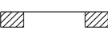

This enumeration defines the basic ways how individual door panels operate.

<!-- end of short definition -->

> HISTORY New property enumeration in IFC4.3.2.0 to replace the enumeration IfcDoorPanelOperationEnum

## Items

### SWINGING

Swinging:

### DOUBLE_ACTING

Double acting:

### SLIDING

Sliding:

### FOLDING

Folding:

### REVOLVING

Revolving:

### ROLLINGUP

Rolling up:

### FIXEDPANEL

Fixed panel:

### NOTDEFINED

Not defined.

### OTHER

Other.

### NOTKNOWN

Not known.

### UNSET

Unset.
