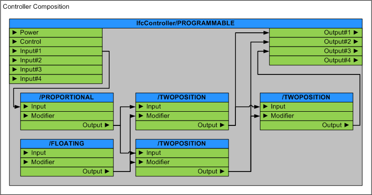

# IfcController

A controller is a device that monitors inputs and controls outputs within a building automation system.

A controller may be physical (having placement within a spatial structure) or logical (a software interface or aggregated within a programmable physical controller).

> HISTORY&nbsp; New entity in IFC4

{ .note}
>

## Attributes

### PredefinedType

## Formal Propositions

### CorrectPredefinedType
Either the _PredefinedType_ attribute is unset (e.g. because an _IfcControllerType_ is associated), or the inherited attribute _ObjectType_ shall be provided, if the _PredefinedType_ is set to USERDEFINED.

### CorrectTypeAssigned
Either there is no controller type object associated, i.e. the _IsTypedBy_ inverse relationship is not provided, or the associated type object has to be of type _IfcControllerType_.

## Concepts

### Composition

Figure 328 illustrates controller composition use.

Figure 328 — Controller composition use

### Material

### Object Typing

### Port

### Property Sets for Objects

### Quantity Sets

