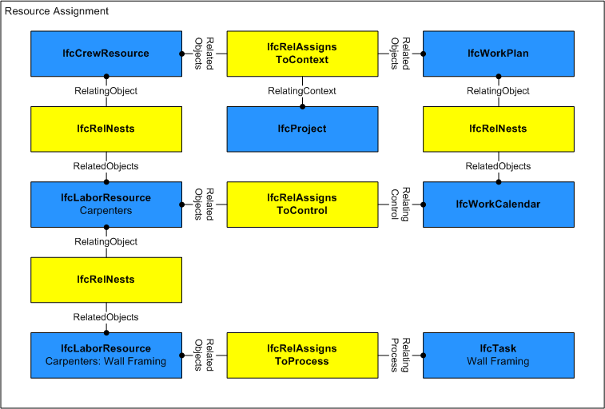
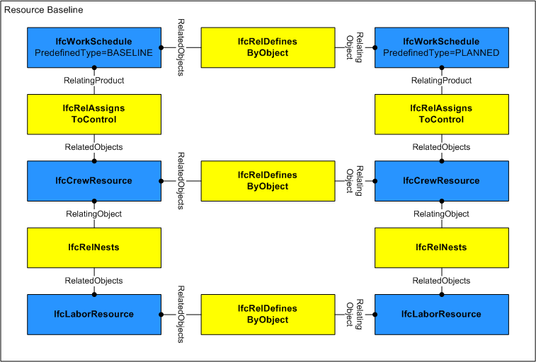
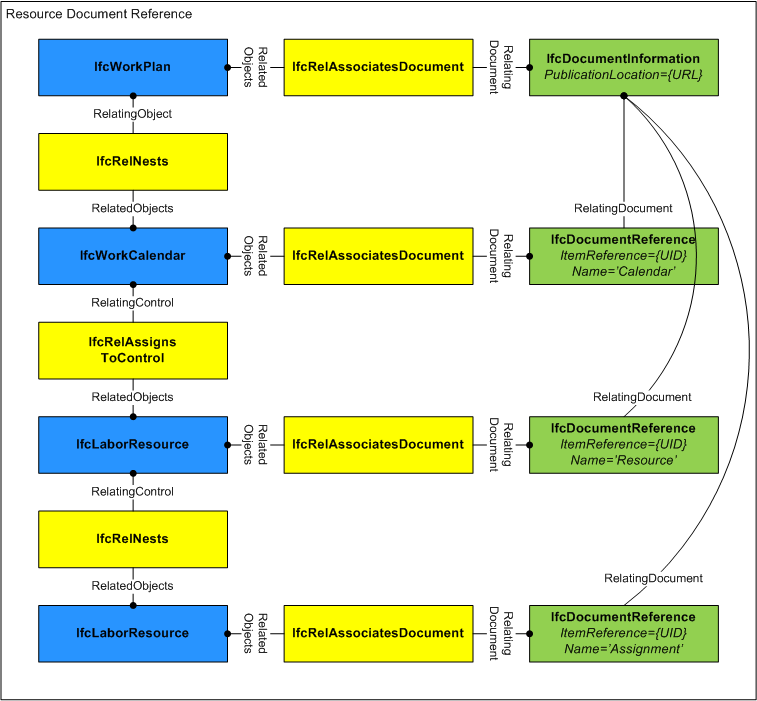
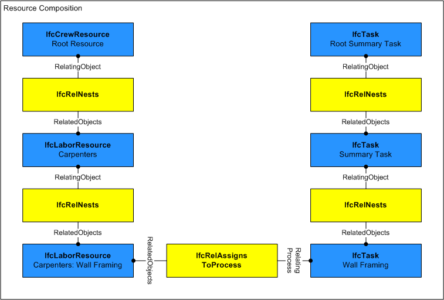
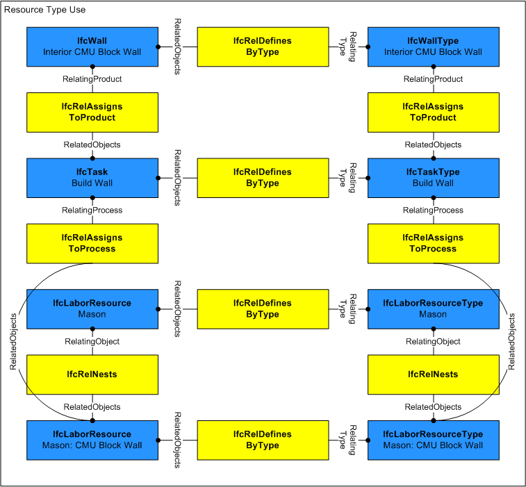
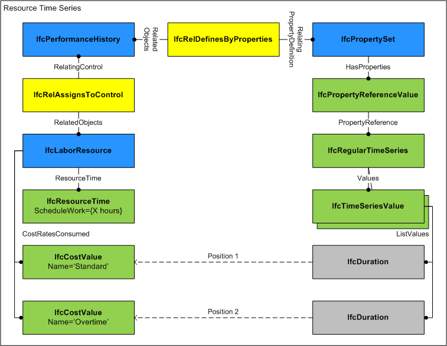

_IfcConstructionResource_ is an abstract generalization of the different resources used in construction projects, mainly labour, material, equipment and product resources, plus subcontracted resources and aggregations such as a crew resource.

<!-- end of short definition -->


A resource represents "use of something" and does not necessarily correspond to a single item such as a person or vehicle, but represents a pool of items having limited availability such as general labor or an equipment fleet. A resource can represent either a generic resource pool (not having any task assignment) or a task-specific resource allocation (having an _IfcTask_ assignment).

> HISTORY New entity in IFC2x2.

{ .change-ifc2x4}
> IFC4 CHANGE Modified in to promote _ResourceIdentifer_ and _ResourceGroup_ (renamed to _LongDescription_) to supertype _IfcResource_ and add attributes as described.

{ .use-head}
### Declaration use definition

A root-level resource (specifically _IfcCrewResource_ or _IfcSubContractResource_) is declared within the project by _IfcRelDeclares_ where _RelatingContext_ refers to the single _IfcProject_ and _RelatedObjects_ refers to one or more _IfcConstructionResource_, and other root-level objects within the project.

{ .use-head}
### Assignment use definition

A resource may be assigned to an actor by _IfcRelAssignsToActor_ where _RelatingActor_ refers to an _IfcActor_ and _RelatedObjects_ refers to one or more _IfcConstructionResource_ or other objects. Such relationship indicates the actor responsible for allocating the resource such as partitioning into task-specific allocations, delegating to other actors, and/or scheduling over time. Note that this assignment does not indicate the person or organization performing the work; that is indicated by _IfcRelAssignsToResource_. The actor responsible for the resource may or may not be the same as any actor(s) performing work.

A resource may be assigned to a control by _IfcRelAssignsToControl_ where _RelatingControl_ refers to an _IfcControl_ and _RelatedObjects_ refers to one or more _IfcConstructionResource_ or other objects. Most commonly an _IfcWorkCalendar_ is assigned indicating availability of the resource, where such calendar is nested within a base calendar or an _IfcWorkPlan_ which in turn is assigned to the _IfcProject_.

A resource may be assigned to a group by _IfcRelAssignsToGroup_ where _RelatingGroup_ refers to an _IfcGroup_ and _RelatedObjects_ refers to one or more _IfcConstructionResource_ or other objects. Most commonly an _IfcAsset_ is assigned indicating the asset to be tracked, where such asset is nested within an _IfcInventory_ which in turn is assigned to the _IfcProject_.

A resource may be assigned to a product by _IfcRelAssignsToProduct_ where _RelatingProduct_ refers to an _IfcProduct_ and _RelatedObjects_ refers to one or more _IfcConstructionResource_ or other objects. Most commonly an _IfcElement_ subtype is assigned indicating the product to be constructed, where such product is connected to a spatial structure which in turn is aggregated within the _IfcProject_.

A resource may be assigned to a process by _IfcRelAssignsToProcess_ where _RelatingProcess_ refers to an _IfcProcess_ and _RelatedObjects_ refers to one or more _IfcConstructionResource_ or other objects. Most commonly an _IfcTask_ is assigned indicating the task to be performed by the resource, where such task is nested within a summary task which in turn is assigned to the _IfcProject_.

A resource may have assignments of other objects using _IfcRelAssignsToResource_ where _RelatingResource_ refers to the _IfcConstructionResource_ and _RelatedObjects_ refers to one or more objects such as _IfcActor_ or _IfcProduct_ subtypes. This relationship indicates specific objects assigned to fulfill resource usage.

Figure 1 illustrates resource assignment.



{ .use-head}
### Baseline use definition

A resource may have any number of baselines defined using the relationship _IfcRelDefinesByObject_ where _RelatingObject_ is the "current" resource and _RelatedObjects_ consists of multiple "baseline" resources, each representing a copy of the resource as it existed at an earlier point in time as shown in Figure 185. Each baseline _IfcConstructionResource_ is identified by its nested _IfcRelAssignsToControl_ relationship to an _IfcWorkSchedule_ having _PredefinedType=BASELINE_, _IfcWorkSchedule.CreationDate_ indicating the date of the baseline, and _IfcWorkSchedule.Name_ indicating the name of the baseline.



## Attributes

### Usage
Indicates the work, usage, and times scheduled and completed. Some attributes on this object may have associated constraints or time series; see documentation of _IfcResourceTime_ for specific usage. If the resource is nested, then certain values may be calculated based on the component resources as indicated at _IfcResourceTime_.

{ .change-ifc2x4}
> IFC4 CHANGE New attribute.

### BaseCosts
Indicates the unit costs for which accrued amounts should be calculated. Such unit costs may be split into _Name_ designations (for example, 'Standard', 'Overtime'), and may contain a hierarchy of cost values that apply at different dates (using _IfcCostValue.ApplicableDate_ and _IfcCostValue.FixedUntilDate_).

{ .change-ifc2x4}
> IFC4 CHANGE New attribute.

### BaseQuantity
Identifies the base quantity consumed of the resource relative to assignments.

For crew, labour, subcontract, and equipment resources, this refers to _IfcQuantityTime_.

For material resources, this refers to any valid dimensional quantity, such as IfcQuantityVolume, IfcQuantityArea, IfcQuantityLength, or IfcQuantityWeight.

For product resources, this refers to _IfcQuantityCount_.

{ .change-ifc2x4}
> IFC4 CHANGE New attribute.

## Concepts

### Constraint Association

Constraints may be applied to a resource to indicate fixed work (such as total person-hours) or fixed usage (such as simultaneous workers).

Figure FIXEDUSAGE indicates fixed usage (such as simultaneous workers) such that changes to ScheduleWork should impact the assigned IfcTask.TaskTime.ScheduleDuration and vice-versa.

```
digraph dot_neato {
IfcLaborResource [pos="0,0!"];
IfcResourceTime [label=<{IfcResourceTime | ScheduleWork: PT16H<br/>ScheduleUsage: 1}>, pos="0,-70!"];

IfcRelAssociatesConstraint [label=<IfcRelAssociates<br/>Constraint>, pos="200,0!"];

IfcObjective [label=<{IfcObjective | ObjectiveQualifier: PARAMETER}>, pos="400,0!"];
IfcMetric [label=<{IfcMetric | ConstraintGrade: HARD<br />Benchmark: EQUALTO}>, pos="400,-70!"];
IfcReference [label=<{IfcReference | AttributeIdentifier: Usage}>, pos="400,-140!"];
IfcReference2 [label=<{IfcReference | AttributeIdentifier: ScheduleUsage }>, pos="400,-210!"];

IfcLaborResource -> IfcResourceTime [label="Usage"]
IfcRelAssociatesConstraint -> IfcLaborResource [headlabel="RelatedObjects[1]", labelangle=90, labeldistance="3"]
IfcRelAssociatesConstraint -> IfcObjective [taillabel="RelatingConstraint", labelangle=90, labeldistance="3"]
IfcObjective -> IfcMetric [headlabel="BenchmarkValues[1]"];
IfcMetric -> IfcReference [headlabel="ReferencePath"];
IfcReference -> IfcReference2 [headlabel="InnerReference"];
}
```

Figure FIXEDUSAGE — A fixed constraint on the schedule usage.


Figure FIXEDWORK indicates fixed work (such as total person-hours) such that changes to ScheduleUsage should impact the assigned IfcTask.TaskTime.ScheduleDuration and vice-versa.

```
digraph dot_neato {
IfcLaborResource [pos="0,0!"];
IfcResourceTime [label=<{IfcResourceTime | ScheduleWork: PT16H<br/>ScheduleUsage: 1}>, pos="0,-70!"];

IfcRelAssociatesConstraint [label=<IfcRelAssociates<br/>Constraint>, pos="200,0!"];

IfcObjective [label=<{IfcObjective | ObjectiveQualifier: PARAMETER}>, pos="400,0!"];
IfcMetric [label=<{IfcMetric | ConstraintGrade: HARD<br />Benchmark: EQUALTO}>, pos="400,-70!"];
IfcReference [label=<{IfcReference | AttributeIdentifier: Usage}>, pos="400,-140!"];
IfcReference2 [label=<{IfcReference | AttributeIdentifier: ScheduleWork }>, pos="400,-210!"];

IfcLaborResource -> IfcResourceTime [label="Usage"]
IfcRelAssociatesConstraint -> IfcLaborResource [headlabel="RelatedObjects[1]", labelangle=90, labeldistance="3"]
IfcRelAssociatesConstraint -> IfcObjective [taillabel="RelatingConstraint", labelangle=90, labeldistance="3"]
IfcObjective -> IfcMetric [headlabel="BenchmarkValues[1]"];
IfcMetric -> IfcReference [headlabel="ReferencePath"];
IfcReference -> IfcReference2 [headlabel="InnerReference"];
}
```

Figure FIXEDWORK — A fixed constraint on the schedule work.

### Document Association

Documents may be published for work plans consisting of schedules, calendars, tasks, and resources. The relationship IfcRelAssociatesDocument may be used to preserve mappings to such document where RelatingDocument points to an IfcDocumentReference and RelatedObjects includes the IfcConstructionResource as shown in Figure 184. _IfcDocumentReference.ItemReference_ identifies the resource within the scope of the document, such as an integer or guid. The _IfcDocumentReference.ReferencedDocument_ corresponds to the document which is uniquely identified by _IfcDocumentInformation.DocumentId_ and/or _IfcDocumentInformation.PublicationLocation_. Such document mapping allows items in the document to be updated from the building information model and vice-versa.



### Object Nesting

Resources may be decomposed into allocation pools using the IfcRelNests relationship as shown in Figure 181. For example, an IfcLaborResource for "Electrician" may be decomposed into three task-specific IfcLaborResource objects: "Electrical Rough-in", "First Floor Circuits", and "Second Floor Circuits". Both relating and related sides may represent the same _ResourceTime.ScheduleUsage_ quantity (for example, 6 workers time-shared), or the related side may break out _ResourceTime.ScheduleUsage_ quantities for reserved use (for example, 4 workers and 2 workers).

A common scenario is two nesting levels where the first-level resources have no task assignments; while second-level resources have specific task assignments indicating that the resource is subdivided into allocations for specific tasks. While the model allows unlimited nesting of resources, implementer agreements may restrict to two nesting levels with task assignments specifically at the second level.



### Object Typing

The resource type may provide shared productivity and cost information, allowing tasks and resources to be selected according to lowest cost and/or shortest duration. Given an IfcProduct of a particular IfcTypeProduct type, an IfcTypeProcess may be selected from those assigned to the product type using IfcRelAssignsToProduct, and an IfcTypeResource may be selected from those assigned to the process type using IfcRelAssignsToProcess. Then IfcTask and IfcConstructionResource occurrences may be instantiated from the type definitions, applying productivitity and rate information to assigned quantities to calculate _ResourceTime.ScheduleWork_. Task durations can then be calculated by dividing _ResourceTime.ScheduleWork_ by _ResourceTime.ScheduleUsage_.



### Property Sets for Objects

For time series properties as shown in Figure 180, each IfcTimeSeriesValue indicates a LIST of values, where the sequence of the value corresponds to the IfcCostValue at _IfcConstructionResource.CostRatesConsumed_. For example, if CostRatesConsumed has two IfcCostValue items in the LIST, "Standard" and "Overtime", then _IfcTimeSeriesValue(IfcDuration('T8H0M0S'),IfcDuration('T2H0M0S'))_ would indicate 8 hours at Standard rate and 2 hours at Overtime rate. If the list of values at _IfcTimeSeriesValue.ListValues_ is less than the size of CostRatesConsumed, then subsequent values are considered to be zero.



