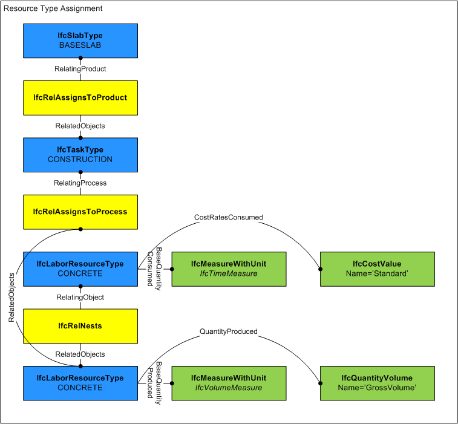

# IfcConstructionResourceType

_IfcConstructionResourceType_ is an abstract generalization of the different resource types used in construction projects, mainly labor, material, equipment and product resource types, plus subcontracted resource types and aggregations such as a crew resource type.
<!-- end of short definition -->

A resource type represents a model of "use of something" and does not necessarily correspond to a specific type of object such as a person or vehicle, but represents possible usages of such objects such as general labor or an equipment fleet. A resource type can either represent usage in general (consumption attributes defined but no task type assignment) or a task-specific resource type (production attributes defined and having an _IfcTask_ assignment).

A construction resource type captures common productivities and cost rates for applying resources to particular task types.

> HISTORY New entity in IFC4.

{ .use-head}
Composition use definition

Resource types may be decomposed into nested resource types indicating productivities when applying the resource to specific task types using the _IfcRelNests_ relationship where _IfcRelNests.RelatingObject_ refers to the general resource type and _IfcRelNests.RelatedObjects_ refers to one or more task-specific productivities. For example, an _IfcLaborResourceType_ may be defined for "Carpenter" which may have a nested _IfcLaborResourceType_ for "Carpenter - Wall Framing" and another nested _IfcLaborResourceType_ for "Carpenter - Drywall", each of which may have productivities based according to specific task types (_IfcTaskType_).

{ .use-head}
Assignment use definition

Resource types may be assigned to process types (_IfcTypeProcess_ subtypes) using the _IfcRelAssignsToProcess_ relationship as shown in Figure 1. Such relationship indicates that the resource type applies to the process type for the use indicated (e.g. _IfcTaskType.PredefinedType_). Such relationship enables a scenario of placing an _IfcProduct_ of a particular _IfcTypeProduct_, querying for a set of _IfcTypeProcess_ process types for constructing such product (e.g. _IfcTaskTypeEnum.CONSTRUCTION_), querying each _IfcTypeProcess_ for a set of _IfcTypeResource_ resource types for carrying out the process, and finally choosing an _IfcTypeProcess_ and _IfcTypeResource_ combination resulting in the shortest time for instantiated _IfcTask_ occurrence(s) and/or lowest-cost for instantiated _IfcConstructionResource_ occurrence(s).

## Attributes

### BaseCosts
Indicates the unit costs and environmental impacts for which accrued amounts should be calculated. Such unit costs may be split into _Name_ designations (e.g. 'Standard', 'Overtime'), and may contain a hierarchy of cost values that apply at different dates (using _IfcCostValue.ApplicableDate_ and _IfcCostValue.FixedUntilDate_).

### BaseQuantity
Identifies the quantity for which the _BaseQuantityProduced_ applies. The _Name_ of the _IfcPhysicalQuantity_ identifies the quantity definition being measured, e.g. "GrossVolume". For production-based resources (e.g. carpentry labor), this value refers to quantities on _IfcProduct_(s) to which the assigned _IfcTask_ is assigned. For duration-based resources (e.g. safety inspector, fuel for equipment), this value refers to quantities that may be assigned to occurrences of the assigned _IfcTaskType_.
