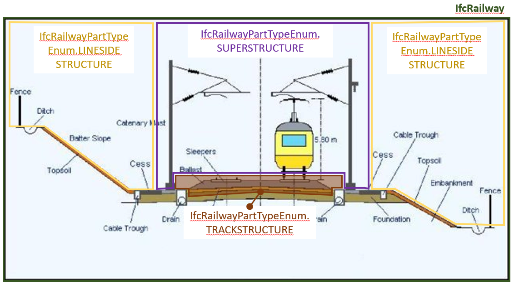
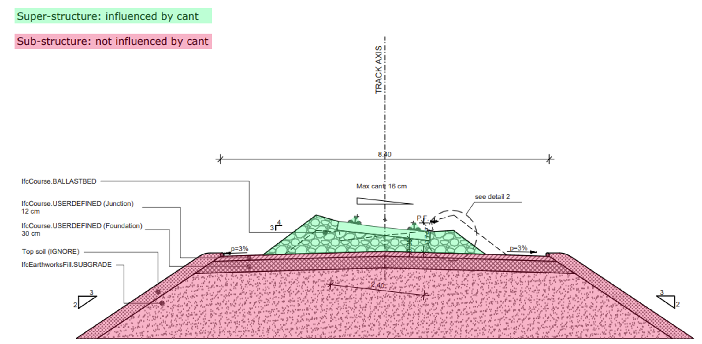
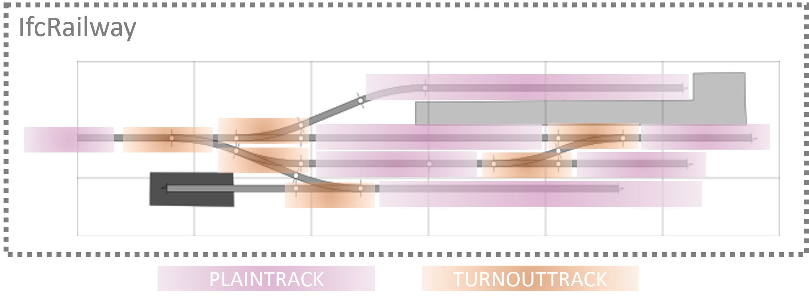

# IfcRailwayPartTypeEnum

The _IfcRailwayPartTypeEnum_ defines the range of different types of railway part that can be specified.<!-- end of definition -->

A railway line can be spatially organised into several parts, using a vertical, longitudinal and lateral criteria for its division. There is not one standardised way of spatially dividing the line, as this depends on the use case. The _IfcRailwayPart_s that can be used to spatially organise a line are:

- **Track**, which can be further described by
  - Plain tracks
  - Turnout tracks
  - Dilatation tracks
  - Or other track parts
- **Line-side**, which can be further described by
  - Line-side parts
- **Substructure** (for constructed ground)
- **Above-track**

See descriptions of enumeration types for further details. Below are some suggestions on how parts can be used to spatially organise a railway line.

**Vertical organisation**

Figure 1 — Example of usage of _IfcRailwayPart_ to vertically organise the elements of a railway line

> NOTE If required by the use case, the part below the track can be distinguished between _IfcRailwayPart.SUBSTRUCTURE_ (for constructed ground) and _IfcFacilityPartCommon.BELOWGROUND_ (for non constructed, existing ground).

> NOTE The Figure above covers the average simple case. For example, other advanced cases could be:
> * Railway line on a bridge
> * Railway line in a tunnel (single or multiple tubes)
> * Railway line junction (two or more lines crossing)
> * Railway line in the context of a main station building
> * Railway line with its supporting radio communication equipment (e.g. GSM-R equipment, antenna poles) on a nearby hill
> 
> Such more advanced cases might require a specific spatial organisation.

**Detailed vertical organisation**
If required by the use case, the *SUBSTRUCTURE* part can contain elements such as _IfcCourse_ or _IfcEarthworksFill_ to distinguish the different substructure layers. An example is captured in the Figure below.

Figure 2 — Example of the courses and elements that may be contained in the *SUBSTRUCTURE* part 

**Longitudinal organisation**

Tracks may also have a longitudinal organisation based on track specificities:

* PLAINTRACK for the plain line tracks.
* TURNOUTTRACK for the area of turnouts.

As depicted in the example Figure below. Other parts, not included in the example, may be:
* DILATATIONTRACK for the area of dilatation panels.
* TRACKPART for generic-purpose longitudinal organisation of parts of the track.

Figure 3 — Example of _IfcRailwayPart_ to longitudinally organise the elements of a railway line

**Mixed organisation**
The attribute _IfcFacilityPart.UsageType_ allows to to spatially organise the same dataset using multiple criteria. For example, a general vertical organisation, like in Figure 1, and a further longitudinal organisation just for the track, as in Figure 2. 

> NOTE This creates an implicit hierarchy among spatial parts and increases the complexity of the model.

## Items

### TRACK
A spatial structure element that contains track-related elements, for example rails and sleepers.

### PLAINTRACK
A spatial structure element to further divide a track. It does do not contain any turnout panel or dilatation panel.

### TURNOUTTRACK
A spatial structure element to further divide a track. It contains turnouts, and does not contain any plain track or dilatation panel.

### DILATATIONTRACK
A spatial structure element to further divide a track. It may be used in specific points of the line, where expansions or movements of tracks need to be accommodated (e.g., before and after a bridge). It does not contain any plain-track or turnout panel.

### TRACKPART
A spatial structure element to further divide a track, for purposes that do not fall into these categories: plain-track, turnout-track, dilatation-track.

### LINESIDE
A spatial structure element that contains elements of the railway that are not in or over the tracks, hence line-side.

### LINESIDEPART
A spatial structure element to further divide a line-side part. It can be used to distinguish line-side parts into more manageable volumes, for engineering purposes.

### ABOVETRACK
A spatial structure element that contains elements that are positioned above or over the track, for example catenary lines and suspension systems.

### SUBSTRUCTURE
A spatial structure element that contains elements that are positioned below the track, for example the earthwork platform, prepared subgrade and embankment. This can be above or below finished ground level. 

### USERDEFINED
User-defined type

### NOTDEFINED
Undefined type.
