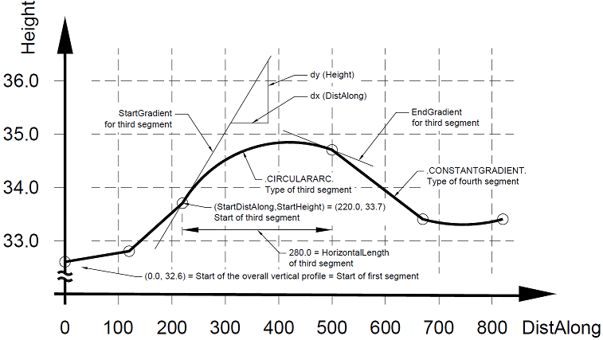

# IfcAlignmentVerticalSegment

Individual segment along the _IfcAlignmentVertical_, being defined in the distance-along/z coordinate space.

The vertical alignment is defined by segments that connects end-to-start. The vertical alignment curve geometry is defined in a plane with x = distance along horizontal, the y = height (or elevation). The transition at the segment connection is not enforced to be tangential, The _IfcSegment_ _Transition_ enumeration specifies the type of transition explicitly.

The following vertical segment types are defined:

* line segment - _IfcAlignmentVerticalSegmentTypeEnum_ .LINE.
* circular arc segment - _IfcAlignmentVerticalSegmentTypeEnum_ .ARC.
* parabolic arc segment - _IfcAlignmentVerticalSegmentTypeEnum_ .PARABOLICARC. which can describe symmetric and unsymmetric parabolas
* transition segment with linear curvature variation - _IfcAlignmentVerticalSegmentTypeEnum_ .CLOTHOID.

For each vertical segment, the following non-redundant information is provided:

* the start point (in distance along/ height coordinates)
* the start gradient (as a ratio measure with horizontal being 0, uphill positive, and downhill negative) usually between 1 < n < -1 (equal to a percentage of 100% < n < -100%, or to a degree of 45&deg; < n < -45&deg; but higher values are possible)
* the length (as horizontal length along the distance along (not the curve segment length))
* the curve parameter needed for circular and parabolic arc segments

The following information can be calculated (and is therefore not exchanged explicitly to avoid redundancy and inconsistencies)

* the end distance along (from the distance along and segment length)
* the end height (from start distance along, gradient, length and curve parameter)
* the end direction (from start direction, segment length and curve parameter)
* the point of vertical intersection (from start direction and end direction)

The following checks can be done to validate the correct exchange:

* continuity – does the calculated end distance along of the previous segment matches with the provided start distance along of this segment
* tangential continuity – does the calculated end gradient of the previous segment matches with the provided start gradient of this segment

> NOTE  Specific subtypes of the IfcAlignmentVerticalSegment add specific geometric curve parameters. Connectivity between vertical segments is not necessarily tangential, but this can be enforced as a requirement through the attribute _TangentialContinuity_.

## Attributes

### StartDistAlong
Distance along the horizontal alignment as measured along the corresponding _IfcAlignmentHorizontal_.
> NOTE 1  The distance along is measured from the start point of _IfcAlignmentHorizontal_, any optionally provided offset expressed by _IfcAlignmentHorizontal_.StartDistanceAlong is not taken into account.
> NOTE 2  The unit of measurement is the global length unit, as set by _IfcContext_.UnitInContext

### HorizontalLength
Length measured as distance along the horizontal alignment of the segment.

### StartHeight
Elevation in Z of the start point relative to the IfcAlignment coordinate system.
> NOTE  It is strongly advised to not offset the IfcAlignment coordinate system from the project engineering coordinate system.

### StartGradient
Start gradient of the segment.

### EndGradient
End gradient of the segment. In the case of a PredefinedType='.CONSTANTGRADIENT.' the value is the same as _StartGradient_.

### RadiusOfCurvature
Radius of parabola or arc. Positive values imply a CCW direction whereas negative CW.
> NOTE1  For _PredefinedType_ is ARC. The radius of the basis circle for the arc.
> NOTE2  For _PredefinedType_ is PARABOLICARC. Parabola constant (determining the “steepness” of the parabola). The parabola constant is provided by the “minimum parabola radius”, the true radius of a parabola at its vertical axis (the zero-gradient point of the parabola). The minimum radius is twice the focal length of the parabola (the distance between the focal point and the vertex).
> NOTE3  For _PredefinedType_ that is not either ARC or PARABOLICARC the value should be empty.

### PredefinedType
Predefined type of the vertical alignmnent segment.
