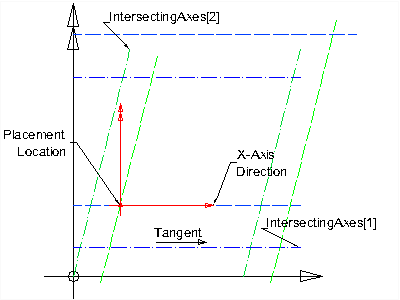
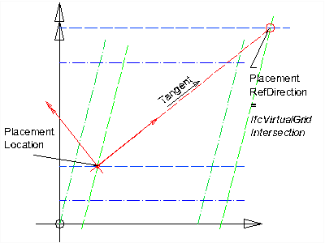

# IfcGridPlacement

_IfcGridPlacement_ provides a specialization of _IfcObjectPlacement_ in which the placement and axis direction of the object coordinate system is defined by a reference to the design grid as defined in _IfcGrid_.

The location of the object coordinate system is given by the attribute _PlacementLocation_. It is defined as an _IfcVirtualGridIntersection_, that is, an intersection between two grid axes with optional offsets.

The axis direction of the x-axis of the object coordinate system is given either:

* _PlacementRefDirection_ = NIL: by the tangent of the first grid axis (_PlacementLocation.IntersectingAxes[1]_) at the virtual intersection (maybe using the offset curve, if _PlacementLocation.OffsetDistances_ is given);
* _PlacementRefDirection_ = _IfcDirection_: by the explicitly provided direction information;
* _PlacementRefDirection_ = _IfcVirtualGridIntersection_: by the tangent between the virtual grid intersection of _PlacementLocation_ and the virtual grid intersection of _PlacementRefDirection_. Offsets as potentially provided in the _IfcVirtualGridIntersection_'s of _PlacementLocation_ and _PlacementRefDirection_ have to be taken into account.

The direction of the y-axis of the _IfcGridPlacement_ is the orthogonal complement to the x-axis. The plane defined by the x and y axis shall be co-planar to the xy plane of the local placement of the _IfcGrid_.

The direction of the z-axis is the orientation of the cross product of the x-axis and the y-axis, i.e. the z-axis of the _IfcGridPlacement_ shall be co-linear to the z-axis of the local placement of the _IfcGrid_.

> NOTE&nbsp; The _IfcGrid_ local placement, that can be provided relative to the local placement of another spatial structure element, has to be taken into account for calculating the absolute placement of the virtual grid intersection.

> NOTE&nbsp; The _PlacementLocation.OffsetDistances[3]_ and the _PlacementRefDirection.OffsetDistances[3]_ shall either not be assigned or should have the same z offset value.

The following figures/ show the usage of placement location and direction for an _IfcGridPlacement_.

<table cellpadding="2" cellspacing="2" summary="Geometry use definition">
<tr><td align="left" valign="top"></td>
<td style="vertical-align:bottom">

Figure 1 illustrates the case where <em>PlacementRefDirection</em> is <u>not</u> given - the object coordinate system is defined by:

<ul>
<li><u>its location</u>: given by the virtual grid intersection of <em>PlacementLocation</em></li>
<li><u>its x-axis direction</u>: given by the tangent of the first intersecting axis in the offset location of the virtual grid intersection</li>
</ul>
</td>
</tr>
<tr><td>
Figure 1 &mdash; Grid placement
</td>
<td>&nbsp;</td>
</tr>
</table>

<table cellpadding="2" cellspacing="2" summary="Geometry use definition">
<tr>
<td align="left" valign="top"></td>
<td style="vertical-align:bottom">

Figure 2 illustrates the case where <em>PlacementRefDirection</em> is given as an <em>IfcDirection</em>- the object coordinate system is defined by:
<ul>
<li><u>its location</u>: given by the virtual grid intersection of <em>PlacementLocation</em></li>
<li><u>its x-axis direction</u>: given by the <em>DirectionRatios</em> of the <em>IfcDirection</em>, only the ratios for x and y are taken into account,</li>
</ul>
</td>
</tr>
<tr><td>
Figure 2 &mdash; Grid placement with direction
</td>
<td>&nbsp;</td>
</tr>
</table>

<table cellpadding="2" cellspacing="2" summary="Geometry use definition">
<tr><td align="left" valign="top"></td>
<td style="vertical-align:bottom">

Figure 3 illustrates the case where <em>PlacementRefDirection</em> is given as an <em>IfcVirtualGridIntersection</em>- the object coordinate system is defined by:
<ul>
<li><u>its location</u>: given by the virtual grid intersection of <em>PlacementLocation</em></li>
<li><u>its x-axis direction</u>: given by the tangent of the line between the virtual grid intersection of the <em>PlacementLocation</em> and the virtual grid intersection of the <em>PlacementRefDirection</em>.</li>
</ul>
</td>
</tr>
<tr><td>
Figure 3 &mdash; Grid placement with intersection
</td>
<td>&nbsp;</td>
</tr>
</table>

> HISTORY  New entity in IFC1.5. The entity name was changed from IfcConstrainedPlacement in IFC2x.

{ .change-ifc2x4}
> IFC4 CHANGE Attribute data type of _PlacementRefDirection_ has been changed to _IfcGridPlacementDirectionSelect_.

## Attributes

### PlacementLocation
Placement of the object coordinate system defined by the intersection of two grid axes.

### PlacementRefDirection
Reference to either an explicit direction, or a second grid axis intersection, which defines the orientation of the grid placement.
{ .change-ifc2x4}
> IFC4 CHANGE The select of an explict direction has been added.
