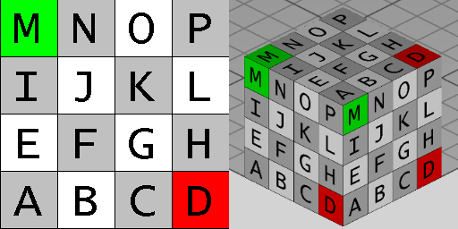

The _IfcBlock_ is a Construction Solid Geometry (CSG) 3D primitive. It is defined by a position and a positive distance along the three orthogonal axes. The inherited _Position_ attribute has the _IfcAxis2Placement3D_ type and provides:

* _SELF\IfcCsgPrimitive3D.Position_: The location and orientation of the axis system for the primitive.
* _SELF\IfcCsgPrimitive3D.Position.Location_: The block has one vertex at location and the edges are aligned with the placement axes in the positive sense.

<!-- end of short definition -->

The _XLength_, _YLength_, and _ZLength_ attributes define the size of the IfcBlock along the three axes.

Figure 1 — Block geometry

Figure 1 illustrates geometric parameters of a block where the block positioned within its own placement
coordinate system. The values for <em>XLength</em>, <em>YLength</em>, and <em>ZLength</em> are applied to the positive
direction of the X, Y, and Z axis.

{ .extDef}
> NOTE Definition according to ISO 10303-42
> A block is a type of geometric representation item which is a solid rectangular parallelepiped, defined with a location and placement coordinate system. The block is specified by the positive lengths x, y, and z along the axes of the placement coordinate system, and has one vertex at the origin of the placement coordinate system.

> NOTE Entity adapted from **block** defined in ISO 10303-42.

> HISTORY New entity in IFC2x3.

{ .use-head}
Texture definition

On each side face, textures are aligned facing upright. On the top and bottom faces, textures are aligned facing front-to-back. Textures are stretched or repeated to the extent of each face according to _RepeatS_ and _RepeatT_.

Figure 2 illustrates default texture mapping with a clamped texture (RepeatS=False and RepeatT=False). The image on the left shows the texture where the S axis points to the right and the T axis points up. The image on the right shows the texture applied to the geometry where the X axis points back to the right, the Y axis points back to the left, and the Z axis points up.

{ .gridtable}

Figure 2 — Block textures

|Side|Normal|Origin X|Origin Y|Origin Z|S Axis|T Axis|
|--- |--- |--- |--- |--- |--- |--- |
|Left|-X|0|+YLength|0|-Y|+Z|
|Right|+X|+XLength|0|0|+Y|+Z|
|Front|-Y|0|0|0|+X|+Z|
|Back|+Y|+XLength|+YLength|0|-X|+Z|
|Bottom|-Z|0|+YLength|0|+X|-Y|
|Top|+Z|0|0|+ZLength|+X|+Y|

Table 3 — Texture parameters

## Attributes

### XLength
The size of the block along the placement X axis. It is provided by the inherited axis placement through _SELF\IfcCsgPrimitive3D.Position.P[1]_.

### YLength
The size of the block along the placement Y axis. It is provided by the inherited axis placement through _SELF\IfcCsgPrimitive3D.Position.P[2]_.

### ZLength
The size of the block along the placement Z axis. It is provided by the inherited axis placement through _SELF\IfcCsgPrimitive3D.Position.P[3]_.
