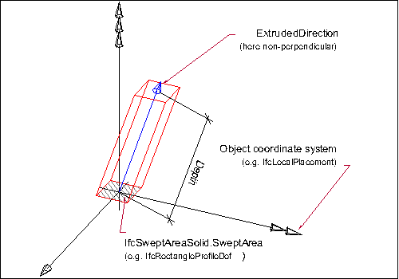
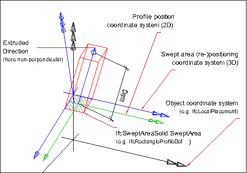
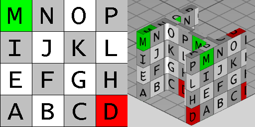

# IfcExtrudedAreaSolid

The _IfcExtrudedAreaSolid_ is defined by sweeping a cross section provided by a profile definition. The direction of the extrusion is given by the _ExtrudedDirection_ attribute and the length of the extrusion is given by the _Depth_ attribute. If the planar area has inner boundaries (holes defined), then those holes shall be swept into holes of the solid.<!-- end of definition -->

The resulting solid is positioned by the _IfcSweptAreaSolid_._Position_ relative to the object coordinate system. If provided, it allows to reposition the extruded solid. If not provided, it defaults to the current object coordinate system. The _ExtrudedDirection_ is given within the position coordinate system as defined by _IfcSweptAreaSolid_._Position_. The extruded direction can be any direction which is not perpendicular to the z axis of the position coordinate system.

Figure 1 — Extruded area solid geometry

> EXAMPLE Figure 1 illustrates geometric parameters of the extruded area solid. The extruded area solid defines the extrusion of a 2D area by an direction and depth. The result is a solid.

 * The profile to be swept is defined:
    * as a 2D primitive, here <em>IfcRectangleProfileDef</em>, that is placed relative to the xy plane of object coordinate system
    * since no 2D profile position coordinate system is provided, here <em>IfcParameterizedProfileDef</em>.<em>Position</em> = NIL, the profile is positioned without transformation into the xy plane of the object coordinate system (by default, centric at 0.,0. with no rotation)
 * The resulting swept solid is not repositioned, as no position coordinate system is provided, here IfcSweptAreaSolid.<em>Position</em> = NIL.

Figure 2 — Repositioned extruded area solid geometry

> EXAMPLE Figure 2 illustrates geometric parameters and additional positioning parameters of the extruded area solid. The extruded area solid defines the extrusion of a 2D area by an direction and depth. The 2D area, provided by a parameterized profile definition, can be positioned relative to the object coordinate system (other then by default at 0.,0. with no rotation). The result is a solid that can be repositioned within the object coordinate system.

 * The profile to be swept is defined:
    * as a 2D primitive, here <em>IfcRectangleProfileDef</em>, that is placed relative to the xy plane of object coordinate system
    * a 2D profile position coordinate system is provided that positions the profile relative to the xy plane (here at a corner of the rectangle)
 * The resulting swept solid is repositioned, here it is moved into local z and rotated by 15' along the y axis.

{ .extDef}
> NOTE  Definition according to ISO/CD 10303-42:1992
> An extruded area solid is a solid defined by sweeping a bounded planar surface. The direction of translation is defined by a direction vector, and the length of the translation is defined by a distance depth. The planar area may have holes which will sweep into holes in the solid.

> NOTE  Entity adapted from **extruded_area_solid** defined in ISO 10303-42.

> HISTORY  New entity in IFC1.5

{ .use-head}
Texture use definition

For side faces, textures are aligned facing upright continuously along the sides with origin at the first point of an arbitrary profile, and following the outer bound of the profile counter-clockwise (as seen from above). For parameterized profiles, the origin is defined at the +Y extent for rounded profiles (having no sharp edge) and the first sharp edge counter-clockwise from the +Y extent for all other profiles. Textures are stretched or repeated on each side along the outer boundary of the profile according to _RepeatS_. Textures are stretched or repeated on each side along the extrusion axis according to _RepeatT_.

For top and bottom caps, textures are aligned facing front-to-back, with the origin at the minimum X and Y extent. Textures are stretched or repeated on the top and bottom to the extent of each face according to _RepeatS_ and _RepeatT_.

For profiles with voids, textures are aligned facing upright along the inner side with origin at the first point of an arbitrary profile, and following the inner bound of the profile clockwise (as seen from above). For parameterized profiles, the origin of inner sides is defined at the +Y extent for rounded profiles (having no sharp edge such as hollow ellipses or rounded rectangles) and the first sharp edge clockwise from the +Y extent for all other profiles.

Figure 3 — Extruded area solid textures

> EXAMPLE Figure 3 illustrates default texture mapping with a repeated texture (RepeatS=True and RepeatT=True). The image on the left shows the texture where the S axis points to the right and the T axis points up. The image on the right shows the texture applied to the geometry where the X axis points back to the right, the Y axis points back to the left, and the Z axis points up. For an <em>IfcExtrudedAreaSolid</em> having a profile of <em>IfcIShapeProfileDef</em>, the side texture coordinate origin is the first corner counter-clockwise from the +Y axis, which equals   (-0.5*IfcIShapeProfileDef.OverallWidth, +0.5*IfcIShapeProfileDef.OverallDepth),   while the top (end cap) texture coordinates start at   (-0.5*IfcIShapeProfileDef.OverallWidth, -0.5*IfcIShapeProfileDef.OverallDepth).

## Attributes

### ExtrudedDirection
The direction in which the surface, provided by _SweptArea_ is to be swept.

### Depth
The distance the surface is to be swept along the _ExtrudedDirection_.

## Formal Propositions

### ValidExtrusionDirection
The _ExtrudedDirection_ shall not be perpendicular to the local z-axis.
