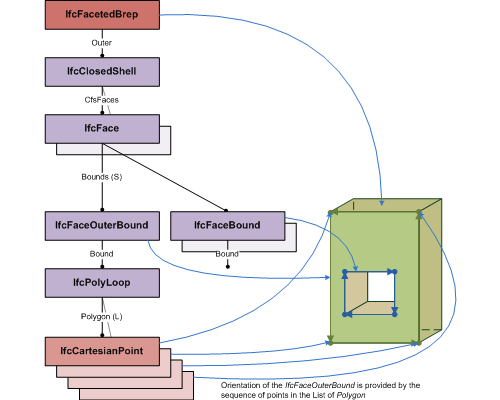

# IfcFacetedBrep

The _IfcFacetedBrep_ is a manifold solid brep with the restriction that all faces are planar and bounded polygons.<!-- end of definition -->

Figure 1 — Diagram showing the use of <em>IfcFacetedBrep</em>

> NOTE  Use of <em>IfcFacetedBrep</em> is restricted for boundary representation models with planar surfaces only. Those surfaces are implicitly represented by the bounding polygons. The diagram shows the topological and geometric representation items that are used for faceted breps. Each <em>IfcCartesianPoint</em>, used within the <em>IfcFacetedBrep</em> shall be referenced three times by an <em>IfcPolyLoop</em> bounding a different <em>IfcFace</em>.

{ .extDef}
> NOTE  Definition according to ISO/CD 10303-42:1992
> A faceted B-rep is a simple form of boundary representation model in which all faces are planar and all edges are straight lines. Unlike the B-rep model, edges and vertices are not represented explicitly in the model but are implicitly available through the poly loop entity. A faceted B-rep has to meet the same topological constraints as the manifold solid B-rep.

{ .extDef}
> The faceted B-rep has been introduced in order to support the larger number of systems that allow boundary type solid representations with planar surfaces only.

> NOTE  Entity adapted from **manifold_solid_brep** defined in ISO 10303-42.

> HISTORY  New entity in IFC1.0

**Informal Propositions**

1. All the bounding loops of all the faces of all the shells in the _IfcFacetedBrep_ shall be of type _IfcPolyLoop_.
2. All vertices shall be referenced by all polyloops, sharing the vertex. I.e., each Cartesian point shall be references by at least three polyloops.
