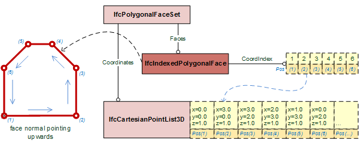

# IfcIndexedPolygonalFace

The _IfcIndexedPolygonalFace_ is a compact representation of a planar face being part of a face set. The vertices of the polygonal planar face are provided by 3 or more Cartesian points, defined by indices that point into an _IfcCartesianPointList3D_, either directly, or via the _PnIndex_, if provided at _IfcPolygonalFaceSet_.
<!-- end of short definition -->

Figure 1 shows an _IfcIndexedPolygonalFace_ at an _IfcPolygonalFaceSet_ not using _PnIndex_ (the default).

Figure 1 — Polygonal face geometry provided by indices into a point list

Figure 2 shows an _IfcIndexedPolygonalFace_ at an _IfcPolygonalFaceSet_ using _PnIndex_.

Figure 2 — Polygonal face geometry provided by indices into an PN Index

> HISTORY New entity in IFC4 Addendum 2.

## Attributes

### CoordIndex
One-dimensional list with the indices for the three or more points, that define the vertices of the outer loop. If the tessellated face set is closed, indicated by _SELF\IfcTessellatedFaceSet.Closed_, then the points, defining the outer loop, shall connect counter clockwise, as seen from the outside of the body, so that the resulting normal will point outwards.
> NOTE The coordinates of the vertices are provided by the indexed list of _SELF\IfcTessellatedFaceSet.Coordinates.CoordList_. If the _SELF\IfcTessellatedFaceSet.PnIndex_ is provided, the indices point into it, otherwise directly into the _IfcCartesianPointList3D_.

### ToFaceSet
Reference to the _IfcPolygonalFaceSet_ for which this face is associated.

### HasTexCoords
Optional reference to the _IfcTextureCoordinateIndices_ that provide the texture coordinates for applying textures to this face.
