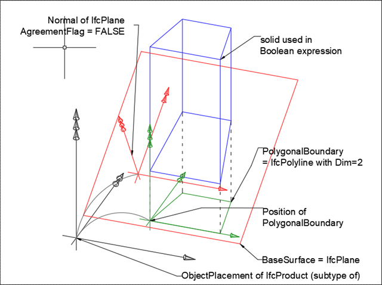

# IfcPolygonalBoundedHalfSpace

The polygonal bounded half space is a special subtype of a half space solid, where the material of the half space used in Boolean expressions is bounded by a two-dimensional boundary. The base surface of the half space is positioned by its normal relative to the object coordinate system (as defined at the supertype _IfcHalfSpaceSolid_), and its boundary (with straight and arc segments) is defined in the XY plane of the position coordinate system established by the _Position_ attribute, the subtraction body is extruded perpendicular to the XY plane of the position coordinate system, that is, into the direction of the positive Z axis defined by the _Position_ attribute.<!-- end of definition -->

The boundary is defined by a 2 dimensional polyline (or 2 dimensional composite curve, consisting of straight segments and circular arc segments, or indexed poly curve) within the XY plane of the position coordinate system. The side of the surface which is in the half space is determined by the surface normal and the agreement flag. If the agreement flag is TRUE, then the subset is the one the normal points away from. If the agreement flag is FALSE, then the subset is the one the normal points into.

> NOTE A polygonal bounded half space is not a subtype of _IfcSolidModel_, half space solids are only useful as operands in Boolean expressions. The term _IfcPolygonalBoundedHalfSpace_ was coined when only curves of type _IfcPolyline_ were allowed as boundary definitions.

Figure 1 illustrates a polygonal bounded half space.

Figure 1 — Polygonal half space geometry

 * Black coordinates indicate the object coordinate system (usually provided by <em>IfcLocalPlacement</em>).
 * Green coordinates indicate the position coordinate system; the <em>PolygonalBoundary</em> is given within this coordinate system. It is provided by <em>IfcPolygonalBoundedHalfSpace.Position</em>. This coordinate system is relative to the object coordinate system. The extrusion direction of the subtraction body is the positive Z axis.
 * Red coordinates indicate the normal of the plane. It is provided by the <em>BaseSurface</em> (<em>IfcSurface.Position</em>). This normal is also relative to the object coordinate system.

The polygonal bounded half space is used to limit the volume of the half space in Boolean difference expressions. Only the part that is defined by a theoretical intersection between the half space solid and an extruded area solid, defined by extruding the polygonal boundary, is used for Boolean expressions.

The _PolygonalBoundary_ defines the 2D polyline which bounds the effectiveness of the half space in Boolean expressions. The _BaseSurface_ is defined by a plane, and the normal of the plane together with the _AgreementFlag_ defines the side of the material of the half space.

> HISTORY New entity in IFC2x.

**Informal Propositions**

1. The _IfcPolyline_ or the _IfcCompositeCurve_ providing the _PolygonalBoundary_ shall be closed.
2. If the _PolygonalBoundary_ is given by an _IfcCompositeCurve_, it shall only have _IfcCompositeCurveSegment_'s of type _IfcPolyline_, or _IfcTrimmedCurve_ (having a _BasisCurve_ of type _IfcLine_, or _IfcCircle_)
3. The _BaseSurface_ defined at supertype _IfcHalfSpaceSolid_ shall be of type _IfcPlane_
4. The normal of the plane, being the _BaseSurface_, shall not be perpendicular to the z-axis of the position coordinate system

## Attributes

### Position
Definition of the position coordinate system for the two-dimensional boundary.

### PolygonalBoundary
Two-dimensional bounded curve, defined in the xy plane of the position coordinate system.

> IFC2x3 CHANGE The attribute type has been changed from _IfcPolyline_ to its supertype _IfcBoundedCurve_ with upward compatibility for file based exchange.

## Formal Propositions

### BoundaryDim
The bounding polyline should have the dimensionality of 2.

### BoundaryType
Only bounded curves of type _IfcCompositeCurve_, _IfcPolyline_, and _IfcIndexedPolyCurve_ are valid boundary curves.
