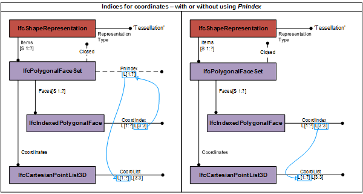
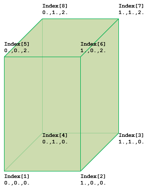

# IfcPolygonalFaceSet

The _IfcPolygonalFaceSet_ is a tessellated face set with all faces being bound by polygons. The planar faces are constructed by implicit polylines defined by three or more Cartesian points. Each planar face is defined by an instance of _IfcIndexedPolygonalFace_, or in case of faces with inner loops by _IfcIndexedPolygonalFaceWithVoids_.<!-- end of definition -->

Depending on the value of the inherited attribute _Closed_ the instance of _IfcPolygonalFaceSet_ represents:

* if TRUE, a boundary representation (or B-rep);
* if FALSE, a face based surface representation.

The attribute _Faces_ refers to a list of _IfcIndexedPolygonalFace_'s having an one-based _CoordIndex_ that provides three or more indices. If the face has inner loops, the _IfcIndexedPolygonalFaceWithVoids_ has a two-dimensional, one-based list, where:
* the first dimension of the two-dimensional list addresses the list of inner loops;
* the second dimension of the two-dimensional list provides three or more indices each being a vertex of the planar polygon representing the inner loop.

Depending on the provision of _PnIndex_ the indices point either directly into the _IfcCartesianPointList3D_ referenced by _Coordinates_ defined at the supertype _IfcTessellatedFaceSet_, or they point into the _PnIndex_ where the integer values at that position provides the location of the coordinate values within the _IfcCartesianPointList3D_. See Figure 1 for the handling of point index.



> NOTE  If the _IfcPolygonalFaceSet_ is closed, the face vertices of the _IfcIndexedPolygonalFace_'s shall connect counterclock-wise when seen from the outside of the closed shell to guarantee that the face normal points away from the material of the shell. Inner loops, provided by the _IfcIndexedPolygonalFaceWithVoids_, shall connect clock-wise.



Figure 2 — Polygonal face set geometry

Figure 2 shows an <em>IfcPolygonalFaceSet</em> represented by:

```
#1 IfcIndexedPolygonalFace: ((1, 2, 6, 5)
#2 IfcIndexedPolygonalFace: ((6, 2, 3, 7)
#3 IfcIndexedPolygonalFace: ((7, 3, 4, 8)
#4 IfcIndexedPolygonalFace: ((8, 4, 1, 5)
#5 IfcIndexedPolygonalFace: ((1, 4, 3, 2)
#6 IfcIndexedPolygonalFace: ((6, 7, 8, 5)
#7 IfcCartesianPointList3D:
((0.,0.,0.), (1.,0.,0.), (1.,1.,0.), (0.,1.,0.), (0.,0.,2.), (1.,0.,2.), (1.,1.,2.), (0.,1.,2.))
```

> NOTE  The definition of _IfcPolygonalFaceSet_ is based on the **indexedFaceSet** defined in ISO/IEC 19775-1

> HISTORY  New entity in IFC4 Addendum 2.

**Informal Propositions**

1. If _Closed_ = TRUE, the same topological constraints as imposed by an faceted boundary representation shall be safisfied. In particular:
    * each face shall be unique;
    * each edge shall be used by exactly two outer or inner boundaries of faces;
    * the topological normal at each point on the boundary of the polygonal face set shall point away from the material of the solid.

## Attributes

### Closed
Indication whether the face set is a closed shell (TRUE) or an open shell (FALSE). If omitted no such information can be asserted.

### Faces
The list of polygonal faces, with or without inner loops, that bound the faceted face set.

### PnIndex
The list of integers defining the locations in the _IfcCartesianPointList3D_ to obtain the point coordinates for the indices at the indexed polygonal faces. If the _PnIndex_ is not provided the indices at the indexed polygonal faces point directly into the  _IfcCartesianPointList3D_.
