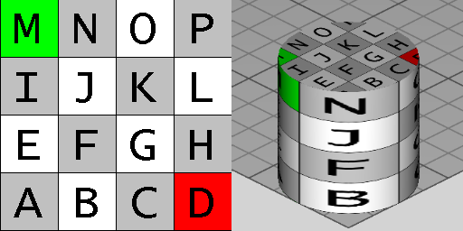

# IfcRightCircularCylinder

The _IfcRightCircularCylinder_ is a Construction Solid Geometry (CSG) 3D primitive. It is a solid with a circular base and top. The cylindrical surface between if formed by points at a fixed distance from the axis of the cylinder. The inherited _Position_ attribute defines the _IfcAxis2Placement3D_ and provides:

* _SELF\IfcCsgPrimitive3D.Position_: The location and orientation of the axis system for the primitive.
* _SELF\IfcCsgPrimitive3D.Position.Location_: The center of the circular area being the bottom face of the cylinder.
* _SELF\IfcCsgPrimitive3D.Position.Position[3]:_ The z axis provides the center axis and the height is measured from the origin along the positive direction of the z axis.
<!-- end of short definition -->

Figure 1 illustrates geometric parameters of the cylinder. The cylinder is positioned within its own placement coordinate system. The origin is the center of the bottom circular disk, that lies in the XY plane. The center of the top circular disk is on the positive z axis at [0, 0, _Height_].

{ .extDef}
> NOTE Definition according to ISO/CD 10303-42:1992
> A right circular cylinder is a CSG primitive in the form of a solid cylinder of finite height. It is defined by an axis point at the centre of one planar circular face, an axis, a height, and a radius. The faces are perpendicular to the axis and are circular discs with the specified radius. The height is the distance from the first circular face centre in the positive direction of the axis to the second circular face centre.

> NOTE Entity adapted from **right_circular_cylinder** defined in ISO 10303-42.

> HISTORY New entity in IFC2x3.

{ .use-head}
Texture use definition

On the circular side, textures are aligned facing upright with origin at the back (+Y direction) revolving counter-clockwise. Textures are stretched or repeated to the extent of the circumference according to RepeatS. Textures are stretched or repeated to the extent of the _Height_ according to RepeatT.

On the top and bottom faces, textures are aligned facing front-to-back, with the center of the circle aligned to the center of the texture.

Figure 2 illustrates default texture mapping with a clamped texture (RepeatS=False and RepeatT=False). The image on the left shows the texture where the S axis points to the right and the T axis points up. The image on the right shows the texture applied to the geometry where the X-axis points back to the right, the Y-axis points back to the left, and the Z axis points up.

{ .gridtable}

Figure 2 — Right circular cylinder textures

|Side|Normal|Origin X|Origin Y|Origin Z|S Axis|T Axis|
|--- |--- |--- |--- |--- |--- |--- |
|Side|+Y|0|+Radius|0|-X|+Z|
|Bottom|-Z|-Radius|+Radius|0|+X|-Y|
|Top|+Z|-Radius|-Radius|+Height|+X|+Y|

Table 3 Texture parameters

## Attributes

### Height
The distance between the planar circular faces of the cylinder.

### Radius
The radius of the cylinder.
