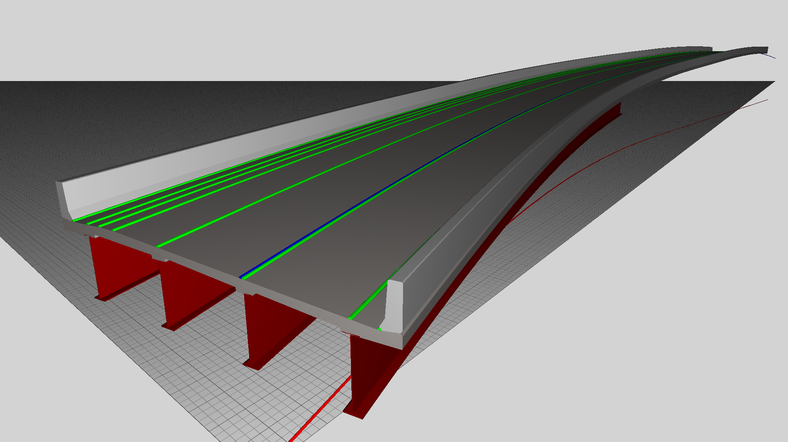
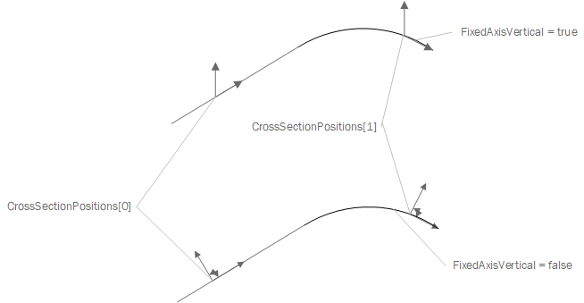
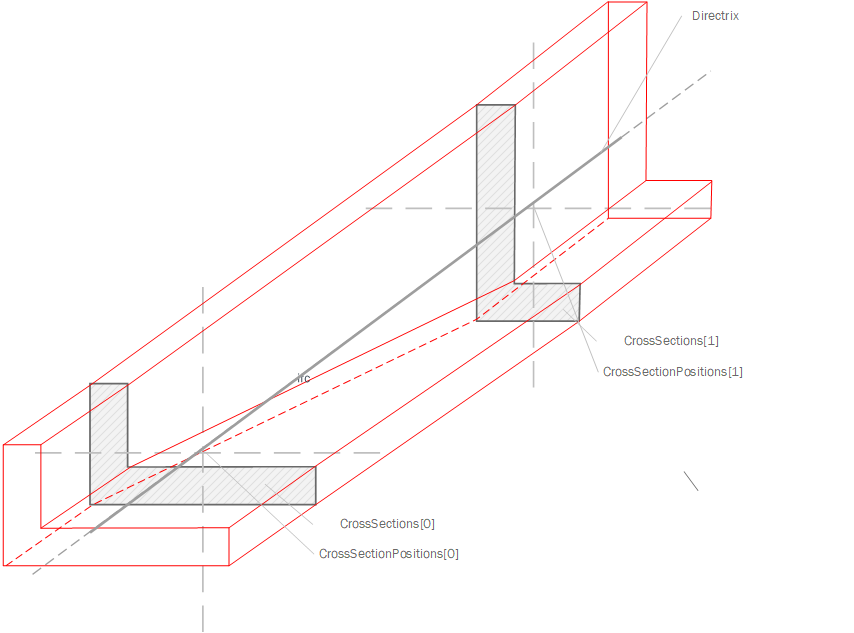

# IfcSectionedSolidHorizontal

An _IfcSectionedSolidHorizontal_ is a solid model constructed by sweeping potentially varying cross sections along a curve horizontally.

The solid is generated by sweeping the _CrossSections_ between _CrossSectionPositions_ with linear interpolation between profile points with the same tag along the directrix.  The profile normal is derived from the associated _IfcAxis2PlacementLinear_, not necessarily the tangent of the _Directrix_. The profile X axis is the direction of _RefDirection_ from _IfcAxis2PlacementLinear_, and the profile Y axis is the direction of _Axis_.

For sections having cross-section rotated according to a single super-elevation, _IfcDerivedProfileDef_ may be used to indicate such rotation with each _ParentProfile_ referring to the same underlying profile. For sections having cross-section transformed according to multiple super-elevations with points varying independently, each profile may be of a different instance but of same type (e.g. _IfcArbitraryClosedProfileDef_), and may optionally have cross section points associated to string lines ("guide curves") by matching labels using _IfcIndexedPolyCurve_ with _IfcCartesianPointList2D.TagList_.

Figure 1 illustrates four girders of a bridge having a constant parameterized profile, two guardrails having a constant arbitrary profile (one of them mirrored), and a bridge deck having a variable arbitrary profile.

Figure 1 &mdash; Sectioned solid horizontal

Figure 2 &mdash; Side View showing multiple CrossSectionPositions

Figure 3 &mdash; Example Shape in red based on two Cross Sections both not starting at the beginning or end and different in shape.

## Informal Propositions

1. No two consecutive sections shall intersect.
2. If the type of sections is not IfcParameterizedProfileDef (i.e. an arbitrary profile), then the number of points and edges should be the same for two consecutive profiles
3. If the directrix is not tangent continuous, the resulting solid is created by a miter at half angle between the two segments.
4. Very sharp edges may result in nearly impossible miter; implementer agreements may define acceptable limits for tangent discontinuity or require the directrix to be tangent continuous.
5. The directrix shall not intersect

## Attributes

### CrossSectionPositions
Position coordinate systems in sequentially increasing order paired with _CrossSections_, indicating the position of the corresponding section along the _Directrix_.

## Formal Propositions

### CorrespondingSectionPositions
The set of cross sections and the set of cross section positions shall be of the same size.

### NoLongitudinalOffsets
Distance expressions must not use longitudinal offsets.
