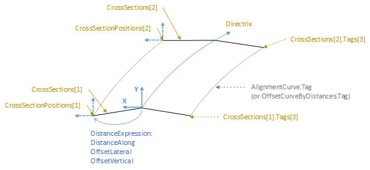
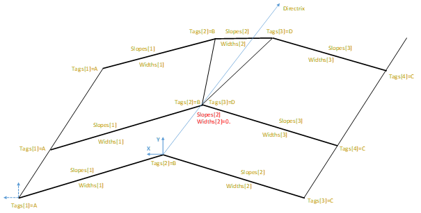

# IfcSectionedSurface

A surface constructed by sweeping potentially varying open cross sections along a curve horizontally (or near horizontally). The surface is generated by sweeping the _CrossSections_ between _CrossSectionPositions_; linear interpolation is assumed, unless transitions curves between cross section points are indicated by OpenCrossProfileDef.Tags.
<!-- end of short definition -->

The profile normal is derived from the associated _IfcAxis2PlacementLinear_, not necessarily the tangent of the _Directrix_. The profile Y-axis is oriented according to _Axis_ attribute of _IfcAxis2PlacementLinear_ and the X is derived from the cross product of _Directrix_ and the _Axis_ attribute of _IfcAxis2PlacementLinear_.

Figure 1 illustrates an _IfcSectionedSurface_ defined using _IfcOpenCrossProfileDef_.

Figure 1 — Sectioned surface using _IfcOpenCrossProfileDef_

In case of branching longitudinal breaklines, the _IfcSectionedSurface_ shall use _IfcOpenCrossProfileDef_ instances with varying number of cross section points. In that case, the point in two consecutive cross sections that are connected are identified by the same tag value.

Figure 2 illustrates an _IfcSectionedSurface_ featuring branching longitudinal breaklines.

Figure 2 — Sectioned surface with branching longitudinal breaklines

**Informal Propositions**

1. No two consecutive sections shall intersect.
2. If the directrix is not tangent continuous, the resulting surface is created by a miter at half angle between the two segments.
3. Very sharp edges may result in nearly impossible miter; implementer agreements may define acceptable limits for tangent discontinuity or require the directrix to be tangent continuous.
4. The directrix shall not intersect

## Attributes

### Directrix
The curve used to define the sweeping operation

### CrossSectionPositions
List of positions in sequentially increasing order paired with _CrossSections_, indicating the position of the corresponding section along the _Directrix_.

### CrossSections
List of cross sections in sequential order along the Directrix

## Formal Propositions

### AreaProfileTypes
The profile type shall be CURVE within the list of the profiles defining the cross sections.

### CorrespondingSectionPositions
The set of cross sections and the set of cross section placements shall be of the same size.

### DirectrixIs3D
The curve entity which is the underlying directrix shall have the dimensionality of 3.

### NoOffsets
Distance expressions must not use longitudinal, laterial or vertical offsets.

### ProfilesAreCurves
The profile type shall be CURVE within the list of the profiles defining the cross sections.

### SectionsSameType
The entity type for each section must be the same.
